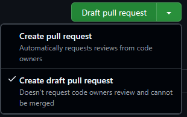
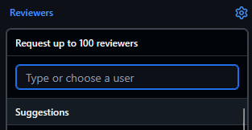
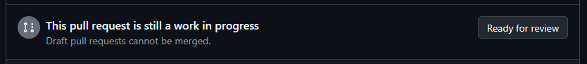
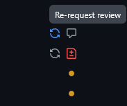

# Contributing to TheRock

We are enthusiastic about contributions to our code and documentation. Please
feel free to file issues where documentation or functionality is lacking or,
even better, volunteer to contribute to help close these gaps!

## Developer policies

These policies apply to all forms of activity and engagement in this project.

> [!IMPORTANT]
> AMD employees must also follow the ROCm open source software
> contributing policies at http://u.amd.com/rocm-oss-policies.

### Project governance

See
[ROCm Project Governance](https://github.com/ROCm/ROCm/blob/develop/GOVERNANCE.md),
which also defines the code of conduct.

### Licensing

Code contributions to this project are covered under the terms of the
[LICENSE](LICENSE) file.

### Communication channels

TheRock uses **GitHub** as the source of truth for all issue tracking, project
planning, and code contributions. This makes it easy for developers across
companies to observe the project and contribute. We also leverage an open source
stack for our development tools and infrastructure so that forks and downstream
projects can benefit too.

We are also active on the
[AMD Developer Community Discord Server](https://discord.com/invite/amd-dev)
in channels like `#therock-contributors` and `#rocm-build-install-help`.

<!-- - TODO: link to AMD internal comms channels via a u.amd.com link -->

### AI tool use policy

We allow the use of AI tools to help author issues, pull requests, reviews,
comments, and more.

While we don't have a formal AI tool use policy in the ROCm GitHub organization
at the moment, we are actively monitoring contribution patterns and take
inspiration from policies in neighboring ecosystem projects:

- https://llvm.org/docs/AIToolPolicy.html
- https://github.com/pytorch/pytorch/blob/main/AI_POLICY.md

Of particular note, from the LLVM AI Tool Use Policy:

> The contributor is always the author and is fully accountable for their
> contributions. Contributors should be sufficiently confident that the
> contribution is high enough quality that asking for a review is a good use of
> scarce maintainer time, and they should be able to answer questions about
> their work during review.

When posting significant portions of AI-generated content on issues or pull
requests, we also encourage contributors to clearly disclose which sections
of a comment are human or AI-generated (e.g., using a code or quote block, or
by posting the output to https://gist.github.com/) along with accompanying
human commentary explaining the relevance and accuracy of the content.

> [!TIP]
> If you use an AI coding assistant, this repository includes several PR-quality
> "skills" that help you author and review changes. See
> [`skills/`](/skills/) for the full index:
>
> - [`skills/rocm-pr-quality/`](/skills/rocm-pr-quality/): the ROCm-wide base
>   (start here).
> - [`skills/therock-pr-quality/`](/skills/therock-pr-quality/): TheRock overlay
>   for changes to this specific repository.

### Branch creation policy

Most contributions from AMD employees should be made via branches in the shared
repository and not personal forks according to the
http://u.amd.com/rocm-oss-contributing policy. Branches in the shared repository
benefit from code security scanning, code quality tooling, and easier
collaboration.

<!-- TODO: u.amd.com shortlink to a page explaining how to get write access -->

For external contributors, PRs from forks are of course accepted and most
workflows are compatible with this contribution model.

> [!NOTE]
> One notable exception is that GitHub Actions workflows using our self-hosted
> runners can only be triggered using
> [workflow_dispatch](https://docs.github.com/en/actions/how-tos/manage-workflow-runs/manually-run-a-workflow)
> from branches in the shared repository, so if a change requires more extensive
> testing than what our standard CI workflows provide then a branch in the
> shared repository may need to be created.

### Branch naming policy

Branches in personal forks can use any name.

Branches created in the shared repository should match one of these patterns so
branches are easily sortable and can be audited by repository maintainers:

| Branch name pattern                      | Example                          |
| ---------------------------------------- | -------------------------------- |
| `users/[USERNAME]/[feature-or-bug-name]` | `users/cooldeveloper/my-feature` |
| `shared/[feature-or-bug-name]`           | `shared/kpack-integration`       |

A few exceptions are granted for automation and some subproject-specific branch
naming conventions:

- `bump-*`
- `revert-*`
- `dependabot/**/*`
- `copilot/**/*`
- `compiler-*`
- `amd-compiler-*`
- `amd/dev/**/*`
- `amd/staging/**/*`

Additionally, a few long-lived branches exist using other patterns:

- [`main`](https://github.com/ROCm/TheRock/tree/main)
- [`release/*`](https://github.com/ROCm/TheRock/branches/all?query=release%2F)
- [`compiler/amd-staging`](https://github.com/ROCm/TheRock/tree/compiler/amd-staging)

Branch naming is enforced via a
[branch protection ruleset](https://docs.github.com/en/repositories/configuring-branches-and-merges-in-your-repository/managing-rulesets/about-rulesets)
that restricts branch creation (specifically [this ruleset](https://github.com/ROCm/TheRock/settings/rules/18327486)
for maintainers).

## Development workflows and contributing guide

### Using GitHub Issues for bug reporting

Before filing a new issue, please search through
[existing issues](https://github.com/ROCm/TheRock/issues) to make sure your issue hasn't
already been reported.

General issue guidelines:

- Use your best judgement for new issue creation. If you find a similar open (or
  closed) issue already reported, upvote the issue and leave a comment with
  any new details, such as how you reproduced it.
- When filing an issue, be sure to provide as much information as possible,
  including reproduction steps and complete script output so we can triage
  efficiently.
- Check your issue regularly, as we may require additional information to
  resolve the issue.

### Using GitHub Issues for feature development

Discussion about new features is welcome via

- Filing a [GitHub issue](https://github.com/ROCm/TheRock/issues)
- Posting a [GitHub discussion](https://github.com/ROCm/TheRock/discussions)
- Reaching out [on Discord](https://discord.com/invite/amd-dev)

> [!TIP]
> When planning complex changes, please solicit feedback and announce your
> intent to work on a pull request early in development, as this gives other
> contributors time to offer advice and avoid duplicating effort.

### Creating pull requests

To keep code quality high across the project, we hold pull requests to the
following standards:

| Check description                     | Enforced via                                                                                                                                 | Details                                                                                                                                                   |
| ------------------------------------- | -------------------------------------------------------------------------------------------------------------------------------------------- | --------------------------------------------------------------------------------------------------------------------------------------------------------- |
| ✅ Code style guidelines              | <ul><li>Manual code review</li></ul>                                                                                                         | <ul><li>[Coding style guides](#coding-style-guides)</li></ul>                                                                                             |
| ✅ Branch naming patterns             | <ul><li>Repository ruleset</li></ul>                                                                                                         | <ul><li>[Branch naming policy](#branch-naming-policy)<br>(`users/USERNAME/feature-name`)</li></ul>                                                        |
| ✅ Pull requests should link an issue | <ul><li>[`therock-pr-bot.yml`](/.github/workflows/therock-pr-bot.yml)</li></ul>                                                              | <ul><li>[`pull_request_template.md`](/.github/pull_request_template.md)<li>Policy Bot [`FAQ.md`](/skills/therock_pr_bot/FAQ.md#-pr-description)</li></ul> |
| ✅ Lint pre-commit checks             | <ul><li>[`pre-commit.yml`](.github/workflows/pre-commit.yml)</li></ul>                                                                       | <ul><li>[pre-commit checks](#pre-commit-checks)</li></ul>                                                                                                 |
| ✅ Changes should be unit tested      | <ul><li>[`unit_tests.yml`](.github/workflows/unit_tests.yml)</li><li>[`therock-pr-bot.yml`](/.github/workflows/therock-pr-bot.yml)</li></ul> | <ul><li>(Planned) `TESTING.md` file</li><li>[`docs/development/adding_tests.md`](docs/development/adding_tests.md)</li></ul>                              |

> [!NOTE]
> For more information about the PR Policy Bot which enforces some of these
> policies see [`therock_pr_bot/FAQ.md`](/skills/therock_pr_bot/FAQ.md).

#### Coding style guides

We have project-wide style guides with recommendations to follow at
[`docs/development/style_guides/`](/docs/development/style_guides/):

- [Bash Style Guide](/docs/development/style_guides/bash_style_guide.md)
- [CMake Style Guide](/docs/development/style_guides/cmake_style_guide.md)
- [GitHub Actions Style Guide](/docs/development/style_guides/github_actions_style_guide.md)
- [Python Style Guide](/docs/development/style_guides/python_style_guide.md)

Improvements to the style guides are welcome, particularly for common patterns
observed across multiple commits.

> [!TIP]
> These style guides are intended for both human developers _and_ AI agents.
>
> The repository's [`CLAUDE.md`](/CLAUDE.md) references them, as do the
> PR-quality skills for AI agents under [`skills/`](/skills/). Following these
> guides during agent-driven development can help produce higher-quality
> contributions that are easier for maintainers to review.

#### Linking pull requests to GitHub issues

All pull requests should be associated with at least one GitHub issue.

This lets reviewers see the context for contributions, helps link bugs and their
fixes together, and helps with release planning. See also the
[Using GitHub Issues for bug reporting](#using-github-issues-for-bug-reporting)
and
[Using GitHub Issues for feature development](#using-github-issues-for-feature-development)
sections above.

- The repository [`pull_request_template.md`](/.github/pull_request_template.md)
  has a section for this.
- Our PR Policy Bot enforces this by checking for references in the pull request
  description such as:
  ```markdown
  Fixes https://github.com/ROCm/TheRock/issues/123
  ```
  See the ["PR Description" section of `therock_pr_bot/FAQ.md`](/skills/therock_pr_bot/FAQ.md#-pr-description) for full details.
- Contributions by AMD employees may also/instead reference a JIRA ID, though
  GitHub issues are preferred for open source development.
- Exceptions may be granted on a case-by-case basis via the PR Policy Bot.

#### pre-commit checks

We use [pre-commit](https://pre-commit.com/) to run automated "hooks" like lint
checks and formatters on each commit. See the list of hooks we currently
run at [`.pre-commit-config.yaml`](.pre-commit-config.yaml). Contributors are
encouraged to download pre-commit and run it on their commits before sending
pull requests for review.

> [!TIP]
> The pre-commit tool can also be "installed" as a git hook to run automatically
> on every `git commit`.

For example:

```bash
# Download (note: this is already included in requirements.txt).
pip install pre-commit

# Run locally on staged files.
pre-commit run

# Run locally on all files.
pre-commit run --all-files

# Install the git hook.
pre-commit install
```

#### Requesting a code review

If you are not looking for a review on a pull request yet, please mark that pull
request as a draft:

- 
- GitHub Docs: [Creating a pull request](https://docs.github.com/en/pull-requests/collaborating-with-pull-requests/proposing-changes-to-your-work-with-pull-requests/creating-a-pull-request)
- GitHub Docs: [Changing the stage of a pull request](https://docs.github.com/en/pull-requests/collaborating-with-pull-requests/proposing-changes-to-your-work-with-pull-requests/changing-the-stage-of-a-pull-request)

When you are ready for a review, please request a review from a maintainer and
mark the PR as not a draft as needed:

- 
- 
- GitHub Docs: [Requesting a pull request review](https://docs.github.com/en/pull-requests/collaborating-with-pull-requests/proposing-changes-to-your-work-with-pull-requests/requesting-a-pull-request-review)

You can check the git history to see who recently authored or approved PRs in
the same files or folders:

- CODEOWNERS
  - GitHub Docs: [About code owners](https://docs.github.com/en/repositories/managing-your-repositorys-settings-and-features/customizing-your-repository/about-code-owners)
  - [`.github/CODEOWNERS`](/.github/CODEOWNERS)
- Checking history
  - GitHub Docs: [Viewing and understanding files](https://docs.github.com/en/repositories/working-with-files/using-files/viewing-and-understanding-files)
  - GitHub Docs: [Differences between commit views](https://docs.github.com/en/pull-requests/committing-changes-to-your-project/viewing-and-comparing-commits/differences-between-commit-views)

> [!TIP]
> After addressing feedback, please
> [re-request review](https://docs.github.com/en/pull-requests/collaborating-with-pull-requests/proposing-changes-to-your-work-with-pull-requests/requesting-a-pull-request-review#requesting-reviews-from-collaborators-and-organization-members)
>
> 
>
> this ensures that your pull request shows up for reviewers on dashboards such
> as <https://github.com/pulls/reviews>.
