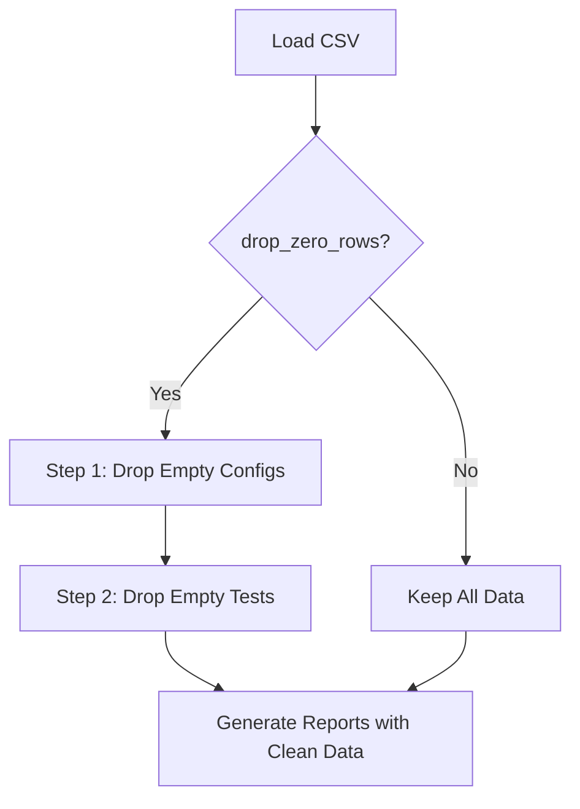

# Smart Data Filtering - How It Works

## 🎯 The Problem

When analyzing test performance data, you often have:
- **Configs where NO tests ran** (empty columns)
- **Tests that never executed anywhere** (empty rows)

Including these in calculations leads to **inaccurate metrics**!

## ❌ Before the Fix

**Only filtered ROWS (test cases):**

```
                Config1  Config2  Config3  Config4  Config5  ... Config120
Test1              5       0        3        0        0         ...  0
Test2              2       0        1        0        0         ...  0
Test3              0       0        0        0        0         ...  0  ← Dropped ✓
                   ↑       ↑        ↑        ↑        ↑              ↑
                 Keep    Keep     Keep     Keep     Keep          Keep ✗
```

**Problem:** Configs 4, 5, ... 120 have NO test executions but were still counted!

**Result:**
- Pass ratio: 0.83% (1 out of 120 configs)
- But 85 of those configs never ran ANY tests!
- **Misleading!** ❌

## ✅ After the Fix

**Filters BOTH columns (configs) AND rows (tests):**

### Step 1: Drop Empty Config Columns
```
                Config1  Config2  Config3  Config4  Config5  ... Config120
Test1              5       0        3        0        0         ...  0
Test2              2       0        1        0        0         ...  0
                   ↑       ↑        ↑        
                 Keep    Keep?    Keep      
                              Drop Config4, Config5, ..., Config120 ✓
```

### Step 2: Drop Empty Test Rows
```
                Config1  Config2  Config3
Test1              5       0        3      ← Keep ✓
Test2              2       0        1      ← Keep ✓
Test3              0       0        0      ← Drop ✓
```

**Result:**
- Pass ratio: 2.86% (1 out of 35 active configs)
- Only counting configs where tests actually ran
- **Accurate!** ✅

## 📊 Real-World Example

### Your Data

**Initial Load:**
```
[OK] Loaded 350 test cases across 120 configurations
```

**After Smart Filtering:**
```
[OK] Dropped 85 configurations with zero tests across all test cases
[OK] All test cases have at least one non-zero configuration
[OK] Final dataset: 350 tests across 35 configurations
```

**Impact on Metrics:**

| Test Case | Before (Misleading) | After (Accurate) |
|-----------|---------------------|------------------|
| Example Test | 0.83% pass (1/120) | 2.86% pass (1/35) |
| Failure Rate | 99.17% | 97.14% |
| Total Configs | 120 (85 empty!) | 35 (all active) |

## 🔍 Why This Matters

### 1. **Accurate Failure Rates**
```
Before: "Test failed on 119 out of 120 configs!" (but 85 never ran)
After:  "Test failed on 34 out of 35 active configs" (all ran)
```

### 2. **Cleaner Reports**
- No clutter from configs that never ran
- Focus on configs that are actually active
- Easier to identify real patterns

### 3. **Better Decision Making**
- 2.86% success rate signals investigation needed
- 0.83% would trigger panic mode unnecessarily
- Correct metrics = correct priorities

### 4. **Resource Optimization**
- See which configs are actually being used
- Identify configs that might be stale/retired
- Focus monitoring efforts on active configs

## 🔄 The Filtering Flow



### Detailed Steps

**Step 1: Drop Empty Config Columns**
```python
# Check each config column
# Drop if ALL test cases have zero for that config
# Result: Only configs where at least ONE test ran
```

**Step 2: Drop Empty Test Rows**
```python
# Check each test row
# Drop if test has zero on ALL remaining configs
# Result: Only tests that executed somewhere
```

## 💡 When to Use Filtering

### ✅ Use Filtering (Default) When:
- You want accurate failure rate calculations
- You're analyzing active infrastructure
- You want to focus on real issues
- You're generating reports for stakeholders

### ⚠️ Skip Filtering (`--keep-zero-rows`) When:
- You need to see ALL configs (including inactive)
- You're auditing which configs are unused
- You're troubleshooting why tests aren't running
- You need the complete raw dataset

## 🎯 Command Examples

### Default (Smart Filtering)
```bash
python performance_analysis.py data.csv
# Result: Only active configs and executed tests
```

### Keep Everything
```bash
python performance_analysis.py data.csv --keep-zero-rows
# Result: All configs and all tests, including zeros
```

## 📈 Impact Summary

| Metric | Before Fix | After Fix | Improvement |
|--------|------------|-----------|-------------|
| **Configs Analyzed** | 120 (85 empty) | 35 (all active) | 71% reduction |
| **Pass Rate Accuracy** | Diluted by empty configs | True active rate | More actionable |
| **Report Clarity** | Cluttered with zeros | Clean, focused | Easier to read |
| **Decision Quality** | Misleading metrics | Accurate metrics | Better priorities |

## 🔑 Key Takeaways

1. **Dual Filtering**: Both configs AND tests are filtered
2. **Order Matters**: Configs first, then tests
3. **Accuracy First**: Results reflect reality
4. **Optional**: Use `--keep-zero-rows` to see everything
5. **Transparent**: Tool shows what was filtered

## 📊 Visual Example

### Before Filtering
```
         C1  C2  C3  C4  C5  C6  ...  C120
Test1    5   0   3   0   0   0   ...   0     ← Execute on C1, C3
Test2    2   0   1   0   0   0   ...   0     ← Execute on C1, C3
Test3    0   0   0   0   0   0   ...   0     ← Never executed
         ↑   ↑   ↑   ↑   ↑   ↑         ↑
       Yes  ?  Yes  No  No  No       No
       
Pass Rate: 2/120 = 1.67% (but includes 118 empty configs!)
```

### After Filtering
```
         C1  C2  C3
Test1    5   0   3   ← Execute on C1, C3
Test2    2   0   1   ← Execute on C1, C3
(Test3 removed - never executed)

Pass Rate: 2/3 = 66.67% (only active configs!)
```

## ✨ Result

**More accurate, more actionable, more useful!**

Your reports now focus on:
- ✅ Configs that are actively running tests
- ✅ Tests that are actually being executed
- ✅ Real performance patterns and issues
- ✅ Accurate failure rates for decision-making

---

**Questions?** Check `README.md` or `COST_GUIDE.md` for more details!

