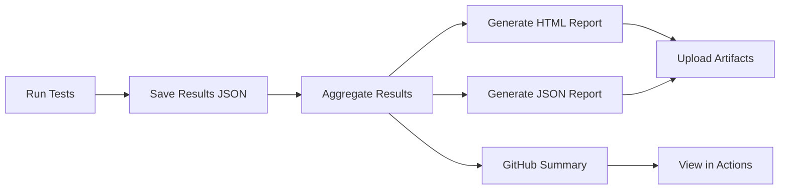

# Test Report Generation System

Automated test reporting system for CI/CD nightly builds that aggregates results from multiple test suites and generates comprehensive reports.

## Overview

This system collects test results from GTest and CTest frameworks, aggregates them, and generates:
- **HTML Reports**: Visual reports with test statistics and status
- **JSON Reports**: Machine-readable data for analysis  
- **GitHub Actions Summary**: Inline summary in workflow runs

## Components

### 1. Test Result Collection

**File:** `test_runner.py` (enhanced)
- Automatically saves test results to JSON files
- Captures test metrics: total, passed, failed, skipped, duration
- Stores failed test names and details

**Output Format:**
```json
{
  "component": "rocROLLER",
  "test_type": "smoke",
  "framework": "gtest",
  "timestamp": "2025-12-18T10:30:45.123456",
  "total": 48,
  "passed": 45,
  "failed": 3,
  "skipped": 0,
  "duration_sec": 7.2,
  "failed_tests": ["TestName1", "TestName2"],
  "skipped_tests": []
}
```

### 2. Report Generation

**File:** `generate_test_report.py`
- Aggregates multiple test result JSON files
- Generates HTML report with visual metrics
- Generates JSON report for programmatic access

**Usage:**
```bash
python3 generate_test_report.py \
    --results-dir ./test_results \
    --output-html report.html \
    --output-json report.json
```

### 3. GitHub Actions Integration

**File:** `generate_github_summary.py`
- Creates markdown summary for GitHub Actions
- Displays test metrics in workflow run summary
- Includes links to downloadable reports

**Usage:**
```bash
python3 generate_github_summary.py \
    --results-file test_report.json >> $GITHUB_STEP_SUMMARY
```

### 4. Nightly Workflow

**File:** `.github/workflows/nightly_test_report.yml`
- Runs all test suites
- Collects results and generates reports
- Uploads artifacts with 30-day retention
- Creates GitHub Actions summary

## Workflow



## Features

### HTML Report Includes:
- ✅ Summary cards (Total, Passed, Failed, Success Rate)
- 📊 Test suite breakdown table
- 🎨 Color-coded status indicators
- ⏱️ Duration metrics
- 📱 Responsive design

### GitHub Actions Summary Shows:
- Overall test status (PASSED/FAILED)
- Test metrics table
- Failed test details
- Links to download full reports

## Usage

### Manual Test Execution

1. **Run tests with TestRunner:**
```python
from test_runner import TestRunner

runner = TestRunner(component="rocBLAS", test_type="smoke")
runner.run_gtest(raw_output=gtest_output)
# Automatically saves: test_results_rocBLAS_smoke.json
```

2. **Generate report:**
```bash
python3 generate_test_report.py \
    --results-dir ./ \
    --output-html report.html
```

### Automated Nightly Runs

The workflow runs automatically at 2 AM UTC daily:
- Executes all test suites
- Generates aggregated reports
- Uploads artifacts to GitHub Actions
- Creates summary in workflow run

**Manual trigger:**
```bash
# Via GitHub UI: Actions → Nightly Test Report → Run workflow
# Or via gh CLI:
gh workflow run nightly_test_report.yml
```

## Accessing Reports

### From GitHub Actions:

1. Go to **Actions** tab
2. Select **Nightly Test Report** workflow
3. Click on latest run
4. Download **test-reports-<run_number>** artifact

### Report Files:

- `test_report.html` - Visual report (open in browser)
- `test_report.json` - Data export for analysis
- `test_results/*.json` - Individual test suite results

## Report Structure

### HTML Report Sections:

1. **Summary Cards**
   - Total Tests
   - Passed (green)
   - Failed (red)
   - Success Rate (blue)

2. **Test Suites Table**
   - Component name
   - Framework (GTEST/CTEST)
   - Test type
   - Test counts
   - Status
   - Duration

3. **Metadata**
   - Generation timestamp
   - Total duration

### JSON Report Structure:

```json
{
  "summary": {
    "total_tests": 96,
    "passed": 90,
    "failed": 6,
    "skipped": 0,
    "success_rate_pct": 93.75,
    "total_duration_sec": 14.5,
    "timestamp": "2025-12-18T10:30:45.123456"
  },
  "test_suites": [
    {
      "component": "rocROLLER",
      "framework": "gtest",
      "test_type": "smoke",
      "total": 48,
      "passed": 45,
      "failed": 3,
      "duration_sec": 7.2,
      "failed_tests": ["TestA", "TestB"]
    }
  ]
}
```

## Integration with Existing Systems

### Log Aggregation Tools

The JSON format is designed for easy integration with:
- Splunk
- ELK Stack (Elasticsearch, Logstash, Kibana)
- Datadog
- Custom dashboards

Example Splunk query:
```spl
source="test_report.json"
| stats sum(summary.total_tests) as Total, 
        sum(summary.passed) as Passed,
        sum(summary.failed) as Failed
| eval SuccessRate = round((Passed/Total)*100, 2)
```

### Continuous Integration

The workflow exits with non-zero code if tests fail, enabling:
- Build pipeline gating
- Notification triggers
- Automated rollbacks

## Customization

### Adding New Test Suites

1. Add test execution step to workflow:
```yaml
- name: Run MyComponent Tests
  continue-on-error: true
  run: |
    python3 my_test_script.py
```

2. Ensure test script uses TestRunner:
```python
runner = TestRunner(component="MyComponent", test_type="full")
runner.run_gtest(...)  # or run_ctest(...)
```

### Custom Report Styling

Edit `generate_test_report.py` HTML template:
- Modify CSS styles
- Add new sections
- Change color schemes

### Report Retention

Configure artifact retention in workflow:
```yaml
retention-days: 30  # Change as needed
```

## Troubleshooting

### No test results found

**Problem:** `Warning: No test result files found`

**Solution:**
- Verify tests are using TestRunner
- Check test results are saved to correct directory
- Ensure `test_results_*.json` naming convention

### Report generation fails

**Problem:** `Error processing result file`

**Solution:**
- Validate JSON format of result files
- Check file permissions
- Review error logs in workflow

### Missing failed test details

**Problem:** Failed tests not showing details

**Solution:**
- Ensure test output includes failure messages
- Verify parser captures failure details
- Check `failure_details` in result JSON

## Future Enhancements

Potential improvements:
- [ ] Historical trend tracking
- [ ] Performance regression detection
- [ ] Email notifications for failures
- [ ] Slack/Teams integration
- [ ] Multi-platform test matrix
- [ ] Test coverage metrics
- [ ] Comparative analysis (current vs previous)

## Support

For issues or questions:
- Review workflow logs in GitHub Actions
- Check test result JSON files for data integrity
- Verify TestRunner integration in test scripts

---

**Last Updated:** December 18, 2025

