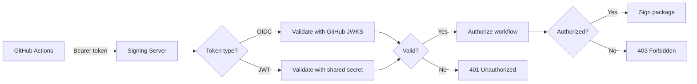
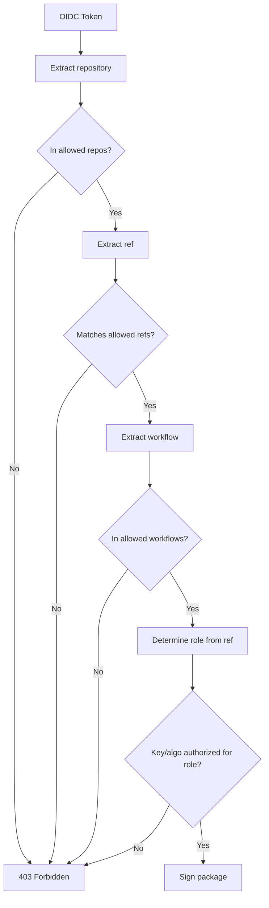

# OIDC Implementation Summary

## Overview

OIDC (OpenID Connect) authentication support has been added to the signing server while maintaining backward compatibility with existing JWT tokens.

## What Was Implemented

### 1. Server-Side OIDC Validation

**File: `server/auth.py`**
- Added `validate_github_oidc_token()` - Validates RS256-signed tokens from GitHub
- Added `authorize_oidc_request()` - Enforces workflow-based authorization
- Added `determine_role_from_oidc()` - Maps branch/ref to signing role
- Updated `audit_log()` - Captures rich OIDC context (repository, workflow, actor, run_id, etc.)

**File: `server/signing-server.py`**
- Updated `authenticate_request()` - Tries OIDC first, falls back to JWT
- Updated `do_POST()` - Handles both JWT and OIDC authorization paths
- Updated audit logging - Includes OIDC-specific metadata

### 2. Configuration

**File: `requirements.txt`** (new)
```
PyJWT[crypto]>=2.8.0
```

**File: `config/authorization-example.json`** (new)
Shows OIDC-specific configuration:
- `oidc_role_mapping` - Maps git refs to roles
- `allowed_repositories` - Restricts which repos can sign
- `allowed_refs` - Restricts which branches can sign
- `allowed_workflows` - Restricts which workflow files can sign

### 3. Documentation

**File: `docs/github-oidc-integration.md`** (new)
- Complete GitHub Actions workflow examples
- OIDC token payload structure
- Authorization configuration guide
- Troubleshooting section
- Migration guide reference

**File: `JWT_VS_OIDC_WORKFLOW_RESTRICTION.md`** (existing)
- Detailed comparison of JWT vs OIDC for workflow restriction
- Implementation code for both approaches
- Security analysis

## Key Features

### Dual Authentication Support

The server now supports **both** authentication methods:

1. **JWT (HMAC-SHA256)** - Existing method
   - Tokens stored in GitHub Secrets
   - Manual role assignment
   - Requires custom GitHub Actions context passing for workflow restriction

2. **OIDC (RS256)** - New method (recommended)
   - No secrets stored (GitHub-issued tokens)
   - Automatic workflow metadata (repository, branch, actor, etc.)
   - Native workflow restriction
   - Short-lived (10 minutes)
   - Cryptographically verified via GitHub's JWKS

### Workflow-Based Authorization

OIDC tokens enable enforcement of:

- **Repository restriction**: Only `ROCm/TheRock` can sign
- **Branch restriction**: Only `main` and `release/*` branches for production keys
- **Workflow restriction**: Only authorized workflow files can trigger signing
- **Dynamic role mapping**: Branch determines signing role automatically

Example authorization rule:
```json
{
  "roles": {
    "release": {
      "allowed_repositories": ["ROCm/TheRock"],
      "allowed_refs": ["refs/heads/main", "refs/heads/release/*"],
      "allowed_workflows": [".github/workflows/build_native_linux_packages.yml"]
    }
  }
}
```

### Rich Audit Trail

OIDC authentication provides comprehensive audit logs:

```json
{
  "timestamp": "2024-03-06T10:30:00Z",
  "auth_type": "oidc",
  "repository": "ROCm/TheRock",
  "ref": "refs/heads/main",
  "workflow": ".github/workflows/build_native_linux_packages.yml",
  "actor": "john.doe",
  "run_id": "123456789",
  "run_number": "42",
  "event_name": "workflow_dispatch",
  "role": "release",
  "key_id": "therock-release@amd.com",
  "status": "SUCCESS"
}
```

## Backward Compatibility

✅ **Existing JWT authentication continues to work unchanged**

- If PyJWT is not installed, server operates in JWT-only mode
- Existing workflows using JWT tokens will continue functioning
- No breaking changes to existing configuration

## How It Works

### Authentication Flow



### Authorization Flow (OIDC)



## GitHub Actions Integration

### Minimal Example

```yaml
jobs:
  sign:
    runs-on: ubuntu-24.04
    permissions:
      id-token: write  # Enable OIDC

    steps:
      - name: Get OIDC token
        id: oidc
        run: |
          OIDC_TOKEN=$(curl -H "Authorization: bearer $ACTIONS_ID_TOKEN_REQUEST_TOKEN" \
            "$ACTIONS_ID_TOKEN_REQUEST_URL&audience=amd-signing-service" | jq -r '.value')
          echo "::add-mask::$OIDC_TOKEN"
          echo "token=$OIDC_TOKEN" >> $GITHUB_OUTPUT

      - name: Sign packages
        env:
          GPG_SIGNING_SERVER: ${{ secrets.GPG_SIGNING_SERVER }}
          GPG_SERVER_TOKEN: ${{ steps.oidc.outputs.token }}
        run: |
          rpmsign --addsign --define "_gpg_path $HOME/.local/bin/gpgshim" dist/*.rpm
```

## Deployment Steps

### Server Deployment

1. **Install PyJWT:**
   ```bash
   cd build_tools/packaging/linux/signing_infrastructure
   pip install -r requirements.txt
   ```

2. **Configure authorization:**
   ```bash
   cp config/authorization-example.json config/authorization.json
   # Edit authorization.json with your repository, branches, workflows
   ```

3. **Start server with OIDC:**
   ```bash
   export OIDC_AUDIENCE=amd-signing-service
   python3 server/signing-server.py \
     --enable-auth \
     --secrets-file config/secrets.json \
     --authz-config config/authorization.json \
     --port 8443
   ```

### Workflow Update

1. **Add id-token permission:**
   ```yaml
   permissions:
     id-token: write
     contents: read
   ```

2. **Request OIDC token** (see `docs/github-oidc-integration.md` for complete example)

3. **Use token with gpgshim** (existing environment variable `GPG_SERVER_TOKEN`)

## Verification

### Test OIDC Authentication

```bash
# Trigger workflow with OIDC enabled
gh workflow run build_native_linux_packages.yml \
  --ref main \
  -f native_package_type=rpm

# Check audit log
tail -f /var/log/gpg-signing/audit.log

# Look for:
# - "auth_type": "oidc"
# - "repository": "ROCm/TheRock"
# - "workflow": ".github/workflows/..."
```

### Test Authorization Enforcement

Try signing from:
- ✅ Allowed workflow → Should succeed
- ❌ Malicious workflow → Should fail with "Workflow not authorized"
- ❌ Wrong branch → Should fail with "Branch not authorized"
- ❌ Fork repository → Should fail with "Repository not authorized"

## Security Comparison

| Security Aspect | JWT | OIDC |
|----------------|-----|------|
| Secrets stored in GitHub | Yes | No |
| Token lifetime | Days/weeks | 10 minutes |
| Rotation required | Manual | Automatic |
| Workflow metadata | Must add manually | Built-in |
| Tamper-proof | Depends on secret security | GitHub-signed (cryptographic proof) |
| Compromise risk | Medium | Low |
| Revocation | Manual | Automatic expiration |

**Recommendation:** Migrate to OIDC for production deployments.

## Migration Path

See `GITHUB_OIDC_MIGRATION_GUIDE.md` for complete migration plan (7-11 days effort).

**Quick migration:**
1. Phase 1: Deploy server with PyJWT installed (both JWT and OIDC work)
2. Phase 2: Update workflows to use OIDC tokens
3. Phase 3: Verify OIDC works in production
4. Phase 4: Deprecate JWT tokens (optional - can run both indefinitely)

## Files Modified/Created

### Modified Files
- `server/auth.py` - Added OIDC validation and authorization functions
- `server/signing-server.py` - Updated to support both JWT and OIDC

### New Files
- `requirements.txt` - PyJWT dependency
- `config/authorization-example.json` - OIDC configuration example
- `docs/github-oidc-integration.md` - Integration guide
- `JWT_VS_OIDC_WORKFLOW_RESTRICTION.md` - Comparison and implementation details
- `OIDC_IMPLEMENTATION_SUMMARY.md` - This file

## Next Steps

1. **Deploy to staging:**
   - Install PyJWT on staging signing server
   - Update `authorization.json` with test repository
   - Test OIDC authentication with test workflow

2. **Verify authorization:**
   - Test all authorization scenarios (allowed/denied repos, branches, workflows)
   - Verify audit logs capture OIDC metadata
   - Test rate limiting with OIDC tokens

3. **Production rollout:**
   - Update production `authorization.json` with `ROCm/TheRock` repository
   - Deploy PyJWT to production server
   - Update production workflows to use OIDC
   - Monitor audit logs for anomalies

4. **Documentation:**
   - Add OIDC examples to internal runbooks
   - Update security documentation
   - Train team on OIDC workflow restriction

## Support

- Documentation: `docs/github-oidc-integration.md`
- Comparison: `JWT_VS_OIDC_WORKFLOW_RESTRICTION.md`
- Migration: `GITHUB_OIDC_MIGRATION_GUIDE.md`
- Security: `SECURITY_COMPARISON.md`, `GITHUB_SECRETS_SECURITY_ANALYSIS.md`

## References

- [GitHub OIDC Documentation](https://docs.github.com/en/actions/deployment/security-hardening-your-deployments/about-security-hardening-with-openid-connect)
- [PyJWT Documentation](https://pyjwt.readthedocs.io/)
- [OpenID Connect Core Specification](https://openid.net/specs/openid-connect-core-1_0.html)
