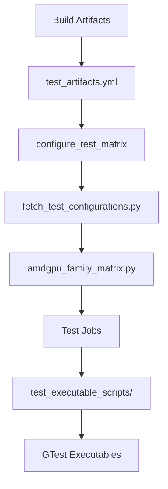

# How to Add New Test Cases to Strix in TheROCK

**Target Platforms:** Strix Point (gfx1150) and Strix Halo (gfx1151)  
**Last Updated:** December 2025

---

## 📋 Table of Contents

1. [Available Test Cases](#available-test-cases)
2. [Test Infrastructure Overview](#test-infrastructure-overview)
3. [Step-by-Step: Add a New Library Test](#step-by-step-add-a-new-library-test)
4. [Step-by-Step: Add a Platform-Specific Test](#step-by-step-add-a-platform-specific-test)
5. [Step-by-Step: Add Strix-Specific Modifications](#step-by-step-add-strix-specific-modifications)
6. [Complete Examples](#complete-examples)
7. [Testing Your Changes](#testing-your-changes)
8. [Troubleshooting](#troubleshooting)

---

## 🎯 Available Test Cases

### Currently Available Tests for Strix (gfx1151/gfx1150)

#### **1. Core Library Tests**

Located in: `build_tools/github_actions/test_executable_scripts/`

| Test Name | Script | Linux | Windows | Notes |
|-----------|--------|-------|---------|-------|
| **rocblas** | `test_rocblas.py` | ✅ | ✅ | BLAS operations |
| **rocroller** | `test_rocroller.py` | ✅ | ❌ | Linux only |
| **hipblas** | `test_hipblas.py` | ✅ | ✅ | HIP BLAS wrapper |
| **hipblaslt** | `test_hipblaslt.py` | ✅ | ✅ | Windows: quick mode only |
| **hipsolver** | `test_hipsolver.py` | ✅ | ✅ | Linear algebra solvers |
| **rocsolver** | `test_rocsolver.py` | ✅ | ❌ | Linux only |
| **rocprim** | `test_rocprim.py` | ✅ | ✅ | Parallel primitives |
| **hipcub** | `test_hipcub.py` | ✅ | ✅ | CUB API wrapper |
| **rocthrust** | `test_rocthrust.py` | ✅ | ✅ | Thrust API |
| **hipsparse** | `test_hipsparse.py` | ✅ | ❌ | Linux only |
| **rocsparse** | `test_rocsparse.py` | ✅ | ❌ | Excluded on Windows gfx1151 |
| **hipsparselt** | `test_hipsparselt.py` | ✅ | ❌ | Linux only |
| **rocrand** | `test_rocrand.py` | ✅ | ✅ | Random number generation |
| **hiprand** | `test_hiprand.py` | ✅ | ✅ | HIP RAND wrapper |
| **rocfft** | `test_rocfft.py` | ✅ | ❌ | Linux only |
| **hipfft** | `test_hipfft.py` | ✅ | ✅ | HIP FFT wrapper |
| **miopen** | `test_miopen.py` | ✅ | ❌ | Linux only |
| **hipdnn** | `test_hipdnn.py` | ✅ | ✅ | DNN operations |
| **miopen_plugin** | `test_miopen_plugin.py` | ✅ | ✅ | MIOpen plugin |
| **rocwmma** | `test_rocwmma.py` | ✅ | ✅ | Wave matrix multiply |
| **rccl** | `test_rccl.py` | ❌ | ❌ | Multi-GPU only (N/A for Strix) |

#### **2. Sanity Tests**

Located in: `tests/test_rocm_sanity.py`

- ✅ ROCm Info detection
- ✅ GPU device enumeration
- ✅ HIP compilation (hipcc)
- ✅ HIP printf execution
- ✅ ROCm agent enumerator

#### **3. AI/ML Tests (Recommended for Strix)**

See: `docs/development/STRIX_AI_ML_TEST_PLAN.md`

Recommended tests for edge AI workloads:
- Vision Language Models (VLM): LLaVA, CLIP, Qwen-VL
- Vision Transformers (ViT): ViT-Base, DINOv2, Swin
- Object Detection: YOLOv8, DETR
- Quantized Inference: INT8, FP8 models
- ONNX Runtime integration
- DirectML/WinML (Windows only)

---

## 🏗️ Test Infrastructure Overview

### Architecture



### Key Files

1. **`build_tools/github_actions/fetch_test_configurations.py`**
   - Central test registry
   - Defines all available tests
   - Handles platform and family filtering

2. **`build_tools/github_actions/amdgpu_family_matrix.py`**
   - GPU family definitions
   - Runner configurations
   - Strix configuration

3. **`build_tools/github_actions/test_executable_scripts/`**
   - Individual test scripts
   - Python wrappers for test executables
   - Platform-specific logic

4. **`.github/workflows/test_artifacts.yml`**
   - GitHub Actions workflow
   - Test orchestration

### Strix Configuration

In `amdgpu_family_matrix.py`:

```python
"gfx1151": {
    "linux": {
        "test-runs-on": "linux-strix-halo-gpu-rocm",
        "family": "gfx1151",
        "bypass_tests_for_releases": True,
        "build_variants": ["release"],
        "sanity_check_only_for_family": True,  # Limited test set
    },
    "windows": {
        "test-runs-on": "windows-strix-halo-gpu-rocm",
        "family": "gfx1151",
        "build_variants": ["release"],
    },
}
```

---

## 📝 Step-by-Step: Add a New Library Test

### Step 1: Create Test Script

Create `build_tools/github_actions/test_executable_scripts/test_mynewlib.py`:

```python
#!/usr/bin/env python3
"""
Test script for MyNewLib library
"""
import logging
import os
import shlex
import subprocess
from pathlib import Path

# Environment variables
THEROCK_BIN_DIR = os.getenv("THEROCK_BIN_DIR")
AMDGPU_FAMILIES = os.getenv("AMDGPU_FAMILIES")
platform = os.getenv("RUNNER_OS").lower()
SCRIPT_DIR = Path(__file__).resolve().parent
THEROCK_DIR = SCRIPT_DIR.parent.parent.parent

logging.basicConfig(level=logging.INFO)

# GTest sharding configuration
SHARD_INDEX = os.getenv("SHARD_INDEX", 1)
TOTAL_SHARDS = os.getenv("TOTAL_SHARDS", 1)
environ_vars = os.environ.copy()
# Convert to 0-based index for GTest
environ_vars["GTEST_SHARD_INDEX"] = str(int(SHARD_INDEX) - 1)
environ_vars["GTEST_TOTAL_SHARDS"] = str(TOTAL_SHARDS)

# Test type: full, smoke, quick
test_type = os.getenv("TEST_TYPE", "full")

# STRIX-SPECIFIC: Handle platform constraints
if AMDGPU_FAMILIES in ["gfx1150", "gfx1151"]:
    logging.info(f"Running on Strix platform: {AMDGPU_FAMILIES}")
    
    # Example: Windows Strix has memory constraints
    if platform == "windows" and AMDGPU_FAMILIES == "gfx1151":
        logging.info("Applying memory-constrained test mode for Windows Strix Halo")
        test_type = "quick"

# Build test filter based on test type
test_filter = []
if test_type == "smoke":
    test_filter.append("--gtest_filter=*smoke*")
elif test_type == "quick":
    test_filter.append("--gtest_filter=*quick*")
# If test_type == "full", run all tests (no filter)

# Construct command
cmd = [f"{THEROCK_BIN_DIR}/mynewlib-test"] + test_filter

# Execute test
logging.info(f"++ Exec [{THEROCK_DIR}]$ {shlex.join(cmd)}")
subprocess.run(cmd, cwd=THEROCK_DIR, check=True, env=environ_vars)
```

### Step 2: Register in Test Matrix

Edit `build_tools/github_actions/fetch_test_configurations.py`:

Add your test to the `test_matrix` dictionary:

```python
test_matrix = {
    # ... existing tests ...
    
    # NEW TEST: MyNewLib
    "mynewlib": {
        "job_name": "mynewlib",
        "fetch_artifact_args": "--mynewlib --tests",  # Artifact dependencies
        "timeout_minutes": 30,  # Adjust based on expected runtime
        "test_script": f"python {_get_script_path('test_mynewlib.py')}",
        "platform": ["linux", "windows"],  # or ["linux"] if Windows not ready
        "total_shards": 1,  # Increase for parallel execution if needed
        
        # OPTIONAL: Exclude specific GPU families
        # "exclude_family": {
        #     "windows": ["gfx1151"],  # Exclude Windows Strix if not working
        #     "linux": ["gfx1150"],     # Exclude Linux Strix Point if needed
        # },
    },
}
```

### Step 3: Update Artifact Installation (if needed)

If you're adding a **new component** (not just a new library in an existing component), update:

`build_tools/install_rocm_from_artifacts.py`

See: [Adding Support for New Components](./installing_artifacts.md#adding-support-for-new-components)

### Step 4: Test Locally

```bash
# Set environment variables
export THEROCK_BIN_DIR=/path/to/therock/build/bin
export AMDGPU_FAMILIES=gfx1151
export TEST_TYPE=smoke
export RUNNER_OS=Linux
export SHARD_INDEX=1
export TOTAL_SHARDS=1

# Run your test script
python build_tools/github_actions/test_executable_scripts/test_mynewlib.py
```

### Step 5: Commit and Test in CI

```bash
git add build_tools/github_actions/test_executable_scripts/test_mynewlib.py
git add build_tools/github_actions/fetch_test_configurations.py
git commit -m "Add mynewlib test for Strix platforms"
git push origin your-branch
```

The test will automatically run in CI on the next PR or push.

---

## 🎯 Step-by-Step: Add a Platform-Specific Test

For tests that are **only for Strix** or need special Strix handling:

### Step 1: Create Strix-Specific Test

Create `tests/test_strix_specific.py`:

```python
#!/usr/bin/env python3
"""
Strix-specific test suite
Tests that only apply to gfx1150/gfx1151
"""
import pytest
import subprocess
import os
from pathlib import Path

THEROCK_BIN_DIR = Path(os.getenv("THEROCK_BIN_DIR", "/opt/rocm/bin")).resolve()
AMDGPU_FAMILIES = os.getenv("AMDGPU_FAMILIES", "")


def is_strix():
    """Check if running on Strix hardware"""
    return AMDGPU_FAMILIES in ["gfx1150", "gfx1151"]


@pytest.mark.skipif(not is_strix(), reason="Strix-specific test")
class TestStrixPlatform:
    """Tests specific to Strix iGPU platforms"""
    
    def test_strix_igpu_detection(self):
        """Verify Strix iGPU is detected correctly"""
        result = subprocess.run(
            [f"{THEROCK_BIN_DIR}/rocminfo"],
            capture_output=True,
            text=True
        )
        assert result.returncode == 0
        assert "gfx115" in result.stdout, "Strix GPU not detected"
    
    def test_strix_shared_memory(self):
        """Test iGPU shared memory characteristics"""
        # Strix uses shared system memory (UMA)
        # Test memory allocation patterns specific to iGPU
        
        test_code = """
        #include <hip/hip_runtime.h>
        #include <iostream>
        
        int main() {
            // Test unified memory allocation
            void *ptr;
            size_t size = 100 * 1024 * 1024; // 100MB
            
            hipError_t err = hipMalloc(&ptr, size);
            if (err != hipSuccess) {
                std::cerr << "Allocation failed: " << hipGetErrorString(err) << std::endl;
                return 1;
            }
            
            // Test memory access
            err = hipMemset(ptr, 0, size);
            if (err != hipSuccess) {
                std::cerr << "Memset failed: " << hipGetErrorString(err) << std::endl;
                hipFree(ptr);
                return 1;
            }
            
            hipFree(ptr);
            std::cout << "Shared memory test passed" << std::endl;
            return 0;
        }
        """
        
        # Compile and run
        test_file = Path("/tmp/strix_mem_test.hip")
        test_file.write_text(test_code)
        
        # Compile
        compile_result = subprocess.run(
            [f"{THEROCK_BIN_DIR}/hipcc", str(test_file), "-o", "/tmp/strix_mem_test"],
            capture_output=True
        )
        assert compile_result.returncode == 0, "Compilation failed"
        
        # Execute
        run_result = subprocess.run(["/tmp/strix_mem_test"], capture_output=True, text=True)
        assert run_result.returncode == 0
        assert "Shared memory test passed" in run_result.stdout
        
        # Cleanup
        test_file.unlink()
        Path("/tmp/strix_mem_test").unlink()
    
    def test_strix_concurrent_kernel_execution(self):
        """Test concurrent kernel execution on Strix"""
        # Test that multiple kernels can execute concurrently on iGPU
        pass  # Implement based on requirements
    
    @pytest.mark.parametrize("allocation_size_mb", [1, 10, 100, 500])
    def test_strix_memory_allocation_sizes(self, allocation_size_mb):
        """Test various memory allocation sizes"""
        # Test different allocation sizes typical for edge AI workloads
        pass  # Implement


@pytest.mark.skipif(not is_strix() or os.name != "nt", reason="Windows Strix only")
class TestStrixWindows:
    """Windows-specific Strix tests"""
    
    def test_windows_strix_memory_constraint(self):
        """Test memory-constrained scenarios on Windows Strix"""
        # Windows Strix Halo has memory limitations (Issue #1750)
        pass
    
    def test_windows_directml_integration(self):
        """Test DirectML integration on Windows Strix"""
        # Test DirectML backend for AI workloads
        pass
```

### Step 2: Add to Test Matrix (Optional)

If you want this to run automatically in CI:

```python
# In fetch_test_configurations.py
"strix_specific": {
    "job_name": "strix_specific",
    "fetch_artifact_args": "--tests",
    "timeout_minutes": 10,
    "test_script": "pytest tests/test_strix_specific.py -v",
    "platform": ["linux", "windows"],
    "total_shards": 1,
},
```

### Step 3: Run Locally

```bash
export THEROCK_BIN_DIR=/opt/rocm/bin
export AMDGPU_FAMILIES=gfx1151

pytest tests/test_strix_specific.py -v
```

---

## 🔧 Step-by-Step: Add Strix-Specific Modifications

### Scenario: Existing Test Needs Strix-Specific Logic

**Example:** A test needs to run with reduced memory footprint on Windows Strix.

### Step 1: Modify Existing Test Script

Edit `build_tools/github_actions/test_executable_scripts/test_existinglib.py`:

```python
import logging
import os
import shlex
import subprocess
from pathlib import Path

THEROCK_BIN_DIR = os.getenv("THEROCK_BIN_DIR")
AMDGPU_FAMILIES = os.getenv("AMDGPU_FAMILIES")
platform = os.getenv("RUNNER_OS").lower()
SCRIPT_DIR = Path(__file__).resolve().parent
THEROCK_DIR = SCRIPT_DIR.parent.parent.parent

logging.basicConfig(level=logging.INFO)

# GTest sharding
SHARD_INDEX = os.getenv("SHARD_INDEX", 1)
TOTAL_SHARDS = os.getenv("TOTAL_SHARDS", 1)
environ_vars = os.environ.copy()
environ_vars["GTEST_SHARD_INDEX"] = str(int(SHARD_INDEX) - 1)
environ_vars["GTEST_TOTAL_SHARDS"] = str(TOTAL_SHARDS)

# Test type
test_type = os.getenv("TEST_TYPE", "full")

# ⭐ ADD STRIX-SPECIFIC LOGIC HERE ⭐
if AMDGPU_FAMILIES in ["gfx1150", "gfx1151"]:
    logging.info(f"Detected Strix platform: {AMDGPU_FAMILIES}")
    
    # Windows Strix Halo: Use quick tests due to memory constraints
    # Reference: https://github.com/ROCm/TheRock/issues/1750
    if platform == "windows" and AMDGPU_FAMILIES == "gfx1151":
        logging.warning("Applying Windows Strix Halo memory constraint workaround")
        test_type = "quick"
    
    # Strix Point: Custom configuration if needed
    if AMDGPU_FAMILIES == "gfx1150":
        logging.info("Running on Strix Point - using default configuration")

# Build test filter
test_filter = []
if test_type == "smoke":
    test_filter.append("--gtest_filter=*smoke*")
elif test_type == "quick":
    test_filter.append("--gtest_filter=*quick*")

cmd = [f"{THEROCK_BIN_DIR}/existinglib-test"] + test_filter

logging.info(f"++ Exec [{THEROCK_DIR}]$ {shlex.join(cmd)}")
subprocess.run(cmd, cwd=THEROCK_DIR, check=True, env=environ_vars)
```

### Step 2: Update Test Matrix (if excluding Strix)

If the test **cannot work** on certain Strix configurations:

```python
# In fetch_test_configurations.py
"existinglib": {
    "job_name": "existinglib",
    "fetch_artifact_args": "--existinglib --tests",
    "timeout_minutes": 30,
    "test_script": f"python {_get_script_path('test_existinglib.py')}",
    "platform": ["linux", "windows"],
    "total_shards": 1,
    
    # ⭐ EXCLUDE STRIX IF NEEDED ⭐
    "exclude_family": {
        "windows": ["gfx1151"],  # Exclude Windows Strix Halo
        # "linux": ["gfx1150"],  # Exclude Linux Strix Point if needed
    },
},
```

### Step 3: Document the Change

Add a comment with the GitHub issue:

```python
# Only run quick tests (less memory intensive) for Windows Strix Halo
# Issue: https://github.com/ROCm/TheRock/issues/1750
if AMDGPU_FAMILIES == "gfx1151" and platform == "windows":
    test_type = "quick"
```

---

## 📚 Complete Examples

### Example 1: Simple Library Test

`test_mynewlib.py`:

```python
import logging
import os
import shlex
import subprocess
from pathlib import Path

THEROCK_BIN_DIR = os.getenv("THEROCK_BIN_DIR")
SCRIPT_DIR = Path(__file__).resolve().parent
THEROCK_DIR = SCRIPT_DIR.parent.parent.parent

logging.basicConfig(level=logging.INFO)

# Simple test without sharding
test_type = os.getenv("TEST_TYPE", "full")

if test_type == "smoke":
    test_filter = ["--gtest_filter=*smoke*"]
else:
    test_filter = []

cmd = [f"{THEROCK_BIN_DIR}/mynewlib-test"] + test_filter

logging.info(f"++ Exec [{THEROCK_DIR}]$ {shlex.join(cmd)}")
subprocess.run(cmd, cwd=THEROCK_DIR, check=True)
```

### Example 2: Test with Full Strix Support

`test_advancedlib.py`:

```python
import logging
import os
import shlex
import subprocess
from pathlib import Path

THEROCK_BIN_DIR = os.getenv("THEROCK_BIN_DIR")
AMDGPU_FAMILIES = os.getenv("AMDGPU_FAMILIES")
platform = os.getenv("RUNNER_OS").lower()
SCRIPT_DIR = Path(__file__).resolve().parent
THEROCK_DIR = SCRIPT_DIR.parent.parent.parent

logging.basicConfig(level=logging.INFO)

# GTest sharding
SHARD_INDEX = os.getenv("SHARD_INDEX", 1)
TOTAL_SHARDS = os.getenv("TOTAL_SHARDS", 1)
environ_vars = os.environ.copy()
environ_vars["GTEST_SHARD_INDEX"] = str(int(SHARD_INDEX) - 1)
environ_vars["GTEST_TOTAL_SHARDS"] = str(TOTAL_SHARDS)

# Test type
test_type = os.getenv("TEST_TYPE", "full")

# Platform-specific logic
if AMDGPU_FAMILIES in ["gfx1150", "gfx1151"]:
    logging.info(f"Strix platform detected: {AMDGPU_FAMILIES}")
    
    # Windows Strix Halo memory constraint
    if platform == "windows" and AMDGPU_FAMILIES == "gfx1151":
        logging.info("Using quick tests for Windows Strix Halo")
        test_type = "quick"
    
    # Linux Strix: Add custom environment variables if needed
    if platform == "linux":
        environ_vars["STRIX_OPTIMIZATIONS"] = "1"

# Build test filter
test_filter = []
if test_type == "smoke":
    test_filter.append("--gtest_filter=*smoke*")
elif test_type == "quick":
    test_filter.append("--gtest_filter=*quick*")

# Additional flags for specific platforms
if AMDGPU_FAMILIES in ["gfx1150", "gfx1151"]:
    # Add Strix-specific test flags
    test_filter.extend(["--strix-mode", "--reduced-memory"])

cmd = [f"{THEROCK_BIN_DIR}/advancedlib-test"] + test_filter

logging.info(f"++ Exec [{THEROCK_DIR}]$ {shlex.join(cmd)}")
subprocess.run(cmd, cwd=THEROCK_DIR, check=True, env=environ_vars)
```

### Example 3: Test Matrix Entry with Full Options

```python
# In fetch_test_configurations.py
"advancedlib": {
    # Required fields
    "job_name": "advancedlib",
    "fetch_artifact_args": "--advancedlib --tests --blas",  # Dependencies
    "timeout_minutes": 60,
    "test_script": f"python {_get_script_path('test_advancedlib.py')}",
    "platform": ["linux", "windows"],
    
    # Sharding for parallel execution
    "total_shards": 4,  # Split into 4 parallel jobs
    
    # Platform/family exclusions
    "exclude_family": {
        "windows": ["gfx1151"],  # Exclude Windows Strix Halo
    },
},
```

---

## 🧪 Testing Your Changes

### Local Testing

#### 1. Test Script Directly

```bash
# Set all required environment variables
export THEROCK_BIN_DIR=/path/to/build/bin
export THEROCK_BUILD_DIR=/path/to/build
export AMDGPU_FAMILIES=gfx1151
export RUNNER_OS=Linux
export TEST_TYPE=smoke
export SHARD_INDEX=1
export TOTAL_SHARDS=1

# Run the test script
python build_tools/github_actions/test_executable_scripts/test_mynewlib.py
```

#### 2. Test with PyTest

```bash
export THEROCK_BIN_DIR=/opt/rocm/bin
export AMDGPU_FAMILIES=gfx1151

pytest tests/test_strix_specific.py -v
```

#### 3. Test Matrix Generation

```bash
# Test that your test is included in the matrix
export RUNNER_OS=Linux
export AMDGPU_FAMILIES=gfx1151
export TEST_TYPE=full
export TEST_LABELS='[]'  # Empty for all tests

python build_tools/github_actions/fetch_test_configurations.py
```

### CI Testing

#### 1. Run on Pull Request

Your tests will automatically run on PR if configured in the test matrix.

#### 2. Manual Trigger (workflow_dispatch)

Go to GitHub Actions → `ci.yml` → Run workflow

Set inputs:
- `linux_amdgpu_families`: `gfx1151`
- `linux_test_labels`: `["mynewlib"]`  # Your test name
- `linux_use_prebuilt_artifacts`: `false` (or `true` if artifacts available)

#### 3. Check Results

Navigate to:
- GitHub Actions → Your workflow run
- Look for job: `Test Linux gfx1151 mynewlib`
- Review logs for any failures

---

## 🐛 Troubleshooting

### Issue 1: Test Not Running in CI

**Symptom:** Test script exists but doesn't run in CI

**Solutions:**
1. Check test is registered in `fetch_test_configurations.py`
2. Verify `platform` includes target OS (`linux` or `windows`)
3. Check for `exclude_family` that might be excluding Strix
4. Ensure `test-runs-on` runner label exists in `amdgpu_family_matrix.py`

```python
# Verify your test is in the matrix
"mynewlib": {
    "job_name": "mynewlib",
    "platform": ["linux", "windows"],  # ← Check this
    # ...
}
```

### Issue 2: Test Times Out

**Symptom:** Test exceeds timeout limit

**Solutions:**
1. Increase `timeout_minutes` in test matrix
2. Add sharding to parallelize execution
3. Filter tests to run only quick/smoke tests on Strix

```python
"mynewlib": {
    "timeout_minutes": 120,  # Increase from 30 to 120
    "total_shards": 4,       # Split into 4 parallel jobs
}
```

### Issue 3: Test Fails on Windows Strix

**Symptom:** Test passes on Linux but fails on Windows gfx1151

**Common Causes:**
- Memory constraints on Windows Strix Halo
- Path separator differences (`/` vs `\`)
- Windows-specific API limitations

**Solutions:**

```python
# Apply memory-constrained mode
if platform == "windows" and AMDGPU_FAMILIES == "gfx1151":
    test_type = "quick"

# Or exclude Windows Strix entirely
"exclude_family": {
    "windows": ["gfx1151"]
}
```

### Issue 4: GTest Binary Not Found

**Symptom:** `FileNotFoundError: [Errno 2] No such file or directory: '.../mynewlib-test'`

**Solutions:**
1. Ensure test binary is built
2. Check artifact fetching includes your test
3. Verify `fetch_artifact_args` in test matrix

```python
"mynewlib": {
    "fetch_artifact_args": "--mynewlib --tests",  # ← Ensure this fetches your binary
}
```

### Issue 5: Test Excluded Unexpectedly

**Symptom:** Test should run on Strix but is skipped

**Check:**

```python
# In fetch_test_configurations.py
if (
    "exclude_family" in test_matrix[key]
    and platform in test_matrix[key]["exclude_family"]
    and amdgpu_families in test_matrix[key]["exclude_family"][platform]
):
    # Test is excluded!
```

**Solution:** Remove or modify `exclude_family` entry.

---

## 📖 Additional Resources

### Documentation
- [Adding Tests to TheRock](./adding_tests.md) - General test guide
- [Strix Testing Guide](./STRIX_TESTING_GUIDE.md) - Complete Strix test reference
- [Strix AI/ML Test Plan](./STRIX_AI_ML_TEST_PLAN.md) - AI workload tests
- [Test Environment Reproduction](./test_environment_reproduction.md) - Reproduce CI environment locally
- [Test Debugging](./test_debugging.md) - Debug failing tests

### Key Files
- `build_tools/github_actions/fetch_test_configurations.py` - Test registry
- `build_tools/github_actions/amdgpu_family_matrix.py` - GPU family config
- `build_tools/github_actions/test_executable_scripts/` - Test scripts
- `.github/workflows/test_artifacts.yml` - Test workflow
- `.github/workflows/ci.yml` - Main CI workflow

### Examples to Reference
- `test_hipblaslt.py` - Good example of Strix-specific logic
- `test_rocblas.py` - Simple test example
- `test_rocsparse.py` - Example with family exclusions
- `test_rocroller.py` - Linux-only test example

---

## ✅ Checklist for Adding a New Test

Use this checklist when adding a test for Strix:

### Before You Start
- [ ] Identify which GPU families the test applies to (gfx1150, gfx1151)
- [ ] Determine platform support (Linux, Windows, or both)
- [ ] Check if any existing test is similar (use as template)
- [ ] Identify test dependencies (which artifacts are needed)

### Implementation
- [ ] Create test script in `test_executable_scripts/`
- [ ] Add appropriate logging (`logging.info()`)
- [ ] Implement GTest sharding if test is long-running
- [ ] Add Strix-specific logic if needed
- [ ] Handle platform differences (Linux vs Windows)
- [ ] Add memory constraint handling for Windows Strix Halo
- [ ] Register test in `fetch_test_configurations.py`
- [ ] Set appropriate `timeout_minutes`
- [ ] Configure `total_shards` if needed
- [ ] Add `exclude_family` if platform-specific

### Testing
- [ ] Test locally with environment variables set
- [ ] Test on actual Strix hardware if available
- [ ] Test both `smoke` and `full` test types
- [ ] Verify test runs within timeout
- [ ] Check test passes on both Linux and Windows (if applicable)

### Documentation
- [ ] Add comment with GitHub issue link (if addressing specific issue)
- [ ] Update this guide if adding new patterns
- [ ] Document any Strix-specific behavior

### CI Integration
- [ ] Push changes and create PR
- [ ] Verify test runs in CI
- [ ] Check test results on Strix runners
- [ ] Fix any failures
- [ ] Get review and merge

---

## 💡 Best Practices

### 1. Always Use Environment Variables

```python
# Good ✅
THEROCK_BIN_DIR = os.getenv("THEROCK_BIN_DIR")
AMDGPU_FAMILIES = os.getenv("AMDGPU_FAMILIES")

# Bad ❌
THEROCK_BIN_DIR = "/opt/rocm/bin"  # Hardcoded path
```

### 2. Handle Platform Differences

```python
# Good ✅
platform = os.getenv("RUNNER_OS").lower()
if platform == "windows":
    # Windows-specific logic
elif platform == "linux":
    # Linux-specific logic

# Bad ❌
# Assuming Linux everywhere
```

### 3. Add Meaningful Logs

```python
# Good ✅
logging.info(f"Running test on Strix platform: {AMDGPU_FAMILIES}")
logging.info(f"Test type: {test_type}, Shards: {TOTAL_SHARDS}")
logging.info(f"++ Exec [{THEROCK_DIR}]$ {shlex.join(cmd)}")

# Bad ❌
# No logging
subprocess.run(cmd)
```

### 4. Use Test Filters Appropriately

```python
# Good ✅
if test_type == "smoke":
    test_filter = ["--gtest_filter=*smoke*"]
elif test_type == "quick":
    test_filter = ["--gtest_filter=*quick*"]
else:
    test_filter = []  # Run all tests

# Bad ❌
test_filter = ["--gtest_filter=*smoke*"]  # Always smoke tests only
```

### 5. Handle Errors Gracefully

```python
# Good ✅
try:
    subprocess.run(cmd, cwd=THEROCK_DIR, check=True, env=environ_vars)
except subprocess.CalledProcessError as e:
    logging.error(f"Test failed with return code {e.returncode}")
    raise

# Bad ❌
subprocess.run(cmd)  # Doesn't check return code
```

### 6. Document Strix-Specific Logic

```python
# Good ✅
# Only run quick tests (less memory intensive) for Windows Strix Halo
# Issue: https://github.com/ROCm/TheRock/issues/1750
if AMDGPU_FAMILIES == "gfx1151" and platform == "windows":
    test_type = "quick"

# Bad ❌
if AMDGPU_FAMILIES == "gfx1151" and platform == "windows":
    test_type = "quick"  # No explanation
```

---

## 📊 Summary

### Quick Reference

| Action | File to Edit |
|--------|-------------|
| Add new test | `test_executable_scripts/test_*.py` + `fetch_test_configurations.py` |
| Exclude Strix | Add `exclude_family` in `fetch_test_configurations.py` |
| Strix-specific logic | Add to test script with `if AMDGPU_FAMILIES in ["gfx1150", "gfx1151"]` |
| Configure runners | `amdgpu_family_matrix.py` |
| Add test dependencies | Update `fetch_artifact_args` in test matrix |

### Test Types

| Type | Description | When to Use |
|------|-------------|-------------|
| `full` | Complete test suite | Default, comprehensive testing |
| `smoke` | Quick validation | Fast feedback, CI gating |
| `quick` | Reduced test set | Resource-constrained environments |

### Strix Runners

| Platform | Family | Runner Label |
|----------|--------|--------------|
| Linux | gfx1151 | `linux-strix-halo-gpu-rocm` |
| Windows | gfx1151 | `windows-strix-halo-gpu-rocm` |
| Linux | gfx1150 | TBD (no runner yet) |
| Windows | gfx1150 | TBD (no runner yet) |

---

**Questions?** Refer to:
- [STRIX_TESTING_GUIDE.md](./STRIX_TESTING_GUIDE.md) - Comprehensive Strix test guide
- [adding_tests.md](./adding_tests.md) - General test addition guide
- GitHub Issues with `strix` label for known issues

**Ready to add your first test?** Follow [Step-by-Step: Add a New Library Test](#step-by-step-add-a-new-library-test)!

