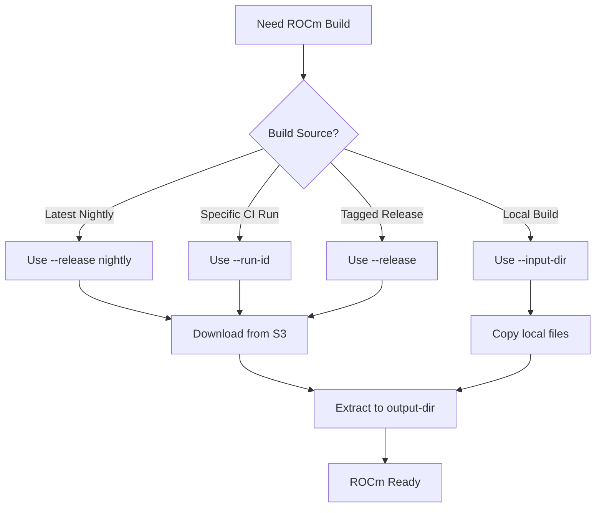
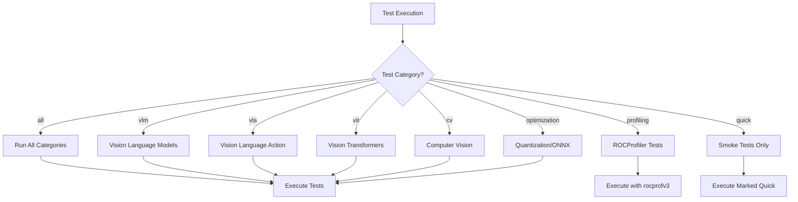
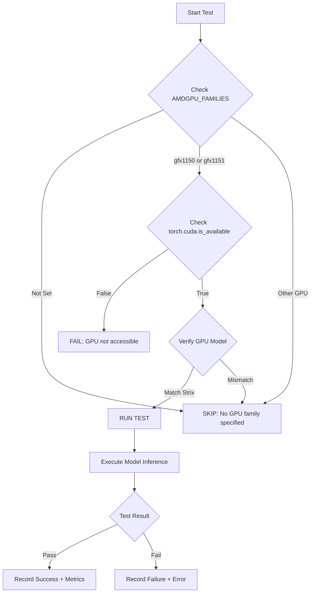

# Strix Testing Workflow - Sequence Diagram & Flow

## Overview

This document provides a comprehensive sequence diagram showing the complete workflow for functional and performance testing on AMD Strix platforms once a ROCm build is selected.

---

## 🔄 Complete Testing Sequence Diagram

```mermaid
sequenceDiagram
    autonumber
    
    participant Dev as Developer/CI Trigger
    participant GHA as GitHub Actions
    participant S3 as Artifact Storage (S3)
    participant Runner as GPU Test Runner
    participant Installer as ROCm Installer
    participant Docker as Container Runtime
    participant PyTest as Test Framework
    participant ROCm as ROCm Stack
    participant GPU as Strix GPU (gfx1150/1151)
    participant Profiler as ROCProfiler v3
    participant Results as Test Results
    
    %% Phase 1: Build Selection & Artifact Retrieval
    rect rgb(200, 220, 255)
        Note over Dev,S3: Phase 1: ROCm Build Selection & Retrieval
        Dev->>GHA: Trigger test workflow (manual/auto)
        Note right of Dev: Input Parameters:<br/>- Platform (Linux/Windows)<br/>- Strix variant (gfx1150/1151)<br/>- Test category (VLM/ViT/CV/etc)<br/>- Test type (smoke/quick/full)<br/>- ROCm build source (run-id/release)
        
        GHA->>GHA: Parse workflow inputs
        GHA->>S3: Request ROCm artifacts
        Note right of S3: Options:<br/>1. CI run ID (--run-id)<br/>2. Release tag (--release)<br/>3. Latest nightly/dev
        
        S3-->>GHA: Download artifacts (.tar.gz)
        Note right of S3: Artifacts:<br/>- Base ROCm stack<br/>- HIP runtime<br/>- ROCProfiler SDK<br/>- PyTorch binaries
    end
    
    %% Phase 2: Environment Setup
    rect rgb(200, 255, 220)
        Note over GHA,Docker: Phase 2: Test Environment Setup
        GHA->>Runner: Allocate GPU test runner
        Note right of Runner: Runner labels:<br/>- linux-strix-halo-gpu-rocm<br/>- windows-strix-halo-gpu-rocm
        
        Runner->>Docker: Pull ROCm container
        Note right of Docker: Container: rocm/pytorch:latest<br/>Includes: PyTorch + ROCm + GPU drivers
        
        Docker->>Docker: Configure container options
        Note right of Docker: Options:<br/>--device /dev/kfd<br/>--device /dev/dri<br/>--group-add video<br/>--ipc host
        
        GHA->>Installer: Execute install_rocm_from_artifacts.py
        Note right of Installer: python install_rocm_from_artifacts.py<br/>--run-id <ID> or --release <VER><br/>--amdgpu-family gfx1151<br/>--output-dir /opt/rocm
        
        Installer->>Installer: Extract ROCm tarballs
        Installer->>Docker: Install ROCm to container
        Note right of Docker: Installation paths:<br/>/opt/rocm/bin<br/>/opt/rocm/lib<br/>/opt/rocm/include
        
        Docker->>Docker: Set environment variables
        Note right of Docker: AMDGPU_FAMILIES=gfx1151<br/>ROCM_HOME=/opt/rocm<br/>THEROCK_BIN_DIR=/opt/rocm/bin
    end
    
    %% Phase 3: Dependency Installation
    rect rgb(255, 240, 220)
        Note over GHA,Docker: Phase 3: AI/ML Dependencies Installation
        GHA->>Docker: Install Python test dependencies
        Docker->>Docker: pip install pytest pytest-check
        Docker->>Docker: pip install transformers accelerate
        Docker->>Docker: pip install ultralytics opencv-python
        Docker->>Docker: pip install timm einops scipy
        
        Docker->>ROCm: Verify ROCm installation
        ROCm-->>Docker: ROCm info (rocminfo, hipconfig)
        
        Docker->>GPU: Detect Strix GPU
        GPU-->>Docker: GPU detected (gfx1150/1151)
        
        Docker->>PyTest: Verify PyTorch GPU access
        PyTest->>GPU: torch.cuda.is_available()
        GPU-->>PyTest: True (GPU accessible)
        
        alt GPU Not Available
            PyTest-->>GHA: FAIL - GPU not detected
            GHA-->>Dev: Abort testing (GPU required)
        end
    end
    
    %% Phase 4: Functional Testing
    rect rgb(255, 220, 220)
        Note over GHA,Results: Phase 4: Functional Testing (AI/ML Models)
        GHA->>PyTest: Execute functional tests
        Note right of GHA: Categories:<br/>- VLM (CLIP, LLaVA)<br/>- VLA (OWL-ViT)<br/>- ViT (Vision Transformers)<br/>- CV (YOLO, DETR)<br/>- Optimization (Quantization)
        
        loop For Each Test Category
            PyTest->>PyTest: Load test configuration
            PyTest->>GPU: Check AMDGPU_FAMILIES
            
            alt Strix GPU Detected
                PyTest->>ROCm: Initialize HIP runtime
                ROCm->>GPU: Allocate GPU memory
                
                PyTest->>PyTest: Load AI model (Hugging Face)
                Note right of PyTest: Model examples:<br/>- openai/clip-vit-base-patch32<br/>- facebook/dino-vitb16<br/>- ultralytics/yolov8n
                
                PyTest->>GPU: Transfer model to GPU
                GPU-->>PyTest: Model loaded on GPU
                
                PyTest->>GPU: Run inference (warmup)
                GPU-->>PyTest: Warmup complete
                
                PyTest->>GPU: Run inference (measured)
                GPU-->>PyTest: Inference results
                
                PyTest->>PyTest: Validate output correctness
                PyTest->>PyTest: Check memory usage
                PyTest->>PyTest: Measure latency
                
                alt Test Passed
                    PyTest->>Results: Record PASS + metrics
                else Test Failed
                    PyTest->>Results: Record FAIL + error details
                end
                
                PyTest->>GPU: Cleanup GPU memory
            else Strix GPU Not Detected
                PyTest->>Results: SKIP test (wrong GPU family)
            end
        end
        
        PyTest->>Results: Generate test-results-*.xml
        Results-->>GHA: Upload JUnit XML artifacts
    end
    
    %% Phase 5: Performance Profiling
    rect rgb(220, 255, 255)
        Note over GHA,Results: Phase 5: Performance Profiling (ROCProfiler)
        GHA->>PyTest: Execute profiling tests
        Note right of GHA: Test file:<br/>test_strix_rocprofv3.py<br/>test_profile_existing_tests.py
        
        PyTest->>Profiler: Check rocprofv3 installation
        Profiler-->>PyTest: rocprofv3 available
        
        loop For Each Model to Profile
            PyTest->>Profiler: Launch rocprofv3 wrapper
            Note right of Profiler: rocprofv3 --hip-trace<br/>--kernel-trace<br/>--memory-copy-trace<br/>--output-format pftrace<br/>-d traces/ -- python test.py
            
            Profiler->>GPU: Enable tracing hooks
            GPU-->>Profiler: Tracing enabled
            
            Profiler->>PyTest: Execute profiled test
            PyTest->>ROCm: Load model and run inference
            
            ROCm->>GPU: Execute HIP kernels
            GPU->>Profiler: Capture kernel timing
            GPU->>Profiler: Capture memory operations
            GPU->>Profiler: Capture GPU utilization
            
            GPU-->>ROCm: Inference complete
            ROCm-->>PyTest: Results returned
            
            Profiler->>Profiler: Process trace data
            Profiler->>Results: Write perfetto traces (.pftrace)
            Note right of Results: Trace outputs:<br/>- HIP API calls<br/>- Kernel execution times<br/>- Memory copy operations<br/>- GPU utilization
            
            PyTest->>Results: Validate trace files exist
            PyTest->>Results: Parse profiling metrics
            
            alt Profiling Successful
                PyTest->>Results: Record profiling metrics
                Note right of Results: Metrics:<br/>- Kernel execution time<br/>- Memory bandwidth<br/>- GPU occupancy<br/>- API call overhead
            else Profiling Failed
                PyTest->>Results: Record profiling error
            end
        end
        
        PyTest->>Results: Generate test-results-profiling-*.xml
        Results-->>GHA: Upload profiling artifacts
        Note right of Results: Artifacts:<br/>- XML test results<br/>- Perfetto trace files<br/>- Performance summary
    end
    
    %% Phase 6: Results Analysis & Reporting
    rect rgb(240, 220, 255)
        Note over GHA,Dev: Phase 6: Results Analysis & Reporting
        GHA->>Results: Collect all test results
        Results->>Results: Parse JUnit XML files
        Results->>Results: Aggregate pass/fail counts
        Results->>Results: Extract performance metrics
        
        GHA->>GHA: Display test summary
        Note right of GHA: Summary includes:<br/>- Total tests run<br/>- Pass/Fail/Skip counts<br/>- Test duration<br/>- GPU model detected<br/>- ROCm version used
        
        GHA->>GHA: Archive test artifacts
        Note right of GHA: Artifacts (30-day retention):<br/>- test-results-*.xml<br/>- profiling trace files<br/>- error logs<br/>- screenshots (if applicable)
        
        GHA->>Results: Display XML inline in logs
        Note right of Results: GitHub Actions UI shows:<br/>- Full test output<br/>- Error details<br/>- Stack traces
        
        alt All Tests Passed
            GHA-->>Dev: ✅ Workflow SUCCESS
        else Some Tests Failed
            GHA-->>Dev: ❌ Workflow FAILURE (with details)
        end
        
        Results-->>Dev: Download artifacts (optional)
        Note right of Dev: Developer can:<br/>- Review perfetto traces<br/>- Analyze performance bottlenecks<br/>- Compare against baselines
    end
```



---

## 📋 Detailed Phase Breakdown

### Phase 1: ROCm Build Selection & Retrieval

**Purpose**: Select and download the appropriate ROCm build artifacts for testing.

**Key Components**:
- **Input Methods**:
  1. GitHub workflow run ID (`--run-id`)
  2. Release tag/version (`--release`)
  3. Nightly/dev builds (latest)

**Script**: `build_tools/install_rocm_from_artifacts.py`

**Example Commands**:
```bash
# From CI workflow run
python build_tools/install_rocm_from_artifacts.py \
    --run-id 14474448215 \
    --amdgpu-family gfx1151 \
    --output-dir /opt/rocm

# From release tag
python build_tools/install_rocm_from_artifacts.py \
    --release 6.4.0rc20250416 \
    --amdgpu-family gfx1151 \
    --output-dir /opt/rocm
```

**Artifacts Downloaded**:
- Base ROCm stack (HIP, HSA)
- ROCProfiler SDK (rocprofv3)
- Math libraries (rocBLAS, rocFFT)
- ML libraries (MIOpen)
- Development tools

---

### Phase 2: Test Environment Setup

**Purpose**: Configure the test environment with ROCm and GPU access.

**Container**: `rocm/pytorch:latest`
- Pre-installed PyTorch with ROCm support
- GPU drivers and runtime
- Python environment

**Container Options**:
```yaml
options: >-
  --ipc host
  --group-add video
  --device /dev/kfd
  --device /dev/dri
  --group-add 110
  --user 0:0
```

**Environment Variables**:
```bash
AMDGPU_FAMILIES=gfx1151
ROCM_HOME=/opt/rocm
THEROCK_BIN_DIR=/opt/rocm/bin
PYTHONUNBUFFERED=1
```

---

### Phase 3: AI/ML Dependencies Installation

**Purpose**: Install Python packages required for AI/ML testing.

**Core Dependencies**:
```bash
pip install pytest pytest-check
pip install transformers accelerate
pip install ultralytics opencv-python pillow
pip install timm einops scipy matplotlib
```

**Verification Steps**:
1. Check ROCm installation: `rocminfo`
2. Check HIP: `hipconfig --version`
3. Check GPU access: `ls /dev/kfd /dev/dri`
4. **Critical**: Verify PyTorch GPU detection:
   ```python
   import torch
   assert torch.cuda.is_available()
   ```

---

### Phase 4: Functional Testing

**Purpose**: Validate AI/ML model functionality on Strix GPU.

**Test Categories** (from `.github/workflows/strix_ai_tests.yml`):

| Category | Models | Test File Location |
|----------|--------|-------------------|
| **VLM** | CLIP, LLaVA | `tests/strix_ai/vlm/` |
| **VLA** | OWL-ViT, Action Recognition | `tests/strix_ai/vla/` |
| **ViT** | Vision Transformers, DINOv2 | `tests/strix_ai/vit/` |
| **CV** | YOLOv8, DETR, Segmentation | `tests/strix_ai/cv/` |
| **Optimization** | Quantization, ONNX | `tests/strix_ai/optimization/` |

**Test Execution Flow**:
```bash
# Run specific category
python3 -m pytest tests/strix_ai/vlm/ -v -s \
    --junit-xml=test-results-vlm.xml

# Run quick smoke tests
python3 -m pytest tests/strix_ai/ -v -s \
    -m "quick" \
    --junit-xml=test-results-quick.xml
```

**Test Steps for Each Model**:
1. Check AMDGPU_FAMILIES environment variable
2. Skip if not Strix GPU (gfx1150/1151)
3. Initialize HIP runtime
4. Load AI model from Hugging Face
5. Transfer model to GPU
6. Run warmup iterations (kernel compilation)
7. Run measured inference
8. Validate output correctness
9. Measure latency and memory usage
10. Cleanup GPU memory

**Output**: JUnit XML files (`test-results-*.xml`)

---

### Phase 5: Performance Profiling

**Purpose**: Profile AI/ML workloads using ROCProfiler v3 for performance analysis.

**Tool**: `rocprofv3` (ROCProfiler SDK)

**Why rocprofv3?**
- Optimized for ROCm 6.2+ and Strix GPUs
- Outputs Perfetto traces (viewable in Chrome)
- Replaces legacy `rocprof` (roctracer)

**Profiling Command**:
```bash
rocprofv3 --hip-trace --kernel-trace --memory-copy-trace \
          --output-format pftrace -d ./traces -- python3 test_model.py
```

**Note**: `--rccl-trace` is NOT used for Strix because:
- Strix is a single integrated GPU (iGPU)
- No multi-GPU communication
- RCCL is excluded from Strix builds

**Test Files**:
1. **`test_strix_rocprofv3.py`**: Validation tests
   - Check rocprofv3 installation
   - Simple kernel profiling
   - PyTorch inference profiling
   - CLIP model profiling

2. **`test_profile_existing_tests.py`**: Integration tests
   - Profile existing VLM/ViT/CV/VLA tests
   - Extract performance metrics
   - Compare against baselines

**Captured Metrics**:
- HIP API call timing
- Kernel execution time
- Memory copy operations (Host ↔ Device)
- GPU utilization
- Memory bandwidth

**Output**:
- JUnit XML: `test-results-profiling-*.xml`
- Perfetto traces: `v3_traces/*.pftrace`

**Viewing Traces**:
```bash
# Open in Chrome
# Navigate to: chrome://tracing
# Load .pftrace file
```

---

### Phase 6: Results Analysis & Reporting

**Purpose**: Aggregate results and provide comprehensive reporting.

**Results Collection**:
1. Parse all JUnit XML files
2. Extract test counts (pass/fail/skip)
3. Extract performance metrics
4. Generate summary report

**GitHub Actions Display**:
```yaml
- name: 📊 Display Test Results XML
  if: always()
  run: |
    for xml_file in test-results-*.xml; do
      cat "$xml_file"
    done
```

**Artifact Archival** (30-day retention):
```yaml
- name: 💾 Archive Test Results
  uses: actions/upload-artifact@v4
  with:
    name: strix-ai-test-results-${{ env.PLATFORM }}-${{ env.AMDGPU_FAMILIES }}
    path: |
      test-results-*.xml
      v3_traces/
      *_traces/
```

**Test Summary Output**:
```
=== Strix AI Test Summary ===
Trigger: workflow_dispatch
Branch: users/rponnuru/strix_poc
Platform: linux
Strix Variant: gfx1151
Test Category: vlm
Test Type: quick
Runner: linux-strix-halo-gpu-rocm
Status: success
```

---

## 🔧 Manual Testing Workflow

For developers who want to test locally:

### Step 1: Install ROCm from Artifacts

```bash
# Choose your source:
# Option 1: From CI run
python build_tools/install_rocm_from_artifacts.py \
    --run-id <WORKFLOW_RUN_ID> \
    --amdgpu-family gfx1151 \
    --output-dir ./rocm-build

# Option 2: From release
python build_tools/install_rocm_from_artifacts.py \
    --release 6.4.0rc20250416 \
    --amdgpu-family gfx1151 \
    --output-dir ./rocm-build
```

### Step 2: Set Environment Variables

```bash
export AMDGPU_FAMILIES=gfx1151
export THEROCK_BIN_DIR=$(pwd)/rocm-build/bin
export ROCM_HOME=$(pwd)/rocm-build
export PATH=$THEROCK_BIN_DIR:$PATH
```

### Step 3: Install Python Dependencies

```bash
pip install transformers accelerate ultralytics opencv-python pillow torch torchvision
pip install pytest pytest-check
```

### Step 4: Verify GPU Access

```bash
rocminfo | grep gfx115
# Should show gfx1150 or gfx1151

python3 -c "import torch; print(torch.cuda.is_available())"
# Should print: True
```

### Step 5: Run Functional Tests

```bash
# Run all tests
pytest tests/strix_ai/ -v

# Run specific category
pytest tests/strix_ai/vlm/ -v        # VLM tests
pytest tests/strix_ai/vit/ -v        # ViT tests
pytest tests/strix_ai/cv/ -v         # CV tests

# Run quick smoke tests
pytest tests/strix_ai/ -m "quick" -v
```

### Step 6: Run Profiling Tests

```bash
# Verify rocprofv3 is installed
rocprofv3 --version

# Run profiling tests
pytest tests/strix_ai/profiling/test_strix_rocprofv3.py -v -s

# Profile a specific model manually
rocprofv3 --hip-trace --kernel-trace --memory-copy-trace \
          --output-format pftrace -d ./my_traces -- \
          python3 -m pytest tests/strix_ai/vlm/test_clip.py -v -s
```

### Step 7: Analyze Results

```bash
# View test results
cat test-results-*.xml

# View profiling traces
# Open chrome://tracing in Chrome browser
# Load .pftrace file from ./my_traces/
```

---

## 🎯 Key Decision Points

### 1. **Selecting ROCm Build Source**



### 2. **Test Category Selection**



### 3. **GPU Detection Flow**



---

## 📊 Performance Metrics Collected

### Functional Testing Metrics

| Metric | Description | Unit |
|--------|-------------|------|
| **Inference Latency** | Time to process one input | milliseconds |
| **Throughput** | Inputs processed per second | FPS / samples/sec |
| **First Run Time** | Initial execution (includes compilation) | seconds |
| **Warmup Time** | Time for kernel compilation | seconds |
| **Peak Memory** | Maximum GPU memory used | GB |
| **Memory Allocated** | Total memory allocated | GB |

### Profiling Metrics (rocprofv3)

| Metric | Description | Source |
|--------|-------------|--------|
| **Kernel Execution Time** | GPU kernel duration | HIP trace |
| **Memory Copy Time** | Host ↔ Device transfer | Memory trace |
| **API Call Overhead** | HIP API latency | HIP trace |
| **GPU Utilization** | Percentage of time GPU active | Kernel trace |
| **Memory Bandwidth** | Data transfer rate | Memory trace |
| **Kernel Launch Count** | Number of kernels executed | Kernel trace |

---

## 🚨 Common Issues & Troubleshooting

### Issue 1: GPU Not Detected

**Symptom**: `torch.cuda.is_available()` returns `False`

**Solutions**:
```bash
# Check ROCm installation
rocminfo | grep gfx115

# Check device permissions
ls -la /dev/kfd /dev/dri

# Verify container options (if using Docker)
# Must include: --device /dev/kfd --device /dev/dri
```

### Issue 2: rocprofv3 Not Found

**Symptom**: `command not found: rocprofv3`

**Solutions**:
```bash
# Check if rocprofiler-sdk is installed
ls /opt/rocm/bin/rocprofv3

# Add to PATH
export PATH=/opt/rocm/bin:$PATH

# Verify version
rocprofv3 --version
```

### Issue 3: Out of Memory (OOM)

**Symptom**: CUDA out of memory errors

**Solutions**:
```python
# Use float16 precision
model = model.half()

# Reduce batch size
batch_size = 1

# Enable gradient checkpointing (for training)
model.gradient_checkpointing_enable()
```

### Issue 4: Model Download Failures

**Symptom**: Hugging Face download timeouts

**Solutions**:
```bash
# Set cache directory
export HF_HOME=/path/to/large/storage

# Pre-download models
python3 -c "from transformers import AutoModel; AutoModel.from_pretrained('openai/clip-vit-base-patch32')"
```

### Issue 5: Tests Skipped

**Symptom**: All tests marked as SKIPPED

**Check**:
```bash
# Verify AMDGPU_FAMILIES is set
echo $AMDGPU_FAMILIES

# Should be gfx1150 or gfx1151
export AMDGPU_FAMILIES=gfx1151
```

---

## 📚 References

### Documentation Files
- **Test Suite Overview**: `tests/strix_ai/README.md`
- **ROCProfiler v3 Guide**: `tests/strix_ai/profiling/README_ROCPROFV3.md`
- **Migration Guide**: `tests/strix_ai/profiling/MIGRATION_GUIDE.md`
- **Installing Artifacts**: `docs/development/installing_artifacts.md`

### Workflow Files
- **Main Test Workflow**: `.github/workflows/strix_ai_tests.yml`
- **Artifact Testing**: `.github/workflows/test_artifacts.yml`
- **Sanity Check**: `.github/workflows/test_sanity_check.yml`

### Scripts
- **ROCm Installer**: `build_tools/install_rocm_from_artifacts.py`
- **Artifact Fetcher**: `build_tools/fetch_artifacts.py`
- **Test Configuration**: `build_tools/github_actions/fetch_test_configurations.py`

### External Resources
- **ROCm Documentation**: https://rocm.docs.amd.com/
- **ROCProfiler SDK**: https://github.com/ROCm/rocprofiler-sdk
- **Perfetto Trace Viewer**: https://ui.perfetto.dev/
- **Chrome Tracing**: chrome://tracing

---

## 🎓 Best Practices

### 1. **Always Use rocprofv3 for Strix**
- rocprofv3 is optimized for ROCm 6.2+ and Strix GPUs
- Legacy rocprof (roctracer) is deprecated
- Perfetto traces provide better visualization

### 2. **Include Warmup Iterations**
- First run includes kernel compilation (slow)
- Run 2-3 warmup iterations before measuring
- Only measure steady-state performance

### 3. **Clean Up GPU Memory**
- Call `torch.cuda.empty_cache()` after tests
- Delete models explicitly: `del model`
- Prevents OOM in subsequent tests

### 4. **Use Appropriate Precision**
- Strix benefits from FP16 precision
- Use `model.half()` or `torch.float16`
- Reduces memory usage and improves performance

### 5. **Test on Actual Hardware**
- Strix-specific optimizations only visible on real hardware
- Use appropriate GPU runner labels
- Verify AMDGPU_FAMILIES matches physical GPU

### 6. **Archive Profiling Traces**
- Always save profiling artifacts
- Use 30-day retention for analysis
- Include timestamps in artifact names

### 7. **Monitor Resource Usage**
- Track memory usage across tests
- Set timeouts for long-running tests
- Use `--timeout-minutes` in workflows

---

## ✅ Checklist for New Tests

When adding new Strix AI/ML tests:

- [ ] Place test in appropriate category directory (`vlm/`, `vit/`, `cv/`, etc.)
- [ ] Add `@pytest.mark.strix` decorator
- [ ] Add category marker (`@pytest.mark.vlm`, etc.)
- [ ] Add priority marker (`@pytest.mark.p0`, `@pytest.mark.p1`)
- [ ] Add `@pytest.mark.quick` for smoke tests
- [ ] Check `AMDGPU_FAMILIES` environment variable
- [ ] Skip if not Strix GPU (gfx1150/1151)
- [ ] Use shared fixtures from `conftest.py`
- [ ] Include warmup iterations
- [ ] Measure and record performance metrics
- [ ] Clean up GPU memory after test
- [ ] Add to test matrix in workflow
- [ ] Document expected performance targets
- [ ] Test on actual Strix hardware

---

## 🔗 Related Documents

- **Strix Testing Guide**: For general Strix testing information
- **Strix AI/ML Test Plan**: For comprehensive test coverage
- **TheRock Test Harness**: For test framework architecture
- **Adding Tests Guide**: For contributing new tests

---

**Last Updated**: 2025-12-18  
**Maintainer**: ROCm TheRock Team  
**Contact**: File issues on GitHub

