# Strix Testing Workflow - Sequence Diagram & Flow

## Overview

This document provides a comprehensive sequence diagram showing the complete workflow for Strix testing on AMD Strix platforms (gfx1150/1151) once a ROCm build is selected.

The testing workflow consists of **7 distinct phases**:
1. **ROCm Build Selection & Retrieval** - Download and install ROCm artifacts
2. **Test Environment Setup** - Configure container, GPU access, and environment
3. **AI/ML Dependencies Installation** - Install Python packages and verify GPU
4. **Functional Testing** - Validate correctness of AI/ML models
5. **Performance Testing** - Measure latency, throughput, and memory metrics
6. **Deep Profiling** - Capture detailed GPU traces with ROCProfiler v3
7. **Results Analysis & Reporting** - Aggregate results and generate reports

**Key Separation**: This workflow clearly separates:
- **Functional testing** (Phase 4): Focuses on correctness validation
- **Performance testing** (Phase 5): Measures quantitative metrics (latency, throughput, memory)
- **Profiling** (Phase 6): Deep GPU analysis with traces for optimization

---

## 🔄 Complete Testing Sequence Diagram

```mermaid
sequenceDiagram
    autonumber
    
    participant Dev as Developer/CI Trigger
    participant GHA as GitHub Actions
    participant S3 as Artifact Storage (S3)
    participant Runner as GPU Test Runner
    participant Installer as ROCm Installer
    participant Docker as Container Runtime
    participant PyTest as Test Framework
    participant ROCm as ROCm Stack
    participant GPU as Strix GPU (gfx1150/1151)
    participant Profiler as ROCProfiler v3
    participant Results as Test Results
    
    %% Phase 1: Build Selection & Artifact Retrieval
    rect rgb(200, 220, 255)
        Note over Dev,S3: Phase 1: ROCm Build Selection & Retrieval
        Dev->>GHA: Trigger test workflow (manual/auto)
        Note right of Dev: Input Parameters:<br/>- Platform (Linux/Windows)<br/>- Strix variant (gfx1150/1151)<br/>- Test category (VLM/ViT/CV/etc)<br/>- Test type (smoke/quick/full)<br/>- ROCm build source (run-id/release)
        
        GHA->>GHA: Parse workflow inputs
        GHA->>S3: Request ROCm artifacts
        Note right of S3: Options:<br/>1. CI run ID (--run-id)<br/>2. Release tag (--release)<br/>3. Latest nightly/dev
        
        S3-->>GHA: Download artifacts (.tar.gz)
        Note right of S3: Artifacts:<br/>- Base ROCm stack<br/>- HIP runtime<br/>- ROCProfiler SDK<br/>- PyTorch binaries
    end
    
    %% Phase 2: Environment Setup
    rect rgb(200, 255, 220)
        Note over GHA,Docker: Phase 2: Test Environment Setup
        GHA->>Runner: Allocate GPU test runner
        Note right of Runner: Runner labels:<br/>- linux-strix-halo-gpu-rocm<br/>- windows-strix-halo-gpu-rocm
        
        Runner->>Docker: Pull ROCm container
        Note right of Docker: Container: rocm/pytorch:latest<br/>Includes: PyTorch + ROCm + GPU drivers
        
        Docker->>Docker: Configure container options
        Note right of Docker: Options:<br/>--device /dev/kfd<br/>--device /dev/dri<br/>--group-add video<br/>--ipc host
        
        GHA->>Installer: Execute install_rocm_from_artifacts.py
        Note right of Installer: python install_rocm_from_artifacts.py<br/>--run-id <ID> or --release <VER><br/>--amdgpu-family gfx1151<br/>--output-dir /opt/rocm
        
        Installer->>Installer: Extract ROCm tarballs
        Installer->>Docker: Install ROCm to container
        Note right of Docker: Installation paths:<br/>/opt/rocm/bin<br/>/opt/rocm/lib<br/>/opt/rocm/include
        
        Docker->>Docker: Set environment variables
        Note right of Docker: AMDGPU_FAMILIES=gfx1151<br/>ROCM_HOME=/opt/rocm<br/>THEROCK_BIN_DIR=/opt/rocm/bin
    end
    
    %% Phase 3: Dependency Installation
    rect rgb(255, 240, 220)
        Note over GHA,Docker: Phase 3: AI/ML Dependencies Installation
        GHA->>Docker: Install Python test dependencies
        Docker->>Docker: pip install pytest pytest-check
        Docker->>Docker: pip install transformers accelerate
        Docker->>Docker: pip install ultralytics opencv-python
        Docker->>Docker: pip install timm einops scipy
        
        Docker->>ROCm: Verify ROCm installation
        ROCm-->>Docker: ROCm info (rocminfo, hipconfig)
        
        Docker->>GPU: Detect Strix GPU
        GPU-->>Docker: GPU detected (gfx1150/1151)
        
        Docker->>PyTest: Verify PyTorch GPU access
        PyTest->>GPU: torch.cuda.is_available()
        GPU-->>PyTest: True (GPU accessible)
        
        alt GPU Not Available
            PyTest-->>GHA: FAIL - GPU not detected
            GHA-->>Dev: Abort testing (GPU required)
        end
    end
    
    %% Phase 4: Functional Testing
    rect rgb(255, 220, 220)
        Note over GHA,Results: Phase 4: Functional Testing (Correctness Validation)
        GHA->>PyTest: Execute functional tests
        Note right of GHA: Categories:<br/>- VLM (CLIP, LLaVA)<br/>- VLA (OWL-ViT)<br/>- ViT (Vision Transformers)<br/>- CV (YOLO, DETR)<br/>- Optimization (Quantization)
        
        loop For Each Test Category
            PyTest->>PyTest: Load test configuration
            PyTest->>GPU: Check AMDGPU_FAMILIES
            
            alt Strix GPU Detected
                PyTest->>ROCm: Initialize HIP runtime
                ROCm->>GPU: Allocate GPU memory
                
                PyTest->>PyTest: Load AI model (Hugging Face)
                Note right of PyTest: Model examples:<br/>- openai/clip-vit-base-patch32<br/>- facebook/dino-vitb16<br/>- ultralytics/yolov8n
                
                PyTest->>GPU: Transfer model to GPU
                GPU-->>PyTest: Model loaded on GPU
                
                PyTest->>GPU: Run inference (warmup)
                GPU-->>PyTest: Warmup complete
                
                PyTest->>GPU: Run inference (test)
                GPU-->>PyTest: Inference results
                
                PyTest->>PyTest: Validate output correctness
                Note right of PyTest: Checks:<br/>- Output shape correct<br/>- Output values valid<br/>- No NaN/Inf values<br/>- Expected classifications
                
                alt Test Passed
                    PyTest->>Results: Record PASS
                else Test Failed
                    PyTest->>Results: Record FAIL + error details
                end
                
                PyTest->>GPU: Cleanup GPU memory
            else Strix GPU Not Detected
                PyTest->>Results: SKIP test (wrong GPU family)
            end
        end
        
        PyTest->>Results: Generate test-results-*.xml
        Results-->>GHA: Upload JUnit XML artifacts
    end
    
    %% Phase 5: Performance Testing
    rect rgb(255, 255, 220)
        Note over GHA,Results: Phase 5: Performance Testing (Metrics Collection)
        GHA->>PyTest: Execute performance tests
        Note right of GHA: Focus: Latency, Throughput,<br/>Memory Usage, FPS
        
        loop For Each Model to Benchmark
            PyTest->>PyTest: Load model configuration
            PyTest->>GPU: Check AMDGPU_FAMILIES
            
            alt Strix GPU Detected
                PyTest->>ROCm: Initialize HIP runtime
                ROCm->>GPU: Allocate GPU memory
                
                PyTest->>PyTest: Load AI model
                PyTest->>GPU: Transfer model to GPU
                
                PyTest->>GPU: Run warmup iterations (3-5x)
                Note right of GPU: Warmup compiles kernels<br/>and stabilizes GPU state
                GPU-->>PyTest: Warmup complete
                
                PyTest->>PyTest: Start performance counters
                Note right of PyTest: Timers:<br/>- Inference latency<br/>- Total throughput<br/>- Memory usage
                
                loop Multiple Iterations (10-100x)
                    PyTest->>GPU: Run inference iteration
                    GPU-->>PyTest: Results
                    PyTest->>PyTest: Record iteration time
                end
                
                PyTest->>PyTest: Calculate statistics
                Note right of PyTest: Metrics:<br/>- Mean latency<br/>- P50/P95/P99 latency<br/>- Throughput (FPS)<br/>- Peak memory usage<br/>- Memory allocated
                
                PyTest->>Results: Record performance metrics
                Note right of Results: Output:<br/>- Latency: XXms<br/>- Throughput: XX FPS<br/>- Memory: X.XX GB
                
                PyTest->>GPU: Cleanup GPU memory
            else Strix GPU Not Detected
                PyTest->>Results: SKIP test (wrong GPU family)
            end
        end
        
        PyTest->>Results: Generate performance-results-*.xml
        Results-->>GHA: Upload performance artifacts
    end
    
    %% Phase 6: Profiling with ROCProfiler
    rect rgb(220, 255, 255)
        Note over GHA,Results: Phase 6: Deep Profiling (ROCProfiler v3)
        GHA->>PyTest: Execute profiling tests
        Note right of GHA: Test files:<br/>test_strix_rocprofv3.py<br/>test_profile_existing_tests.py
        
        PyTest->>Profiler: Check rocprofv3 installation
        Profiler-->>PyTest: rocprofv3 available
        
        alt rocprofv3 Not Available
            PyTest->>Results: SKIP profiling tests
            Note right of Results: rocprofiler-sdk not installed
        end
        
        loop For Each Model to Profile
            PyTest->>Profiler: Launch rocprofv3 wrapper
            Note right of Profiler: rocprofv3 --hip-trace<br/>--kernel-trace<br/>--memory-copy-trace<br/>--output-format pftrace<br/>-d traces/ -- python test.py
            
            Profiler->>GPU: Enable GPU tracing hooks
            Note right of GPU: Intercepts:<br/>- HIP API calls<br/>- Kernel launches<br/>- Memory operations
            GPU-->>Profiler: Tracing enabled
            
            Profiler->>PyTest: Execute profiled test
            PyTest->>ROCm: Load model and run inference
            
            ROCm->>GPU: Execute HIP kernels
            Note right of GPU: All GPU operations<br/>are now being traced
            
            GPU->>Profiler: Stream kernel timing data
            GPU->>Profiler: Stream memory copy data
            GPU->>Profiler: Stream API call data
            GPU->>Profiler: Stream GPU utilization
            
            GPU-->>ROCm: Inference complete
            ROCm-->>PyTest: Results returned
            
            Profiler->>Profiler: Process trace data
            Note right of Profiler: Processing:<br/>- Correlate events<br/>- Build timeline<br/>- Calculate statistics
            
            Profiler->>Results: Write perfetto traces (.pftrace)
            Note right of Results: Trace contents:<br/>- HIP API timeline<br/>- Kernel execution timeline<br/>- Memory copy timeline<br/>- GPU occupancy graph
            
            PyTest->>Results: Validate trace files exist
            PyTest->>Results: Parse profiling metrics
            
            PyTest->>PyTest: Extract key metrics
            Note right of PyTest: Extracted metrics:<br/>- Total kernel time<br/>- Average kernel duration<br/>- Memory bandwidth<br/>- GPU occupancy %<br/>- HIP API overhead
            
            alt Profiling Successful
                PyTest->>Results: Record profiling metrics + traces
            else Profiling Failed
                PyTest->>Results: Record profiling error
            end
        end
        
        PyTest->>Results: Generate profiling-results-*.xml
        Results-->>GHA: Upload profiling artifacts
        Note right of Results: Artifacts:<br/>- XML test results<br/>- Perfetto trace files (.pftrace)<br/>- Kernel statistics<br/>- Memory bandwidth logs
    end
    
    %% Phase 7: Results Analysis & Reporting
    rect rgb(240, 220, 255)
        Note over GHA,Dev: Phase 7: Results Analysis & Reporting
        GHA->>Results: Collect all test results
        Results->>Results: Parse JUnit XML files
        Results->>Results: Aggregate pass/fail counts
        Results->>Results: Extract performance metrics
        
        GHA->>GHA: Display test summary
        Note right of GHA: Summary includes:<br/>- Total tests run<br/>- Pass/Fail/Skip counts<br/>- Test duration<br/>- GPU model detected<br/>- ROCm version used
        
        GHA->>GHA: Archive test artifacts
        Note right of GHA: Artifacts (30-day retention):<br/>- test-results-*.xml<br/>- profiling trace files<br/>- error logs<br/>- screenshots (if applicable)
        
        GHA->>Results: Display XML inline in logs
        Note right of Results: GitHub Actions UI shows:<br/>- Full test output<br/>- Error details<br/>- Stack traces
        
        alt All Tests Passed
            GHA-->>Dev: ✅ Workflow SUCCESS
        else Some Tests Failed
            GHA-->>Dev: ❌ Workflow FAILURE (with details)
        end
        
        Results-->>Dev: Download artifacts (optional)
        Note right of Dev: Developer can:<br/>- Review perfetto traces<br/>- Analyze performance bottlenecks<br/>- Compare against baselines
    end
```



---

## 📋 Detailed Phase Breakdown

The complete testing workflow consists of 7 distinct phases:
1. **ROCm Build Selection & Retrieval** - Download artifacts
2. **Test Environment Setup** - Configure container and GPU
3. **AI/ML Dependencies Installation** - Install Python packages
4. **Functional Testing** - Validate correctness
5. **Performance Testing** - Measure metrics (latency, throughput, memory)
6. **Deep Profiling** - ROCProfiler v3 traces
7. **Results Analysis & Reporting** - Aggregate and report

---

### Phase 1: ROCm Build Selection & Retrieval

**Purpose**: Select and download the appropriate ROCm build artifacts for testing.

**Key Components**:
- **Input Methods**:
  1. GitHub workflow run ID (`--run-id`)
  2. Release tag/version (`--release`)
  3. Nightly/dev builds (latest)

**Script**: `build_tools/install_rocm_from_artifacts.py`

**Example Commands**:
```bash
# From CI workflow run
python build_tools/install_rocm_from_artifacts.py \
    --run-id 14474448215 \
    --amdgpu-family gfx1151 \
    --output-dir /opt/rocm

# From release tag
python build_tools/install_rocm_from_artifacts.py \
    --release 6.4.0rc20250416 \
    --amdgpu-family gfx1151 \
    --output-dir /opt/rocm
```

**Artifacts Downloaded**:
- Base ROCm stack (HIP, HSA)
- ROCProfiler SDK (rocprofv3)
- Math libraries (rocBLAS, rocFFT)
- ML libraries (MIOpen)
- Development tools

---

### Phase 2: Test Environment Setup

**Purpose**: Configure the test environment with ROCm and GPU access.

**Container**: `rocm/pytorch:latest`
- Pre-installed PyTorch with ROCm support
- GPU drivers and runtime
- Python environment

**Container Options**:
```yaml
options: >-
  --ipc host
  --group-add video
  --device /dev/kfd
  --device /dev/dri
  --group-add 110
  --user 0:0
```

**Environment Variables**:
```bash
AMDGPU_FAMILIES=gfx1151
ROCM_HOME=/opt/rocm
THEROCK_BIN_DIR=/opt/rocm/bin
PYTHONUNBUFFERED=1
```

---

### Phase 3: AI/ML Dependencies Installation

**Purpose**: Install Python packages required for AI/ML testing.

**Core Dependencies**:
```bash
pip install pytest pytest-check
pip install transformers accelerate
pip install ultralytics opencv-python pillow
pip install timm einops scipy matplotlib
```

**Verification Steps**:
1. Check ROCm installation: `rocminfo`
2. Check HIP: `hipconfig --version`
3. Check GPU access: `ls /dev/kfd /dev/dri`
4. **Critical**: Verify PyTorch GPU detection:
   ```python
   import torch
   assert torch.cuda.is_available()
   ```

---

### Phase 4: Functional Testing

**Purpose**: Validate AI/ML model functionality on Strix GPU.

**Test Categories** (from `.github/workflows/strix_ai_tests.yml`):

| Category | Models | Test File Location |
|----------|--------|-------------------|
| **VLM** | CLIP, LLaVA | `tests/strix_ai/vlm/` |
| **VLA** | OWL-ViT, Action Recognition | `tests/strix_ai/vla/` |
| **ViT** | Vision Transformers, DINOv2 | `tests/strix_ai/vit/` |
| **CV** | YOLOv8, DETR, Segmentation | `tests/strix_ai/cv/` |
| **Optimization** | Quantization, ONNX | `tests/strix_ai/optimization/` |

**Test Execution Flow**:
```bash
# Run specific category
python3 -m pytest tests/strix_ai/vlm/ -v -s \
    --junit-xml=test-results-vlm.xml

# Run quick smoke tests
python3 -m pytest tests/strix_ai/ -v -s \
    -m "quick" \
    --junit-xml=test-results-quick.xml
```

**Test Steps for Each Model**:
1. Check AMDGPU_FAMILIES environment variable
2. Skip if not Strix GPU (gfx1150/1151)
3. Initialize HIP runtime
4. Load AI model from Hugging Face
5. Transfer model to GPU
6. Run warmup iterations (kernel compilation)
7. Run inference test
8. **Validate output correctness** (primary focus)
   - Check output shape is correct
   - Verify output values are valid (no NaN/Inf)
   - Validate expected classifications/predictions
9. Cleanup GPU memory

**Output**: JUnit XML files (`test-results-*.xml`) with PASS/FAIL/SKIP status

---

### Phase 5: Performance Testing

**Purpose**: Measure performance metrics (latency, throughput, memory usage) for AI/ML workloads on Strix GPU.

**Focus**: Quantitative performance measurements without deep profiling.

**Test Execution**:
```bash
# Run performance benchmarks
python3 -m pytest tests/strix_ai/benchmarks/ -v -s \
    --junit-xml=performance-results.xml

# Or run performance-focused tests in each category
python3 -m pytest tests/strix_ai/ -v -s \
    -m "performance" \
    --junit-xml=performance-results.xml
```

**Test Steps for Each Model**:
1. Check AMDGPU_FAMILIES environment variable
2. Skip if not Strix GPU (gfx1150/1151)
3. Initialize HIP runtime
4. Load AI model from Hugging Face
5. Transfer model to GPU
6. **Run warmup iterations (3-5x)** - Compile kernels, stabilize GPU state
7. **Start performance measurement**
8. Run multiple inference iterations (10-100x)
9. **Collect metrics**:
   - **Latency**: Mean, P50, P95, P99 inference time
   - **Throughput**: Frames per second (FPS) or samples/sec
   - **Memory**: Peak GPU memory, total allocated
   - **First-run overhead**: Time for initial compilation
10. Cleanup GPU memory

**Metrics Collected**:

| Metric | Description | Unit | Target (Example) |
|--------|-------------|------|------------------|
| **Mean Latency** | Average inference time | milliseconds | < 50ms for CLIP |
| **P95 Latency** | 95th percentile latency | milliseconds | < 75ms for CLIP |
| **Throughput** | Samples processed per second | FPS / samples/sec | > 30 FPS for ViT |
| **Peak Memory** | Maximum GPU memory used | GB | < 4GB |
| **Memory Allocated** | Total GPU memory allocated | GB | < 6GB |
| **First Run Time** | Initial execution (with compilation) | seconds | < 10s |

**Output**: 
- JUnit XML: `performance-results-*.xml`
- Performance logs with detailed metrics
- Comparison against baseline targets

**Example Performance Test**:
```python
import torch
import time
from transformers import CLIPModel, CLIPProcessor

# Load model
model = CLIPModel.from_pretrained("openai/clip-vit-base-patch32").cuda()
processor = CLIPProcessor.from_pretrained("openai/clip-vit-base-patch32")

# Warmup
for _ in range(5):
    with torch.no_grad():
        outputs = model(**inputs)

# Performance measurement
latencies = []
for _ in range(100):
    start = time.time()
    with torch.no_grad():
        outputs = model(**inputs)
    torch.cuda.synchronize()
    latencies.append(time.time() - start)

# Calculate metrics
mean_latency = np.mean(latencies) * 1000  # ms
p95_latency = np.percentile(latencies, 95) * 1000  # ms
throughput = 1000 / mean_latency  # FPS
peak_memory = torch.cuda.max_memory_allocated() / 1e9  # GB
```

---

### Phase 6: Deep Profiling (ROCProfiler v3)

**Purpose**: Profile AI/ML workloads using ROCProfiler v3 for detailed GPU performance analysis.

**Focus**: Deep GPU tracing for bottleneck analysis and optimization.

**Tool**: `rocprofv3` (ROCProfiler SDK)

**Why rocprofv3?**
- Optimized for ROCm 6.2+ and Strix GPUs
- Outputs Perfetto traces (viewable in Chrome)
- Replaces legacy `rocprof` (roctracer)
- Provides detailed GPU timeline visualization

**Profiling Command**:
```bash
rocprofv3 --hip-trace --kernel-trace --memory-copy-trace \
          --output-format pftrace -d ./traces -- python3 test_model.py
```

**Note**: `--rccl-trace` is NOT used for Strix because:
- Strix is a single integrated GPU (iGPU)
- No multi-GPU communication
- RCCL is excluded from Strix builds

**Test Execution**:
```bash
# Run profiling validation tests
pytest tests/strix_ai/profiling/test_strix_rocprofv3.py -v -s \
    --junit-xml=profiling-results-validation.xml

# Run integration profiling tests
pytest tests/strix_ai/profiling/test_profile_existing_tests.py -v -s \
    --junit-xml=profiling-results-integration.xml
```

**Test Files**:
1. **`test_strix_rocprofv3.py`**: ROCProfiler validation
   - Check rocprofv3 installation
   - Simple kernel profiling
   - PyTorch inference profiling
   - CLIP model profiling with trace validation

2. **`test_profile_existing_tests.py`**: Comprehensive model profiling
   - Profile CLIP (VLM category)
   - Profile ViT (Vision Transformer category)
   - Profile YOLO (Computer Vision category)
   - Profile OWL-ViT (VLA category)
   - Extract and compare profiling metrics

**Profiling Steps**:
1. Verify rocprofv3 is installed
2. Launch rocprofv3 wrapper with tracing flags
3. Execute AI/ML model inference
4. Capture GPU events:
   - HIP API calls (launch overhead)
   - Kernel executions (compute time)
   - Memory operations (Host ↔ Device transfers)
   - GPU state transitions
5. Generate Perfetto trace files (.pftrace)
6. Parse and extract key metrics
7. Validate trace completeness

**Captured Data in Traces**:

| Data Type | Description | Use Case |
|-----------|-------------|----------|
| **HIP API Timeline** | All HIP function calls with timing | Identify API overhead |
| **Kernel Timeline** | GPU kernel execution with duration | Find slow kernels |
| **Memory Copy Timeline** | Host ↔ Device transfers | Identify memory bottlenecks |
| **GPU Occupancy** | GPU utilization percentage | Check GPU efficiency |
| **Kernel Launch Overhead** | Time between API call and execution | Optimize launch patterns |

**Extracted Profiling Metrics**:
- Total kernel execution time
- Average kernel duration
- Number of kernel launches
- Memory bandwidth utilization
- HIP API call overhead
- GPU occupancy percentage
- Longest running kernels (top 10)
- Memory copy vs compute ratio

**Output**:
- JUnit XML: `profiling-results-*.xml`
- Perfetto traces: `v3_traces/*.pftrace`
- Kernel statistics: CSV or JSON format
- Performance summary report

**Viewing and Analyzing Traces**:

**Option 1: Chrome Tracing (Built-in)**
```bash
# Open Chrome browser
# Navigate to: chrome://tracing
# Click "Load" button
# Select .pftrace file from v3_traces/
```

**Option 2: Perfetto Web UI**
```bash
# Navigate to: https://ui.perfetto.dev/
# Drag and drop .pftrace file
# More features than chrome://tracing
```

**Trace Analysis Workflow**:
1. Open trace in Perfetto UI
2. Zoom into inference section
3. Identify kernel patterns
4. Look for gaps (idle GPU time)
5. Check memory copy overlaps
6. Identify performance bottlenecks
7. Compare against baseline traces

---

### Phase 7: Results Analysis & Reporting

**Purpose**: Aggregate results and provide comprehensive reporting.

**Results Collection**:
1. Parse all JUnit XML files
2. Extract test counts (pass/fail/skip)
3. Extract performance metrics
4. Generate summary report

**GitHub Actions Display**:
```yaml
- name: 📊 Display Test Results XML
  if: always()
  run: |
    for xml_file in test-results-*.xml; do
      cat "$xml_file"
    done
```

**Artifact Archival** (30-day retention):
```yaml
- name: 💾 Archive Test Results
  uses: actions/upload-artifact@v4
  with:
    name: strix-ai-test-results-${{ env.PLATFORM }}-${{ env.AMDGPU_FAMILIES }}
    path: |
      test-results-*.xml
      v3_traces/
      *_traces/
```

**Test Summary Output**:
```
=== Strix AI Test Summary ===
Trigger: workflow_dispatch
Branch: users/rponnuru/strix_poc
Platform: linux
Strix Variant: gfx1151
Test Category: vlm
Test Type: quick
Runner: linux-strix-halo-gpu-rocm
Status: success
```

---

## 🔧 Manual Testing Workflow

For developers who want to test locally:

### Step 1: Install ROCm from Artifacts

```bash
# Choose your source:
# Option 1: From CI run
python build_tools/install_rocm_from_artifacts.py \
    --run-id <WORKFLOW_RUN_ID> \
    --amdgpu-family gfx1151 \
    --output-dir ./rocm-build

# Option 2: From release
python build_tools/install_rocm_from_artifacts.py \
    --release 6.4.0rc20250416 \
    --amdgpu-family gfx1151 \
    --output-dir ./rocm-build
```

### Step 2: Set Environment Variables

```bash
export AMDGPU_FAMILIES=gfx1151
export THEROCK_BIN_DIR=$(pwd)/rocm-build/bin
export ROCM_HOME=$(pwd)/rocm-build
export PATH=$THEROCK_BIN_DIR:$PATH
```

### Step 3: Install Python Dependencies

```bash
pip install transformers accelerate ultralytics opencv-python pillow torch torchvision
pip install pytest pytest-check
```

### Step 4: Verify GPU Access

```bash
rocminfo | grep gfx115
# Should show gfx1150 or gfx1151

python3 -c "import torch; print(torch.cuda.is_available())"
# Should print: True
```

### Step 5: Run Functional Tests (Correctness)

**Purpose**: Validate that models run correctly on Strix GPU

```bash
# Run all functional tests
pytest tests/strix_ai/ -v

# Run specific category
pytest tests/strix_ai/vlm/ -v        # VLM tests
pytest tests/strix_ai/vit/ -v        # ViT tests
pytest tests/strix_ai/cv/ -v         # CV tests

# Run quick smoke tests
pytest tests/strix_ai/ -m "quick" -v
```

**Expected Output**: PASS/FAIL/SKIP for each test, validates correctness only

---

### Step 6: Run Performance Tests (Metrics)

**Purpose**: Measure latency, throughput, and memory usage

```bash
# Run performance benchmarks
pytest tests/strix_ai/benchmarks/ -v -s

# Or run performance-focused tests
pytest tests/strix_ai/ -v -s -m "performance"

# Run specific model performance test
pytest tests/strix_ai/vlm/test_clip.py::test_clip_performance -v -s
```

**Expected Output**:
- Mean latency (ms)
- P95/P99 latency (ms)
- Throughput (FPS)
- Peak memory usage (GB)

**Example output**:
```
CLIP Performance:
  Mean Latency: 45.2ms
  P95 Latency: 68.3ms
  Throughput: 22.1 FPS
  Peak Memory: 2.8GB
```

---

### Step 7: Run Profiling Tests (Deep Analysis)

**Purpose**: Capture detailed GPU traces for optimization

```bash
# Verify rocprofv3 is installed
rocprofv3 --version

# Run profiling validation tests
pytest tests/strix_ai/profiling/test_strix_rocprofv3.py -v -s

# Run comprehensive model profiling
pytest tests/strix_ai/profiling/test_profile_existing_tests.py -v -s

# Profile a specific model manually (advanced)
rocprofv3 --hip-trace --kernel-trace --memory-copy-trace \
          --output-format pftrace -d ./my_traces -- \
          python3 -m pytest tests/strix_ai/vlm/test_clip.py::test_clip_inference -v -s
```

**Expected Output**:
- Perfetto trace files (.pftrace)
- Kernel statistics
- Memory bandwidth logs
- API overhead metrics

---

### Step 8: Analyze Results

```bash
# View functional test results
cat test-results-*.xml

# View performance metrics
cat performance-results-*.xml

# View profiling results
cat profiling-results-*.xml

# Open profiling traces in browser
# Option 1: Chrome Tracing
#   Navigate to: chrome://tracing
#   Load .pftrace file from ./my_traces/
#
# Option 2: Perfetto UI (recommended)
#   Navigate to: https://ui.perfetto.dev/
#   Drag and drop .pftrace file
```

**Trace Analysis Tips**:
1. Look for long-running kernels
2. Identify memory copy bottlenecks
3. Check for GPU idle time (gaps)
4. Verify kernel launch patterns
5. Compare against baseline traces

---

## 🎯 Key Decision Points

### 1. **Selecting ROCm Build Source**


### 2. **Test Category Selection**


### 3. **GPU Detection Flow**


---

## 📊 Metrics Collected Across Phases

### Phase 4: Functional Testing Metrics

**Focus**: Correctness validation

| Metric | Description | Output |
|--------|-------------|--------|
| **Test Status** | Pass/Fail/Skip | PASS/FAIL/SKIP |
| **Output Correctness** | Validation of model predictions | Boolean |
| **Error Messages** | Failure details and stack traces | String |
| **Test Duration** | Total test execution time | seconds |

### Phase 5: Performance Testing Metrics

**Focus**: Quantitative performance measurements

| Metric | Description | Unit | Target (Example) |
|--------|-------------|------|------------------|
| **Mean Latency** | Average inference time | milliseconds | < 50ms (CLIP) |
| **P50 Latency** | Median inference time | milliseconds | < 45ms (CLIP) |
| **P95 Latency** | 95th percentile latency | milliseconds | < 75ms (CLIP) |
| **P99 Latency** | 99th percentile latency | milliseconds | < 100ms (CLIP) |
| **Throughput** | Samples processed per second | FPS / samples/sec | > 30 FPS (ViT) |
| **First Run Time** | Initial execution (with compilation) | seconds | < 10s |
| **Warmup Time** | Time for kernel compilation | seconds | < 5s |
| **Peak Memory** | Maximum GPU memory used | GB | < 4GB |
| **Memory Allocated** | Total GPU memory allocated | GB | < 6GB |
| **Batch Size** | Number of samples per batch | count | 1, 4, 8 |
| **Iterations** | Number of test iterations | count | 100 |

### Phase 6: Profiling Metrics (ROCProfiler v3)

**Focus**: Deep GPU analysis and bottleneck identification

| Metric | Description | Source | Use Case |
|--------|-------------|--------|----------|
| **Total Kernel Time** | Sum of all kernel execution times | Kernel trace | Overall compute time |
| **Average Kernel Duration** | Mean time per kernel launch | Kernel trace | Kernel efficiency |
| **Kernel Launch Count** | Number of kernels executed | Kernel trace | Launch overhead analysis |
| **Memory Copy Time** | Host ↔ Device transfer duration | Memory trace | Memory bottleneck identification |
| **HIP API Overhead** | Time spent in HIP API calls | HIP trace | API efficiency |
| **GPU Utilization %** | Percentage of time GPU is active | Kernel trace | GPU efficiency |
| **Memory Bandwidth** | Data transfer rate (GB/s) | Memory trace | Memory performance |
| **Kernel Occupancy** | GPU occupancy per kernel | Kernel trace | Resource utilization |
| **Longest Kernels** | Top 10 slowest kernels | Kernel trace | Optimization targets |
| **Idle GPU Time** | Gaps between kernel executions | Timeline | Launch optimization |

---

## 🚨 Common Issues & Troubleshooting

### Issue 1: GPU Not Detected

**Symptom**: `torch.cuda.is_available()` returns `False`

**Solutions**:
```bash
# Check ROCm installation
rocminfo | grep gfx115

# Check device permissions
ls -la /dev/kfd /dev/dri

# Verify container options (if using Docker)
# Must include: --device /dev/kfd --device /dev/dri
```

### Issue 2: rocprofv3 Not Found

**Symptom**: `command not found: rocprofv3`

**Solutions**:
```bash
# Check if rocprofiler-sdk is installed
ls /opt/rocm/bin/rocprofv3

# Add to PATH
export PATH=/opt/rocm/bin:$PATH

# Verify version
rocprofv3 --version
```

### Issue 3: Out of Memory (OOM)

**Symptom**: CUDA out of memory errors

**Solutions**:
```python
# Use float16 precision
model = model.half()

# Reduce batch size
batch_size = 1

# Enable gradient checkpointing (for training)
model.gradient_checkpointing_enable()
```

### Issue 4: Model Download Failures

**Symptom**: Hugging Face download timeouts

**Solutions**:
```bash
# Set cache directory
export HF_HOME=/path/to/large/storage

# Pre-download models
python3 -c "from transformers import AutoModel; AutoModel.from_pretrained('openai/clip-vit-base-patch32')"
```

### Issue 5: Tests Skipped

**Symptom**: All tests marked as SKIPPED

**Check**:
```bash
# Verify AMDGPU_FAMILIES is set
echo $AMDGPU_FAMILIES

# Should be gfx1150 or gfx1151
export AMDGPU_FAMILIES=gfx1151
```

---

## 📚 References

### Documentation Files
- **Test Suite Overview**: `tests/strix_ai/README.md`
- **ROCProfiler v3 Guide**: `tests/strix_ai/profiling/README_ROCPROFV3.md`
- **Migration Guide**: `tests/strix_ai/profiling/MIGRATION_GUIDE.md`
- **Installing Artifacts**: `docs/development/installing_artifacts.md`

### Workflow Files
- **Main Test Workflow**: `.github/workflows/strix_ai_tests.yml`
- **Artifact Testing**: `.github/workflows/test_artifacts.yml`
- **Sanity Check**: `.github/workflows/test_sanity_check.yml`

### Scripts
- **ROCm Installer**: `build_tools/install_rocm_from_artifacts.py`
- **Artifact Fetcher**: `build_tools/fetch_artifacts.py`
- **Test Configuration**: `build_tools/github_actions/fetch_test_configurations.py`

### External Resources
- **ROCm Documentation**: https://rocm.docs.amd.com/
- **ROCProfiler SDK**: https://github.com/ROCm/rocprofiler-sdk
- **Perfetto Trace Viewer**: https://ui.perfetto.dev/
- **Chrome Tracing**: chrome://tracing

---

## 🎓 Best Practices

### General Testing

### 1. **Separate Functional, Performance, and Profiling Concerns**
- **Functional tests**: Focus on correctness validation only
- **Performance tests**: Measure metrics with multiple iterations
- **Profiling tests**: Deep analysis with ROCProfiler v3
- Don't mix concerns - keep tests focused on one goal

### 2. **Test on Actual Hardware**
- Strix-specific optimizations only visible on real hardware
- Use appropriate GPU runner labels
- Verify AMDGPU_FAMILIES matches physical GPU (gfx1150 or gfx1151)

### 3. **Clean Up GPU Memory**
- Call `torch.cuda.empty_cache()` after tests
- Delete models explicitly: `del model`
- Prevents OOM in subsequent tests
- Essential when running multiple test categories

### 4. **Use Appropriate Precision**
- Strix benefits from FP16 precision
- Use `model.half()` or `torch.float16`
- Reduces memory usage and improves performance
- Test both FP32 and FP16 for accuracy validation

---

### Functional Testing

### 5. **Focus on Correctness, Not Performance**
- Validate output shapes, values, predictions
- Check for NaN/Inf values in outputs
- Don't measure latency in functional tests
- Single iteration is sufficient for correctness

### 6. **Use Representative Inputs**
- Test with realistic input sizes
- Include edge cases (empty, maximum size)
- Test various data types and formats

---

### Performance Testing

### 7. **Always Include Warmup Iterations**
- First run includes kernel compilation (slow)
- Run 3-5 warmup iterations before measuring
- Only measure steady-state performance
- Report warmup time separately

### 8. **Run Multiple Iterations for Statistics**
- 10-100 iterations for latency measurements
- Calculate mean, median, P95, P99
- Report standard deviation
- Identify and remove outliers

### 9. **Test Multiple Batch Sizes**
- Test batch sizes: 1, 4, 8, 16
- Measure throughput (FPS) vs latency trade-off
- Identify optimal batch size for Strix
- Consider memory constraints

### 10. **Set Performance Baselines**
- Establish target metrics for each model
- Compare against previous runs
- Alert on performance regressions
- Document hardware configuration

---

### Profiling

### 11. **Always Use rocprofv3 for Strix**
- rocprofv3 is optimized for ROCm 6.2+ and Strix GPUs
- Legacy rocprof (roctracer) is deprecated
- Perfetto traces provide better visualization
- Supports latest Strix GPU features

### 12. **Profile After Performance Testing**
- Use performance tests to identify slow models
- Then profile those models for deep analysis
- Don't profile everything - focus on bottlenecks
- Profiling adds overhead, not suitable for benchmarking

### 13. **Archive Profiling Traces**
- Always save profiling artifacts (.pftrace)
- Use 30-day retention for analysis
- Include timestamps in artifact names
- Compress traces for storage efficiency

### 14. **Analyze Traces Methodically**
- Look for long-running kernels first
- Check for GPU idle time (gaps)
- Verify memory copy patterns
- Compare against baseline traces

---

### Workflow Management

### 15. **Monitor Resource Usage**
- Track memory usage across tests
- Set timeouts for long-running tests
- Use `--timeout-minutes` in workflows
- Monitor test execution time trends

### 16. **Use Test Markers Appropriately**
- `@pytest.mark.quick` for smoke tests (< 10s)
- `@pytest.mark.slow` for long tests (> 30s)
- `@pytest.mark.performance` for performance tests
- `@pytest.mark.profiling` for profiling tests

### 17. **Progressive Testing Strategy**
- Start with functional tests (quick validation)
- Run performance tests on passing models
- Profile only models with performance concerns
- Saves time and resources

---

## ✅ Checklist for New Tests

When adding new Strix AI/ML tests:

- [ ] Place test in appropriate category directory (`vlm/`, `vit/`, `cv/`, etc.)
- [ ] Add `@pytest.mark.strix` decorator
- [ ] Add category marker (`@pytest.mark.vlm`, etc.)
- [ ] Add priority marker (`@pytest.mark.p0`, `@pytest.mark.p1`)
- [ ] Add `@pytest.mark.quick` for smoke tests
- [ ] Check `AMDGPU_FAMILIES` environment variable
- [ ] Skip if not Strix GPU (gfx1150/1151)
- [ ] Use shared fixtures from `conftest.py`
- [ ] Include warmup iterations
- [ ] Measure and record performance metrics
- [ ] Clean up GPU memory after test
- [ ] Add to test matrix in workflow
- [ ] Document expected performance targets
- [ ] Test on actual Strix hardware

---

## 🔗 Related Documents

- **Strix Testing Guide**: For general Strix testing information
- **Strix AI/ML Test Plan**: For comprehensive test coverage
- **TheRock Test Harness**: For test framework architecture
- **Adding Tests Guide**: For contributing new tests

---

**Last Updated**: 2025-12-18  
**Maintainer**: ROCm TheRock Team  
**Contact**: File issues on GitHub

