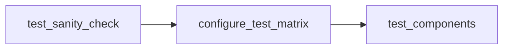

# Adding tests to TheRock

## Test Flow

After TheRock builds its artifacts, we test those artifacts through [`test_artifacts.yml`](../../.github/workflows/test_artifacts.yml). The testing flow works as:



where we:

1. Check that the artifacts pass sanity tests.
1. The `configure_test_matrix` step runs [`fetch_test_configurations.py`](../../build_tools/github_actions/fetch_test_configurations.py), where we generate a test matrix for which tests to run.
1. After we generate the matrix, `test_components` executes those tests in parallel.

### How these tests are executed

These tests are retrieved from [`fetch_test_configurations.py`](../../build_tools/github_actions/fetch_test_configurations.py), where we generate a matrix of tests to run for various AMD GPU families from [`amdgpu_family_matrix.py`](../../build_tools/github_actions/amdgpu_family_matrix.py) on both Linux and Windows test machines.

These tests are run per pull request, main branch commit, `workflow_dispatch` and nightly runs.

### What kind of tests are suitable for TheRock

Since TheRock is the open source build system for HIP and ROCm, we are interested in tests for individual subprojects as well as tests that exercise multiple subprojects, especially for build and runtime dependencies. We also perform higher level testing of overall user-facing behavior and downstream frameworks like PyTorch.

## Adding tests

To add tests, add your executable logic to `github_actions/test_executable_scripts` with a Python file (in order to be compatible with Linux and Windows). Below is an example for [`hipblaslt.py`](../../build_tools/github_actions/test_executable_scripts/test_hipblaslt.py):

```python
cmd = [f"{THEROCK_BIN_DIR}/hipblaslt-test", "--gtest_filter=*pre_checkin*"]
logging.info(f"++ Exec [{THEROCK_DIR}]$ {shlex.join(cmd)}")
subprocess.run(
    cmd,
    cwd=THEROCK_DIR,
    check=True,
)
```

After creating your script, please refer below to create your test entry in [`fetch_test_configurations.py`](../../build_tools/github_actions/fetch_test_configurations.py)

## Fields for the test matrix

Add an entry in [`test_matrix`](../../build_tools/github_actions/fetch_test_configurations.py), then your test will be enabled in the test workflow

In [`fetch_test_configurations.py`](../../build_tools/github_actions/fetch_test_configurations.py), a test option (in this example rocBLAS) in `test_matrix` is setup as:

```
"rocblas": {
    "job_name": "rocblas",
    "fetch_artifact_args": "--blas --tests",
    "timeout_minutes": 5,
    "test_script": f"python {SCRIPT_DIR / 'test_rocblas.py'}",
    "platform": ["linux", "windows"],
}
```

| Field Name          | Type   | Description                                                                                                                        |
| ------------------- | ------ | ---------------------------------------------------------------------------------------------------------------------------------- |
| job_name            | string | Name of the job                                                                                                                    |
| fetch_artifact_args | string | Arguments for which artifacts for [`install_rocm_from_artifacts.py`](../../build_tools/install_rocm_from_artifacts.py) to retrieve |
| timeout_minutes     | int    | The timeout (in minutes) for the test step                                                                                         |
| test_script         | string | The path to the test script                                                                                                        |
| platform            | array  | An array of platforms that the test can execute on, options are `linux` and `windows`                                              |

## Adding artifact support for new components

To allow tests to run for a new component, you must ensure there is support for fetching its artifacts in [`install_rocm_from_artifacts.py`](../../build_tools/install_rocm_from_artifacts.py).

Steps for adding artifact support:

### Step 1: Add command-line argument

Add your component's flag to the argument parser:

```python
parser.add_argument(
    "--blas",
    default=False,
    help="Include 'blas' artifacts",
    action=argparse.BooleanOptionalAction,
)
```

### Step 2: Add artifact installation logic

Add your component to the artifact installation logic:

```python
if args.blas:
    extra_artifacts.append("blas")
```

The artifact patterns are automatically generated as `{component}_lib` and optionally `{component}_test` if `--tests` is specified.

### Step 3: Test artifact fetching

Verify your artifact can be fetched and installed:

```bash
python build_tools/install_rocm_from_artifacts.py \
  --run-id <CI_RUN_ID> \
  --blas \
  --tests \
  --amdgpu-family gfx94X-dcgpu \
  --output-dir ./test-install
```

### Step 4: Add test configuration

Now you can add your test entry to [`fetch_test_configurations.py`](../../build_tools/github_actions/fetch_test_configurations.py):

```python
"rocblas": {
    "job_name": "rocblas",
    "fetch_artifact_args": "--blas --tests",  # Use the flag you created in Step 1
    "timeout_minutes": 5,
    "test_script": f"python {_get_script_path('test_rocblas.py')}",
    "platform": ["linux", "windows"],
},
```
