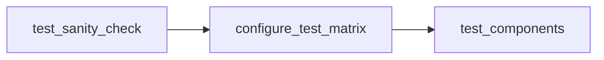

# Adding tests to TheRock

## Test Flow

After TheRock builds its artifacts, we test those artifacts through [`test_artifacts.yml`](/.github/workflows/test_artifacts.yml). The testing flow works as:


```mermaid
graph LR
    test_sanity_check --> configure_test_matrix --> test_components
```

where we:

1. Check that the artifacts pass sanity tests.
1. The `configure_test_matrix` step runs [`fetch_test_configurations.py`](/build_tools/github_actions/fetch_test_configurations.py), where we generate a test matrix for which tests to run.
1. After we generate the matrix, `test_components` executes those tests in parallel.

### How these tests are executed

These tests are retrieved from [`fetch_test_configurations.py`](/build_tools/github_actions/fetch_test_configurations.py), where we generate a matrix of tests to run for various AMD GPU families from [`amdgpu_family_matrix.py`](/build_tools/github_actions/amdgpu_family_matrix.py) on both Linux and Windows test machines.

These tests are run per pull request, main branch commit, `workflow_dispatch` and nightly runs.

### What kind of tests are suitable for TheRock

Since TheRock is the open source build system for HIP and ROCm, we are interested in tests for individual subprojects as well as tests that exercise multiple subprojects, especially for build and runtime dependencies. We also perform higher level testing of overall user-facing behavior and downstream frameworks like PyTorch.

## Adding tests

Adding a component test has two steps:

1. Teach
   [`install_rocm_from_artifacts.py`](/build_tools/install_rocm_from_artifacts.py)
   how to install the component's test artifacts and their dependencies.
1. Add a test executable script and an entry in
   [`fetch_test_configurations.py`](/build_tools/github_actions/fetch_test_configurations.py).

### 1. Configure artifact installation

When adding a new component to TheRock (typically a new `.toml` file), update
[`install_rocm_from_artifacts.py`](/build_tools/install_rocm_from_artifacts.py)
so CI workflows and users can selectively install its test artifacts and their
dependencies. Adding libraries to an existing component requires no script
changes. See [Adding Support for New Components](./installing_artifacts.md#adding-support-for-new-components)
for step-by-step instructions.

### 2. Add the test executable and configuration

Add your executable logic to
[`github_actions/test_executable_scripts/`](/build_tools/github_actions/test_executable_scripts/)
with a Python file (in order to be compatible with Linux and Windows). Below is
an example from [`test_hipblaslt.py`](/build_tools/github_actions/test_executable_scripts/test_hipblaslt.py):

```python
cmd = [f"{THEROCK_BIN_DIR}/hipblaslt-test", "--gtest_filter=*pre_checkin*"]
logging.info(f"++ Exec [{THEROCK_DIR}]$ {shlex.join(cmd)}")
subprocess.run(
    cmd,
    cwd=THEROCK_DIR,
    check=True,
)
```

After creating your script, please refer below to create your test entry in [`fetch_test_configurations.py`](/build_tools/github_actions/fetch_test_configurations.py)

#### 2a. Fields for the test matrix

Add an entry in [`test_matrix`](/build_tools/github_actions/fetch_test_configurations.py), then your test will be enabled in the test workflow

In [`fetch_test_configurations.py`](/build_tools/github_actions/fetch_test_configurations.py), a test option (in this example rocBLAS) in `test_matrix` is setup as:

```
"rocblas": {
    "job_name": "rocblas",
    "fetch_artifact_args": "--blas --tests",
    "timeout_minutes": 5,
    "test_script": f"python {SCRIPT_DIR / 'test_rocblas.py'}",
    "platform": ["linux", "windows"],
}
```

| Field Name                    | Type   | Platform | Description                                                                                                                   |
| ----------------------------- | ------ | -------- | ----------------------------------------------------------------------------------------------------------------------------- |
| job_name                      | string | Any      | Name of the job                                                                                                               |
| fetch_artifact_args           | string | Any      | Arguments for which artifacts for [`install_rocm_from_artifacts.py`](/build_tools/install_rocm_from_artifacts.py) to retrieve |
| additional_requirements_files | array  | Any      | Paths within the fetched artifacts to Python requirements files needed by this test                                           |
| timeout_minutes               | int    | Any      | The timeout (in minutes) for the test step                                                                                    |
| test_script                   | string | Any      | The path to the test script                                                                                                   |
| platform                      | array  | Any      | An array of platforms that the test can execute on, options are `linux` and `windows`                                         |
| container_image               | string | Linux    | The name of a container image to use for this component                                                                       |
| container_options             | string | Linux    | Additional options to be passed when launching the container                                                                  |

#### 2b. Python requirements for component tests

Every component test job installs the root
[`requirements-test.txt`](/requirements-test.txt). This file is for common
requirements used by TheRock's test infrastructure or by all subproject tests.
Keep its package download size minimal: adding a dependency used by only one
subproject makes every component test environment download and install it.

Keep requirements used by an individual subproject with that subproject's
source, typically in a `requirements-test.txt` file. The requirements file must
be copied or installed into a source, build, or stage tree included by the
subproject's test artifact. Add an include pattern to the artifact TOML file if
the test artifact does not already capture the requirements file.

Register each artifact path in the test's `additional_requirements_files` entry
in
[`fetch_test_configurations.py`](/build_tools/github_actions/fetch_test_configurations.py):

```python
"example": {
    "job_name": "example",
    "fetch_artifact_args": "--example --tests",
    "additional_requirements_files": [
        "share/example/tests/requirements-test.txt",
    ],
    "timeout_minutes": 10,
    "test_script": f"python {_get_script_path('test_example.py')}",
    "platform": ["linux"],
}
```

The paths are relative to the extracted test artifact directory, not the source
checkout. The test workflow installs these files into the common test virtual
environment after fetching the component's artifacts. A test can register more
than one requirements file when necessary.
