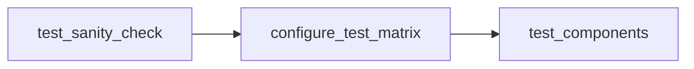

# Adding tests to TheRock

## Test Flow

After TheRock builds its artifacts, we test those artifacts through [`test_artifacts.yml`](../../.github/workflows/test_artifacts.yml). The testing flow works as:


```mermaid
graph LR
    test_sanity_check --> configure_test_matrix --> test_components
```

where we:

1. Check that the artifacts pass sanity tests.
1. The `configure_test_matrix` step runs [`fetch_test_configurations.py`](../../build_tools/github_actions/fetch_test_configurations.py), where we generate a test matrix for which tests to run.
1. After we generate the matrix, `test_components` executes those tests in parallel.

### How these tests are executed

These tests are retrieved from [`fetch_test_configurations.py`](../../build_tools/github_actions/fetch_test_configurations.py), where we generate a matrix of tests to run for various AMD GPU families from [`amdgpu_family_matrix.py`](../../build_tools/github_actions/amdgpu_family_matrix.py) on both Linux and Windows test machines.

These tests are run per pull request, main branch commit, `workflow_dispatch` and nightly runs.

### What kind of tests are suitable for TheRock

Since TheRock is the open source build system for HIP and ROCm, we are interested in tests for individual subprojects as well as tests that exercise multiple subprojects, especially for build and runtime dependencies. We also perform higher level testing of overall user-facing behavior and downstream frameworks like PyTorch.

## Adding tests

To add tests, add your executable logic to `github_actions/test_executable_scripts` with a Python file (in order to be compatible with Linux and Windows). Below is an example for [`hipblaslt.py`](../../build_tools/github_actions/test_executable_scripts/test_hipblaslt.py):

```python
cmd = [f"{THEROCK_BIN_DIR}/hipblaslt-test", "--gtest_filter=*pre_checkin*"]
logging.info(f"++ Exec [{THEROCK_DIR}]$ {shlex.join(cmd)}")
subprocess.run(
    cmd,
    cwd=THEROCK_DIR,
    check=True,
)
```

After creating your script, please refer below to create your test entry in [`fetch_test_configurations.py`](../../build_tools/github_actions/fetch_test_configurations.py)

## Fields for the test matrix

Add an entry in [`test_matrix`](../../build_tools/github_actions/fetch_test_configurations.py), then your test will be enabled in the test workflow

In [`fetch_test_configurations.py`](../../build_tools/github_actions/fetch_test_configurations.py), a test option (in this example rocBLAS) in `test_matrix` is setup as:

```
"rocblas": {
    "job_name": "rocblas",
    "fetch_artifact_args": "--blas --tests",
    "timeout_minutes": 5,
    "test_script": f"python {SCRIPT_DIR / 'test_rocblas.py'}",
    "platform": ["linux", "windows"],
}
```

| Field Name          | Type   | Platform | Description                                                                                                                        |
| ------------------- | ------ | -------- | ---------------------------------------------------------------------------------------------------------------------------------- |
| job_name            | string | Any      | Name of the job                                                                                                                    |
| fetch_artifact_args | string | Any      | Arguments for which artifacts for [`install_rocm_from_artifacts.py`](../../build_tools/install_rocm_from_artifacts.py) to retrieve |
| timeout_minutes     | int    | Any      | The timeout (in minutes) for the test step                                                                                         |
| test_script         | string | Any      | The path to the test script                                                                                                        |
| platform            | array  | Any      | An array of platforms that the test can execute on, options are `linux` and `windows`                                              |
| container_image     | string | Linux    | The name of a container image to use for this component                                                                            |
| container_options   | string | Linux    | Additional options to be passed when launching the container                                                                       |
| emulate             | string | Linux    | Emulator backend to also run this component under, e.g. `"rocjitsu"`. See [Emulated tests](#emulated-tests-mirage--rocjitsu)       |
| emulate_only        | bool   | Linux    | Only run the emulated variant; do not run this component on hardware                                                               |
| emulate_test_type   | string | Linux    | Test category the emulated variant is pinned to, regardless of the run's `TEST_TYPE`                                               |
| emulate_env         | dict   | Linux    | Environment to set for the mirage session, for tests that must know they are emulated                                              |

> [!NOTE]
> When adding a new component to TheRock (typically a new .toml file), you may need to update `install_rocm_from_artifacts.py` to allow CI workflows and users to selectively install it.<br>
> Adding libraries to existing components requires no script changes.<br>
> See the [Adding Support for New Components](./installing_artifacts.md#adding-support-for-new-components) guide for step-by-step instructions.

## Emulated tests (mirage / rocjitsu)

Some GPU targets have no test hardware in CI, and some failures are cheaper to
catch against a simulated device than a real one. For those cases,
[`fetch_test_configurations.py`](../../build_tools/github_actions/fetch_test_configurations.py)
can derive an **emulated variant** of a test component. The variant runs on the
Linux CPU builder, with [mirage](https://github.com/ROCm/rocm-systems/tree/develop/emulation/mirage)
driving the [rocjitsu](https://github.com/ROCm/rocm-systems/tree/develop/emulation/rocjitsu)
software GPU emulator instead of talking to a real device.

Opting a component in means adding this field:

**`"emulate": "rocjitsu"`**

```
"rocrtst": {
    "job_name": "rocrtst",
    ...
    "emulate": "rocjitsu",
}
```

That produces a second matrix entry alongside the hardware one, named
`rocrtst (emulated mi350x)`, which:

- runs on the Linux CPU builder with no GPU devices mapped into the container,
- fetches the `mirage` and `rocjitsu` artifacts,
- gets 10x the component's `timeout_minutes`, capped at one hour.
- runs unsharded
- wraps the unchanged `test_script` in `mirage run`, passing `TEST_EMULATOR` and `TEST_EMULATOR_PROFILE` as literals for repro commands.

The `test_script` itself is unchanged, which is the point: the emulated variant
runs the same entry point the hardware job does, so emulation does not fork the
test definition. For components on the standardized
[`test_runner.py`](../../build_tools/github_actions/test_executable_scripts/test_runner.py)
the emulated job selects from the same component-owned `test_categories.yaml`,
usually with a cheaper category than the hardware job runs. See
[Choosing what an emulated job runs](#choosing-what-an-emulated-job-runs).

Everything that excludes the hardware job — `exclude_family`, test labels,
project selection — excludes the emulated variant too. The one exception is the
multi-GPU availability check: rocjitsu emulates the device in software, so a
component whose family has no multi-GPU pool still gets its emulated variant.

> [!WARNING]
> The component repositories keep their own copies of this routing chain and of
> `test_component.yml` (`therock-test-packages.yml` / `therock-test-component.yml`
> in `rocm-systems`, `rocm-libraries`, and `rocgdb`), and they run *TheRock's*
> `fetch_test_configurations.py` from a pinned ref. Those copies do **not** yet
> carry the emulation changes, so before bumping that pin each one needs:
>
> - `TEST_COMPONENT: ${{ fromJSON(inputs.component).test_component || fromJSON(inputs.component).job_name }}`
>   — otherwise `TEST_COMPONENT` becomes the decorated job name
>   (`rocrtst (emulated mi350x)`) and `test_runner.py` resolves a test directory
>   that does not exist,
> - `if: ${{ !fromJSON(inputs.component).linux_cpu_runner }}` on the
>   "Driver / GPU sanity check" step,
> - `linux_cpu_runner` checked **before** any family-specific `test_runs_on`
>   override. `rocm-systems` currently puts a `gfx125X` override first, which
>   would route mi450x emulated jobs onto the scarce MI455 GPU runners.
>
> `rocrtst` — the one emulated component today — lives in `rocm-systems`.

### Which families are emulated

In [`emulation.py`](../../build_tools/github_actions/emulation.py),
`MIRAGE_PROFILE_BY_FAMILY_PREFIX` maps an AMDGPU family to one of mirage's
builtin profiles (see
[`profiles.rs`](https://github.com/ROCm/rocm-systems/blob/develop/emulation/mirage/builtin/src/profiles.rs)),
and `EMULATED_PROFILES` selects which of those CI actually schedules jobs for:

| Family          | mirage profile | Emulated GPU     | Scheduled in CI                      |
| --------------- | -------------- | ---------------- | ------------------------------------ |
| `gfx94X-dcgpu`  | `mi300x`       | MI300X (gfx942)  | No — ample hardware                  |
| `gfx950-dcgpu`  | `mi350x`       | MI350X (gfx950)  | Yes                                  |
| `gfx125X-dcgpu` | `mi450x`       | MI450X (gfx1250) | Yes, once the family has a test lane |

> [!NOTE]
> `gfx125X-dcgpu` currently sets `test-runs-on: ""` in
> [`amdgpu_family_matrix.py`](../../build_tools/github_actions/amdgpu_family_matrix.py),
> and `test_artifacts.yml` skips the whole test lane for a family without a test
> runner. The emulated entries are generated correctly for it, but nothing
> schedules them until that family is given a runner.

### Writing an emulated test script

The generator wraps the whole `test_script` in a mirage session, so the script
is already running against the emulated GPU when it starts:

```
$THEROCK_BIN_DIR/mirage run --profile mi350x --emulator rocjitsu \
  --env TEST_EMULATOR=rocjitsu --env TEST_EMULATOR_PROFILE=mi350x \
  --env THEROCK_BIN_DIR=$THEROCK_BIN_DIR ... \
  -- python .../test_runner.py
```

Everything the script does — compiling, launching test binaries, spawning ctest
or pytest — happens inside that one session, and the script never invokes mirage
itself. *Which* tests run is decided by the matrix entry's `emulate_test_type`,
not by the script; `emulation.is_emulated()` exists for the few scripts that
have to behave differently under an emulator (`test_emulation.py` refuses to run
outside one).

> [!NOTE]
> `mirage host` starts the workload with `env_clear()`, re-inheriting only
> `PATH`/`HOME`/`USER`/`LANG`/`LC_ALL`/`TERM`/`TMPDIR`. Everything else —
> `THEROCK_BIN_DIR`, `TEST_TYPE`, `AMDGPU_FAMILIES`, the shard variables, the
> `OMP_NUM_THREADS`/`OPENBLAS_NUM_THREADS` limits derived from the pod's
> `KUBE_CPU_REQUEST` — has to cross the session boundary by name, which is what
> the `--env` list is for. Each is emitted as `${NAME:+--env NAME=$NAME}` so a
> variable the workflow left unset stays unset inside the session rather than
> becoming an empty string. A script that starts reading a new CI variable must
> add it to `FORWARDED_ENV` in
> [`emulation.py`](../../build_tools/github_actions/emulation.py), or it will be
> unset under emulation.

Anything an emulated script can derive, it should derive rather than expect to
be forwarded — `test_runner.py` derives `ROCM_PATH` from `THEROCK_BIN_DIR` for
exactly this reason, which guarantees it points at the artifacts this job
actually fetched.

Scripts that need to behave differently under an emulator can ask, using
[`emulation.py`](../../build_tools/github_actions/emulation.py):

```python
import emulation

if emulation.is_emulated():
    ...  # already inside the mirage session; nothing to launch
```

The two emulated components today are:

| Component   | Script              | What it does                                                            |
| ----------- | ------------------- | ----------------------------------------------------------------------- |
| `emulation` | `test_emulation.py` | Checks that the emulated GPU comes up and reports the expected target   |
| `rocrtst`   | `test_runner.py`    | Runs a rocrtst `test_categories.yaml` category against the emulated GPU |

### Choosing what an emulated job runs

Emulation is orders of magnitude slower than hardware and does not implement
everything, so an emulated variant is expected to run a different, cheaper set
of tests than the hardware one — the scaled timeout is headroom, not a licence
to run the full suite.

**Pick a category the component already declares.** TheRock only names it:

```
"emulate_test_type": "quick",
```

This is a **pin, not a default**: which categories an emulator can get through
is a property of the emulator, so a nightly run asking for `comprehensive` must
not drag the emulated variant along with it. Components that leave it unset
follow the run's `TEST_TYPE`. The value has to be in `VALID_TEST_CATEGORIES` in
[`test_runner.py`](../../build_tools/github_actions/test_executable_scripts/test_runner.py)
— an unlisted value silently falls back to `quick`.

Prefer an existing category over a new one, even a coarse fit. rocrtst is
pinned to `quick`: 13 tests in 9.6 s under rocjitsu. Its `standard` covers 65
tests in ~10 min, which the emulated budget could afford, but three of them
fail on emulator gaps — so using it would first require a rocrtst-side
exclusion list. If a component does add a tier for this, the ROCm-wide
convention is the `ffm-*` family (`ffm-quick` and friends, already declared by
rocwmma, rocthrust, hipcub, rocprim, rocfft and hipdnn), not a bespoke name.

### Environment the emulated tests need

Some tests only pass under an emulator once they know they are emulated.
`emulate_env` sets environment for the mirage session:

```
"emulate_env": {"ROCRTST_PLATFORM_OVERRIDE": "EMULATOR"},
```

rocrtst is the live case. It detects emulators from
`/sys/module/amdgpu/parameters/emu_mode`, which rocjitsu does not provide, so
without the override it believes it is on real hardware and skips none of the
~50 entries under `platforms.EMULATOR.blocked_tests` in the
`share/rocrtst/platform_config.yaml` it already ships. Two of those are in
`quick` and fail outright (`IPC`, which also leaves a child spinning at 100% CPU
after the suite reports, and `Deallocation_Notifier_Test`).

Values are validated as quote-free, space-free literals, because the wrapped
command passes through two layers of shell quoting before mirage sees it.

> [!NOTE]
> This is the second-best home for such a variable. A component on the
> standardized flow can put it in its own `test_categories.yaml` under
> `env_variables`, which `parse_test_categories.py` compiles into the CTest
> entry's `ENVIRONMENT` property — scoped to the test binary rather than the
> whole mirage session, and reproducing for anyone running `ctest` by hand
> rather than only in CI. Prefer that when you are able to change the component;
> `emulate_env` is for when you are not.

### Skipping tests an emulator cannot run

Prefer letting the component decide, in its `test_categories.yaml`, and keep
`fetch_test_configurations.py` out of it — per-component test filters there are
exactly what the move to `test_runner.py` exists to retire. Between the platform
filter above and the choice of category, a component usually has enough to
express "what survives the emulator" without TheRock naming a single test.
