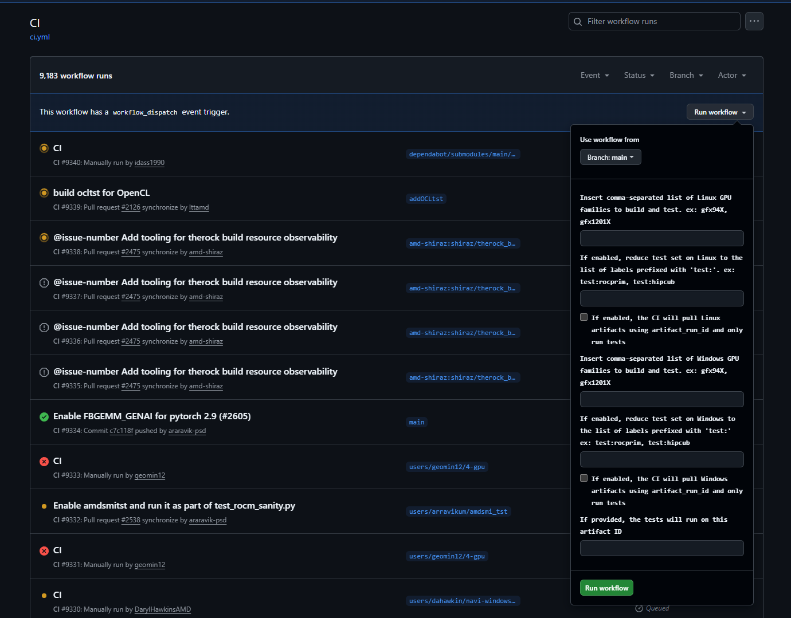

# CI Behavior Manipulation

TheRock CI is controlled by [`configure_ci.py`](../../build_tools/github_actions/configure_ci.py), where it controls push, pull request, workflow dispatch and schedule CI behavior.

## Push behavior

For `push`, TheRock CI only runs builds and tests when pushed to the `main` branch. From [`amdgpu_family_matrix.py`](../../build_tools/github_actions/amdgpu_family_matrix.py), TheRock CI collects the AMD GPU families from `amdgpu_family_info_matrix_presubmit` and `amdgpu_family_info_matrix_postsubmit` dictionaries, then runs builds and tests.

## Pull request behavior

For `pull_request`, TheRock CI collects the `amdgpu_family_info_matrix_presubmit` dictionary from [`amdgpu_family_matrix.py`](../../build_tools/github_actions/amdgpu_family_matrix.py) and runs build/tests.

However, if additional options are wanted, you can add a label to manipulate the behavior. The labels we provide are:

- `skip-ci`: The CI will skip all builds and tests
- `run-all-archs-ci`: The CI will build all possible architectures
- `gfx...`: A build and test (if a test machine is available) is added to the CI matrix for the specified gfx family. (ex: `gfx120X`, `gfx950`)
- `test:...`: The full test will run only for the specified label and other labeled projects (ex: `test:rocthrust`, `test:hipblaslt`)
- `test_runner:...`: The CI will run tests on only custom test machines (ex: `test_runner:oem`)

## Workflow dispatch behavior

For `workflow_dispatch`, you are able to trigger CI in [GitHub's ci.yml workflow page](https://github.com/ROCm/TheRock/actions/workflows/ci.yml). To trigger a workflow dispatch, click "Run workflow" and fill in the fields accordingly:

## Prebuilt stages (Multi-Arch CI)

> **Note:** This feature is under active development and will evolve as
> automatic stage selection and baseline run lookup are added.

The [Multi-Arch CI](https://github.com/ROCm/TheRock/actions/workflows/multi_arch_ci.yml)
workflow supports skipping individual build stages by copying their artifacts
from a previous workflow run. This is useful when iterating on changes that
only affect a subset of the build (e.g. a math-libs change doesn't need to
rebuild foundation or compiler-runtime).

Two `workflow_dispatch` inputs control this:

- **`prebuilt_stages`**: Comma-separated list of stage names to skip
  (e.g. `foundation,compiler-runtime`). Artifacts for these stages are copied
  from the baseline run instead of being built. Applied to both Linux and
  Windows; stages not present on a platform are ignored.
- **`baseline_run_id`**: The workflow run ID to copy prebuilt artifacts from.
  Required when `prebuilt_stages` is set. Find this in the URL of a previous
  successful Multi-Arch CI run
  (e.g. `https://github.com/ROCm/TheRock/actions/runs/22655391643`).

### Stage names

Stage names come from `BUILD_TOPOLOGY.toml`. The current stages are:

| Stage              | Platform       | Description                       |
| ------------------ | -------------- | --------------------------------- |
| `foundation`       | Linux, Windows | sysdeps, base libraries           |
| `compiler-runtime` | Linux, Windows | compiler, runtimes, profiler-core |
| `math-libs`        | Linux, Windows | rocBLAS, rocFFT, etc.             |
| `comm-libs`        | Linux          | RCCL                              |
| `debug-tools`      | Linux          | amd-dbgapi, rocgdb                |
| `dctools-core`     | Linux          | RDC                               |
| `profiler-apps`    | Linux          | rocprofiler-systems               |
| `media-libs`       | Linux          | rocdecode, rocjpeg                |

### Example: rebuild only math-libs

To rebuild math-libs while reusing foundation and compiler-runtime from a
previous run:

1. Find a recent successful Multi-Arch CI run and note its run ID
1. Go to the [Multi-Arch CI workflow page](https://github.com/ROCm/TheRock/actions/workflows/multi_arch_ci.yml)
1. Click "Run workflow" and fill in:
   - `prebuilt_stages`: `foundation,compiler-runtime`
   - `baseline_run_id`: `<run_id from step 1>`

### Important notes

- You must include **all predecessor stages** in `prebuilt_stages`. For
  example, to skip compiler-runtime you must also skip foundation, since
  compiler-runtime depends on it.
- The baseline run must have been built with the **same GPU families** as the
  current run, otherwise the copy will find no matching artifacts.

## Schedule behavior

For `schedule` runs, the `CI Nightly` runs everyday at 2AM UTC. This collects all families from [`amdgpu_family_matrix.py`](../../build_tools/github_actions/amdgpu_family_matrix.py), running all builds and tests.
