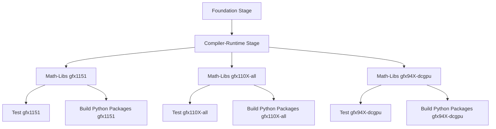
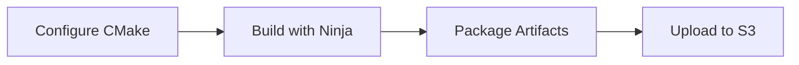
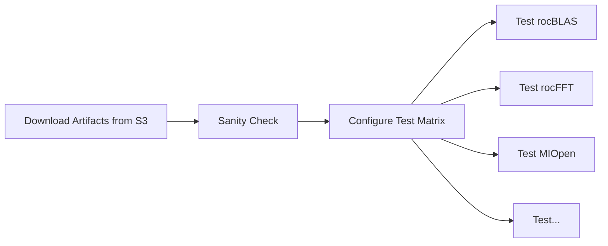

# CI Overview

This document provides an overview of how Continuous Integration (CI) works in TheRock, including the build → artifact → test pipeline. If you're migrating from MathCI or Jenkins-based workflows, this guide will help you understand TheRock's GitHub Actions-based approach.

## Quick Summary

TheRock CI follows this workflow:

1. **Build** ROCm from source via TheRock
2. **Upload** build artifacts to S3 (public-read buckets)
3. **Test** workflows download those artifacts from S3
4. **Run** tests against the downloaded artifacts

Instead of Jenkins and Groovy pipelines, TheRock uses **GitHub Actions** workflows defined in YAML files under `.github/workflows/`.

## CI Architecture

TheRock uses a multi-stage CI pipeline that splits the build into stages (foundation → compiler-runtime → math-libs, etc.) with dependency chaining.

Each stage runs as a separate job, uploads its artifacts and logs to S3, then downstream stages download and build on top of them. This allows for:

- **Parallelization:** Multiple GPU families can build math-libs simultaneously once compiler-runtime completes
- **Incremental builds:** Test-only runs can skip build stages by downloading pre-built artifacts
- **Flexibility:** Different stages can run on different runner types (e.g., CPU-only for foundation, GPU for tests)

**Key workflow files:**
- [`.github/workflows/multi_arch_ci.yml`](/.github/workflows/multi_arch_ci.yml) - Main entry point
- [`.github/workflows/multi_arch_build_portable_linux_artifacts.yml`](/.github/workflows/multi_arch_build_portable_linux_artifacts.yml) - Build orchestration

## Build Phase

TheRock builds ROCm components from source and produces **artifacts** - archive slices of key components organized by role (lib, dev, test, etc.).

**What gets built:** Compiler (LLVM), core runtime (HIP, ROCr), math libraries (rocBLAS, rocFFT), ML libraries (MIOpen), media libraries (rocDecode, rocJPEG), and more.

**Artifact organization:** Each component is packaged into separate archives by role (libraries, headers, tests, tools). See [artifacts.md](artifacts.md) for complete details on artifact structure and naming conventions.

## Artifact Storage and Distribution

### S3 Buckets

TheRock uses Amazon S3 for artifact storage. **All artifact buckets are public-read**, so no authentication is needed to download them.

**CI Buckets (build outputs):**
- `therock-ci-artifacts` - Builds from `ROCm/TheRock`
- `therock-ci-artifacts-external` - Builds from forks and downstream repos (`rocm-libraries`, `rocm-systems`)

**Release Buckets:**
- `therock-nightly-artifacts` - Nightly builds
- `therock-dev-artifacts` - Development builds
- `therock-prerelease-artifacts` - Pre-release builds

See [s3_buckets.md](s3_buckets.md) for the complete bucket list and authentication details for uploads.

### Accessing Artifacts

Download artifacts using the `install_rocm_from_artifacts.py` script, which handles fetching from S3 and extracting to the correct locations.

See [installing_artifacts.md](installing_artifacts.md) for detailed instructions on:
- Finding GitHub run IDs
- Selecting components to download
- Installing from CI runs vs releases
- Using with different GPU families

## Test Phase

Tests are defined in [`fetch_test_configurations.py`](../../build_tools/github_actions/fetch_test_configurations.py), which generates a test matrix for parallel execution across multiple runners.

The test workflow downloads only the artifacts needed for the specific tests being run (e.g., `--blas --tests` for rocBLAS tests), installs them, and runs the test scripts in parallel.

**Test configuration:** Each test specifies which artifacts to download, timeout, platform support (Linux/Windows), and the test script to run.

**Test scripts:** Python scripts in [`build_tools/github_actions/test_executable_scripts/`](../../build_tools/github_actions/test_executable_scripts/) that work on both Linux and Windows. (shortly, these scripts will be migrated to their respective monorepos)

See [adding_tests.md](adding_tests.md) for how to add new tests to the CI pipeline.

## MathCI Migration Guide

For teams migrating from MathCI, here are the key differences:

| Aspect                  | MathCI (Jenkins)                     | TheRock CI (GitHub Actions)                       |
| ----------------------- | ------------------------------------ | ------------------------------------------------- |
| **Pipeline Definition** | Groovy scripts in rocJenkins         | YAML files in `.github/workflows/`                |
| **Test Integration**    | Update Groovy pipeline               | Add entry to `fetch_test_configurations.py`       |
| **Artifact Access**     | Jenkins artifacts                    | Public-read S3 buckets                            |
| **Test Execution**      | Jenkins agents                       | GitHub-hosted or self-hosted runners              |
| **Logs**                | Jenkins UI                           | S3 (see [workflow_outputs.md](workflow_outputs.md)) |

**Migration workflow:**
1. Create test script in `build_tools/github_actions/test_executable_scripts/`
2. Add entry to `fetch_test_configurations.py`
3. Ensure artifact dependencies are configured in `install_rocm_from_artifacts.py`

See [adding_tests.md](adding_tests.md) for step-by-step instructions.

## Common CI Tasks

### Trigger a CI Run

**For PRs:** CI runs automatically on every push and when labels are added.

**For specific GPU families:** Add a label to your PR (e.g., `gfx1151-linux`, `gfx94X-windows`)

**Manual trigger:** Use the "Run workflow" button on the [Multi-Arch CI workflow page](https://github.com/ROCm/TheRock/actions/workflows/multi_arch_ci.yml)

### Download Artifacts from a CI Run

Use `install_rocm_from_artifacts.py` with a run ID from the GitHub Actions UI.

See [installing_artifacts.md](installing_artifacts.md) for detailed instructions on finding run IDs and selecting components.

### Run Specific Tests

Use workflow dispatch with test labels to run only specific tests instead of the full suite.

See [test_filtering.md](test_filtering.md) for advanced filtering options.

### Add a New Test

1. Create test script in `build_tools/github_actions/test_executable_scripts/`
2. Add entry to `fetch_test_configurations.py`
3. Ensure artifact dependencies are configured in `install_rocm_from_artifacts.py`

See [adding_tests.md](adding_tests.md) for step-by-step instructions.

### Reproduce CI Failures Locally

Use the automated reproduction script to download artifacts and set up the same environment as CI.

See [test_environment_reproduction.md](test_environment_reproduction.md) for detailed instructions.

### Debug Build Failures

Build logs are uploaded to S3 and organized by stage and GPU family.

See [workflow_outputs.md](workflow_outputs.md) for the S3 layout structure and [github_actions_debugging.md](github_actions_debugging.md) for debugging techniques.

## Further Reading

### Build System
- [artifacts.md](artifacts.md) - Artifact organization and packaging
- [build_system.md](build_system.md) - CMake build architecture
- [dependencies.md](dependencies.md) - Dependency management
- [installing_artifacts.md](installing_artifacts.md) - Installing ROCm from artifacts

### Testing
- [adding_tests.md](adding_tests.md) - Adding new tests to CI
- [test_environment_reproduction.md](test_environment_reproduction.md) - Reproducing CI failures locally
- [test_filtering.md](test_filtering.md) - Running specific test subsets
- [test_debugging.md](test_debugging.md) - Debugging test failures

### Infrastructure
- [s3_buckets.md](s3_buckets.md) - S3 bucket organization and authentication
- [workflow_outputs.md](workflow_outputs.md) - CI output directory structure
- [github_actions_debugging.md](github_actions_debugging.md) - Debugging GitHub Actions
- [ci_behavior_manipulation.md](ci_behavior_manipulation.md) - Controlling CI behavior with labels and inputs

## Getting Help

- **Issues:** [TheRock GitHub Issues](https://github.com/ROCm/TheRock/issues)
- **Discussions:** Ask in your PR or ask in the [public Discord](https://discord.gg/R6Gf7Bfp4)
- **Documentation:** Check the [docs/development/](.) directory
