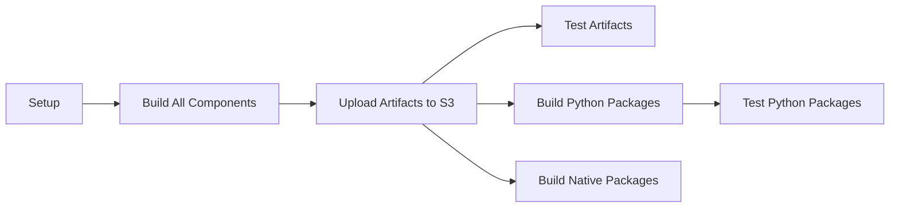
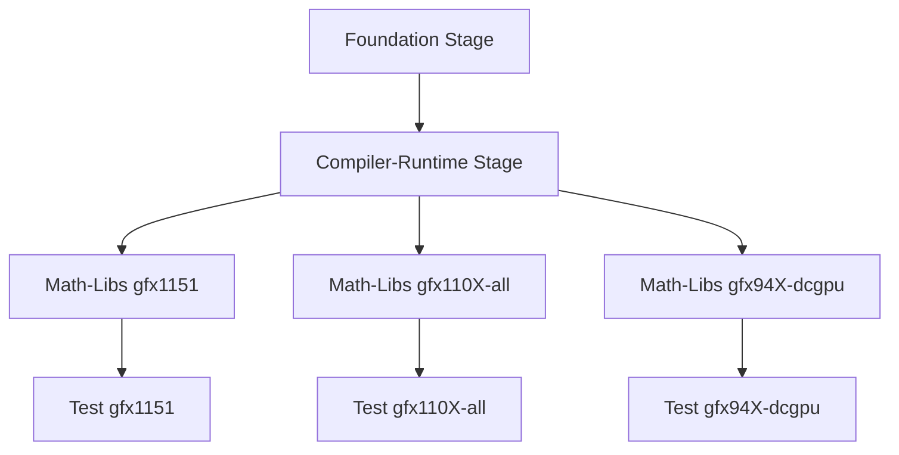
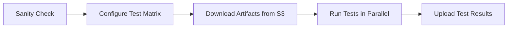
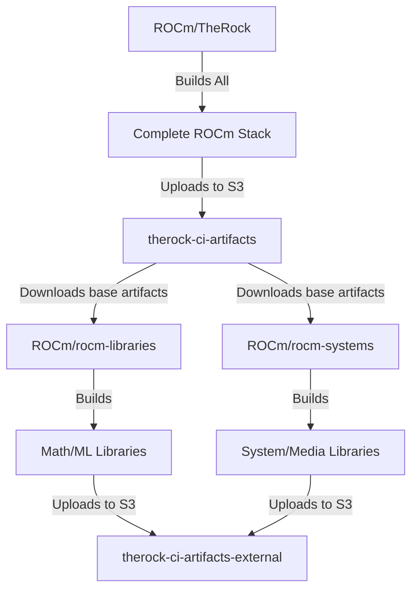

# CI Overview

This document provides an overview of how Continuous Integration (CI) works in TheRock, including the build → artifact → test pipeline. If you're migrating from MatCI or Jenkins-based workflows, this guide will help you understand TheRock's GitHub Actions-based approach.

## Quick Summary

TheRock CI follows this workflow:

1. **Build** ROCm from source via TheRock
2. **Upload** build artifacts to S3 (public-read buckets)
3. **Test** workflows download those artifacts from S3
4. **Run** tests against the downloaded artifacts

Instead of Jenkins and Groovy pipelines, TheRock uses **GitHub Actions** workflows defined in YAML files under `.github/workflows/`.

## CI Architecture

TheRock has two main CI pipeline architectures:

### Single-Stage CI (`ci.yml`)

Used for pull requests and main branch commits. Builds all components in one monolithic job per GPU family.



**Key files:**
- [`.github/workflows/ci.yml`](/.github/workflows/ci.yml) - Main entry point
- [`.github/workflows/ci_linux.yml`](/.github/workflows/ci_linux.yml) - Linux build/test orchestration
- [`.github/workflows/ci_windows.yml`](/.github/workflows/ci_windows.yml) - Windows build/test orchestration

### Multi-Arch CI (`multi_arch_ci.yml`)

Used for releases and multi-architecture builds. Splits the build into stages (foundation → compiler → math-libs, etc.) with dependency chaining.



Each stage runs as a separate job, uploads its artifacts and logs, then downstream stages download and build on top of them.

**Key files:**
- [`.github/workflows/multi_arch_ci.yml`](/.github/workflows/multi_arch_ci.yml)
- [`.github/workflows/multi_arch_build_portable_linux_artifacts.yml`](/.github/workflows/multi_arch_build_portable_linux_artifacts.yml)

## Build Phase

### What Gets Built

TheRock builds ROCm components from source. The build system produces **artifacts** - archive slices of key components:

- **Compiler artifacts:** `amd-llvm`, `hipify`
- **Core artifacts:** `base`, `core-runtime`, `core-hip`
- **Math library artifacts:** `blas`, `fft`, `rand`, `prim`
- **ML library artifacts:** `miopen`
- **Media library artifacts:** `rocdecode`, `rocjpeg` (Linux only)
- **Communication library artifacts:** `rccl`
- **Profiler artifacts:** `rocprofiler-sdk`, `rocprofiler-systems`

Each artifact is divided into components by role:

| Component | Contents                                      | Example Use Case             |
| --------- | --------------------------------------------- | ---------------------------- |
| `lib`     | Shared libraries, runtime files               | Running applications         |
| `dev`     | Headers, CMake configs, static libraries      | Building against ROCm        |
| `run`     | CLI tools, utilities                          | rocm-smi, hipify-perl        |
| `test`    | Test binaries, test data files                | Testing in CI                |
| `dbg`     | Debug symbols                                 | Debugging crashes            |
| `doc`     | Documentation files                           | User reference               |

See [artifacts.md](artifacts.md) for full details on artifact organization.

### Build Workflow Steps

For each GPU family (e.g., `gfx94X-dcgpu`, `gfx110X-all`):

1. **Configure:** CMake configures the build with selected GPU targets
   ```bash
   cmake -B build -GNinja -DTHEROCK_AMDGPU_FAMILIES=gfx110X
   ```

2. **Build:** Ninja builds all enabled components
   ```bash
   ninja -C build
   ```

3. **Create Artifacts:** TheRock packages components into artifact archives
   ```bash
   ninja -C build therock-archives
   ```

4. **Upload to S3:** Artifacts are uploaded to public-read S3 buckets
   - See [s3_buckets.md](s3_buckets.md) for bucket details
   - See [workflow_outputs.md](workflow_outputs.md) for S3 layout structure

## Artifact Storage

### S3 Buckets

TheRock uses Amazon S3 for artifact storage. **All artifact buckets are public-read**, so no authentication is needed to download them.

**CI Buckets (build outputs):**
- `therock-ci-artifacts` - Builds from `ROCm/TheRock`
- `therock-ci-artifacts-external` - Builds from forks and downstream repos (`rocm-libraries`, `rocm-systems`)

**Release Buckets:**
- `therock-nightly-artifacts` - Nightly builds
- `therock-dev-artifacts` - Development builds
- `therock-prerelease-artifacts` - Pre-release builds
- `therock-release-artifacts` - Official releases

See [s3_buckets.md](s3_buckets.md) for the complete list and authentication details for uploads.

### Artifact Naming Convention

Artifacts follow the naming pattern:

```
{artifact_name}_{component}_{target_family}.tar.xz
```

Examples:
- `blas_lib_gfx110X.tar.xz` - BLAS libraries for gfx110X GPUs
- `blas_test_gfx110X.tar.xz` - BLAS tests for gfx110X GPUs
- `core-hip_dev_generic.tar.xz` - HIP development files (GPU-agnostic)

### Accessing Artifacts

**Via Python Script (Recommended):**

```bash
python build_tools/install_rocm_from_artifacts.py \
    --run-id 15575624591 \
    --amdgpu-family gfx110X-all \
    --blas --fft --tests
```

**Via AWS CLI (Manual):**

```bash
aws s3 cp s3://therock-ci-artifacts/15575624591-linux/ \
    ./artifacts/ \
    --no-sign-request --recursive --exclude "*" --include "*.tar.xz"
```

See [installing_artifacts.md](installing_artifacts.md) for detailed instructions.

## Test Phase

### How Tests Are Configured

Tests are defined in [`fetch_test_configurations.py`](../../build_tools/github_actions/fetch_test_configurations.py), which generates a test matrix for parallel execution.

Each test configuration specifies:

```python
"rocblas": {
    "job_name": "rocblas",
    "fetch_artifact_args": "--blas --tests",
    "timeout_minutes": 5,
    "test_script": f"python {SCRIPT_DIR / 'test_rocblas.py'}",
    "platform": ["linux", "windows"],
}
```

### Test Workflow Steps

The test workflow ([`test_artifacts.yml`](/.github/workflows/test_artifacts.yml)) follows this pattern:



1. **Sanity Check:** Quick smoke test to ensure artifacts are valid
2. **Configure Test Matrix:** Generate list of tests based on GPU family and platform
3. **Download Artifacts:** Install artifacts using `install_rocm_from_artifacts.py`
4. **Run Tests:** Execute test scripts in parallel across multiple runners
5. **Upload Results:** Upload test logs and JUnit XML to S3

### Test Scripts

Test scripts live in [`build_tools/github_actions/test_executable_scripts/`](../../build_tools/github_actions/test_executable_scripts/) and are Python scripts that work on both Linux and Windows.

Example test script structure:

```python
#!/usr/bin/env python3
import subprocess
import shlex
import logging
from pathlib import Path

THEROCK_BIN_DIR = Path(os.environ["THEROCK_BIN_DIR"])

cmd = [f"{THEROCK_BIN_DIR}/rocblas-test", "--gtest_filter=*pre_checkin*"]
logging.info(f"Running: {shlex.join(cmd)}")
subprocess.run(cmd, check=True)
```

See [adding_tests.md](adding_tests.md) for how to add new tests.

## Test Data and Datasets

> [!NOTE]
> For teams migrating from MatCI: This section addresses how to store and access test datasets in TheRock CI.

### Where to Store Test Datasets

Unlike MatCI which used a central Jenkins-managed location, TheRock has multiple options:

1. **Include in artifact:** For small datasets (<10MB), include them in your component's artifact
   - Add test data files to your component's `stage/` directory during build
   - They'll be packaged into the `test` component automatically

2. **S3 storage:** For large datasets, upload to a public-read S3 bucket
   - Use `therock-ci-artifacts` or a dedicated test data bucket
   - Download in your test script before running tests

3. **Git LFS:** For datasets versioned with code
   - Store in the component's repo using Git Large File Storage
   - Downloaded during source fetch

### Example: Storing Test Data in Artifacts

**In your CMakeLists.txt:**

```cmake
# Install test binaries and data to stage directory
install(
    FILES testdata/bitstreams.zip testdata/golden_outputs.tar.gz
    DESTINATION share/rocdecode/testdata
)
```

**In your test script:**

```python
TEST_DATA_DIR = Path(os.environ["OUTPUT_ARTIFACTS_DIR"]) / "share/rocdecode/testdata"
cmd = ["rocdecode-test", f"--test-data={TEST_DATA_DIR}"]
subprocess.run(cmd, check=True)
```

See [artifacts.md#component-types](artifacts.md#component-types) for how to configure artifact packaging.

### Example: Downloading Test Data from S3

**Upload test data (one-time):**

```bash
aws s3 cp testdata/ s3://therock-ci-artifacts/testdata/rocdecode/ \
    --recursive --acl public-read
```

**In your test script:**

```python
import boto3
from pathlib import Path

def download_test_data():
    s3 = boto3.client('s3', config=Config(signature_version=UNSIGNED))
    test_data_dir = Path("/tmp/test-data")
    test_data_dir.mkdir(exist_ok=True)

    s3.download_file(
        'therock-ci-artifacts',
        'testdata/rocdecode/bitstreams.zip',
        str(test_data_dir / 'bitstreams.zip')
    )

download_test_data()
cmd = ["rocdecode-test", "--test-data=/tmp/test-data"]
subprocess.run(cmd, check=True)
```

## GitHub Actions vs Jenkins/Groovy

For teams migrating from MatCI, here are the key differences:

| Aspect                  | MatCI (Jenkins)                      | TheRock CI (GitHub Actions)            |
| ----------------------- | ------------------------------------ | -------------------------------------- |
| **Pipeline Definition** | Groovy scripts in rocJenkins         | YAML files in `.github/workflows/`     |
| **Test Integration**    | Update Groovy pipeline               | Add entry to `fetch_test_configurations.py` |
| **Test Data Storage**   | Central Jenkins-managed location     | S3 buckets or artifact bundles         |
| **Artifact Access**     | Jenkins artifacts                    | Public-read S3 buckets                 |
| **Test Execution**      | Jenkins agents                       | GitHub-hosted or self-hosted runners   |
| **Logs**                | Jenkins UI                           | S3 (see workflow_outputs.md)           |

### Example: Migrating a Test from MatCI

**Before (MatCI):**

```groovy
// In rocJenkins Groovy pipeline
stage('rocDecode Tests') {
    steps {
        sh 'LD_LIBRARY_PATH=/opt/rocm/lib /opt/rocm/bin/rocdecode-test'
    }
}
```

**After (TheRock):**

1. Create test script: `build_tools/github_actions/test_executable_scripts/test_rocdecode.py`
   ```python
   #!/usr/bin/env python3
   import subprocess
   from pathlib import Path
   import os

   THEROCK_BIN_DIR = Path(os.environ["THEROCK_BIN_DIR"])
   cmd = [f"{THEROCK_BIN_DIR}/rocdecode-test"]
   subprocess.run(cmd, check=True)
   ```

2. Add to test matrix: `build_tools/github_actions/fetch_test_configurations.py`
   ```python
   "rocdecode": {
       "job_name": "rocdecode",
       "fetch_artifact_args": "--rocdecode --tests",
       "timeout_minutes": 10,
       "test_script": f"python {SCRIPT_DIR / 'test_rocdecode.py'}",
       "platform": ["linux"],
   }
   ```

3. Ensure artifact support exists in `install_rocm_from_artifacts.py`:
   - If `rocdecode` is a new component, follow [adding_tests.md](adding_tests.md#adding-support-for-new-components)

## Repository Organization

TheRock has a monorepo structure with multiple related repositories:

### ROCm/TheRock

The main repository containing the super-project build system.

- **Purpose:** Build ROCm from source, orchestrate CI
- **Contains:** Build scripts, CI workflows, documentation
- **Submodules:** Component source code (as git submodules)
- **CI Workflows:** Full build + test for all components

### ROCm/rocm-libraries

Downstream repository for testing math/ML libraries in isolation.

- **Purpose:** Component-specific testing without rebuilding entire ROCm stack
- **Submodules:** rocBLAS, rocFFT, MIOpen, etc.
- **CI Workflows:** Uses TheRock CI infrastructure and tools
- **Artifacts:** Downloads base ROCm from TheRock, builds only math libraries

**Key Differences from TheRock:**
- Downloads pre-built `base`, `compiler`, and `core` artifacts from TheRock
- Only builds math/ML library components
- Faster iteration for library developers
- Shares same test scripts and CI tooling

### ROCm/rocm-systems

Downstream repository for system-level components and media libraries.

- **Purpose:** Testing rocDecode, rocJPEG, and system management tools
- **Submodules:** rocDecode, rocJPEG, rocm-smi-lib
- **CI Workflows:** Uses TheRock CI infrastructure and tools
- **Artifacts:** Downloads base ROCm from TheRock, builds only system components

**Key Differences from TheRock:**
- Downloads pre-built `base`, `compiler`, and `core` artifacts from TheRock
- Only builds system/media library components
- Specialized test data requirements (video bitstreams, JPEG samples)

### How They Interact



**Shared Infrastructure:**
- Same S3 buckets (external repos use `therock-ci-artifacts-external`)
- Same build tools (`install_rocm_from_artifacts.py`, `fileset_tool.py`)
- Same test framework (`fetch_test_configurations.py`, test scripts)
- Same artifact format and component organization

**When to Use Which:**
- **TheRock:** Full ROCm development, testing inter-component dependencies
- **rocm-libraries:** Math/ML library development, faster library-only builds
- **rocm-systems:** System component development, media library testing

## Reproducing CI Failures Locally

When a test fails in CI, you can reproduce it locally using the automated reproduction script:

```bash
python build_tools/github_actions/reproduce_test_failure.py \
    --run-id 15575624591 \
    --repository ROCm/TheRock \
    --amdgpu-family gfx110X-all \
    --test-script "python build_tools/github_actions/test_executable_scripts/test_rocblas.py"
```

This script:
1. Downloads artifacts from the failing CI run
2. Sets up a Docker container (Linux) or installs dependencies (Windows)
3. Installs the artifacts
4. Runs your test script in the same environment as CI

See [test_environment_reproduction.md](test_environment_reproduction.md) for details.

## Common CI Tasks

### Trigger a CI Run

**For PRs:** CI runs automatically on every push and when labels are added.

**For specific GPU families:** Add a label to your PR:
- `gfx1151-linux` - Test on gfx1151 Linux
- `gfx94X-windows` - Test on gfx94X Windows

**Manual trigger:**

1. Go to [Actions > CI](https://github.com/ROCm/TheRock/actions/workflows/ci.yml)
2. Click "Run workflow"
3. Specify GPU families and test options

### Download Artifacts from a CI Run

**Using Python script:**

```bash
python build_tools/install_rocm_from_artifacts.py \
    --run-id 15575624591 \
    --amdgpu-family gfx110X-all \
    --blas --fft --miopen --tests
```

**Finding run IDs:**

1. Navigate to [TheRock Actions](https://github.com/ROCm/TheRock/actions)
2. Click on a workflow run
3. The run ID is in the URL: `https://github.com/ROCm/TheRock/actions/runs/[RUN_ID]`

See [installing_artifacts.md](installing_artifacts.md) for all options.

### Run Specific Tests

Use the `workflow_dispatch` trigger with test labels:

1. Go to [Actions > CI](https://github.com/ROCm/TheRock/actions/workflows/ci.yml)
2. Click "Run workflow"
3. In "linux_test_labels" or "windows_test_labels", enter: `test:rocblas,test:rocfft`
4. This runs only rocBLAS and rocFFT tests instead of the full suite

See [test_filtering.md](test_filtering.md) for advanced filtering.

### Add a New Test

1. Create test script in `build_tools/github_actions/test_executable_scripts/`
2. Add entry to `fetch_test_configurations.py`
3. Ensure artifact dependencies are configured in `install_rocm_from_artifacts.py`

See [adding_tests.md](adding_tests.md) for step-by-step instructions.

### Debug Build Failures

**View build logs:**

1. Click on the failed workflow run
2. Click on "Build Artifacts" job
3. Logs are uploaded to S3 - link is in the job output

**Download logs locally:**

Build logs follow this S3 pattern:
```
s3://therock-ci-artifacts/{RUN_ID}-{PLATFORM}/logs/{ARTIFACT_GROUP}/{COMPONENT}_{STAGE}.log
```

Example:
```bash
aws s3 cp s3://therock-ci-artifacts/15575624591-linux/logs/gfx110X-all/rocBLAS_build.log \
    . --no-sign-request
```

See [workflow_outputs.md](workflow_outputs.md) for the complete S3 layout and [github_actions_debugging.md](github_actions_debugging.md) for debugging techniques.

## Further Reading

### Build System
- [artifacts.md](artifacts.md) - Artifact organization and packaging
- [build_system.md](build_system.md) - CMake build architecture
- [dependencies.md](dependencies.md) - Dependency management
- [installing_artifacts.md](installing_artifacts.md) - Installing ROCm from artifacts

### Testing
- [adding_tests.md](adding_tests.md) - Adding new tests to CI
- [test_environment_reproduction.md](test_environment_reproduction.md) - Reproducing CI failures locally
- [test_filtering.md](test_filtering.md) - Running specific test subsets
- [test_debugging.md](test_debugging.md) - Debugging test failures

### Infrastructure
- [s3_buckets.md](s3_buckets.md) - S3 bucket organization and authentication
- [workflow_outputs.md](workflow_outputs.md) - CI output directory structure
- [github_actions_debugging.md](github_actions_debugging.md) - Debugging GitHub Actions
- [ci_behavior_manipulation.md](ci_behavior_manipulation.md) - Controlling CI behavior with labels and inputs

## Getting Help

- **Issues:** [TheRock GitHub Issues](https://github.com/ROCm/TheRock/issues)
- **Discussions:** Ask in your PR or create a Discussion
- **Documentation:** Check the [docs/development/](.) directory
