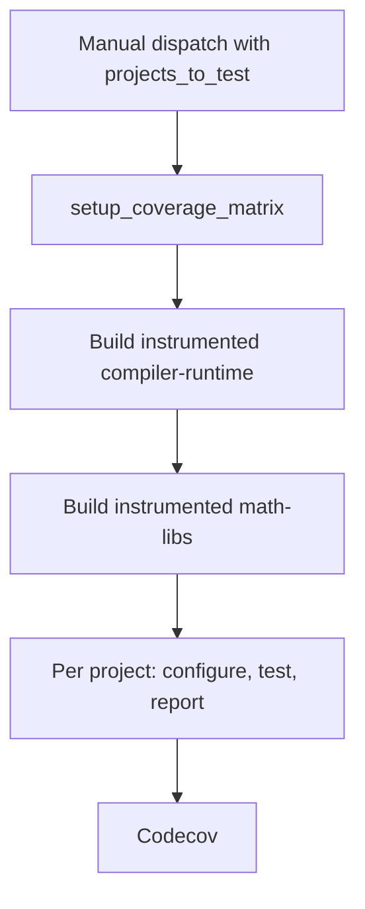

# Code Coverage

TheRock builds ROCm libraries with LLVM's source based code coverage
instrumentation and reports the results to
[Codecov](https://app.codecov.io/gh/ROCm/TheRock). Coverage is opt-in per
project: instrumentation slows a library down substantially, and the report is
only worth producing for projects whose test suites are thorough enough to give
a meaningful signal.

This page is the reference. For a plain-language walkthrough of a single run,
start with
[Nightly Coverage Implementation](nightly_coverage_implementation.md).

## Enabling coverage for a local build

Pass `-D<PROJECT>_ENABLE_COVERAGE=ON` at the top level configure. The project
name must be upper case, matching the usual CMake convention for definitions:

```bash
cmake -B build -GNinja . \
  -DTHEROCK_AMDGPU_FAMILIES=gfx94X-dcgpu \
  -DHIPRAND_ENABLE_COVERAGE=ON
```

`<PROJECT>_ENABLE_COVERAGE` is TheRock's own knob, and it is not what the
subproject sees. Upstream option names are not standardised — hipRAND takes
`BUILD_CODE_COVERAGE`, rocRAND takes `CODE_COVERAGE`, RCCL takes
`ENABLE_CODE_COVERAGE`, hipBLASLt takes `HIPBLASLT_ENABLE_COVERAGE` — so
`therock_subproject.cmake` translates TheRock's flag into whichever name is
registered for that project in `COVERAGE_PROJECTS`. Translating per subproject
is what keeps the generic spellings from instrumenting everything in the build
that happens to understand them.

Passing the flag for a project with no registered option is a configure error
rather than a silent no-op, since the failure it replaces — an uninstrumented
build that tests cleanly and reports nothing — surfaces hours later.

> [!NOTE]
> Coverage builds are incompatible with split kernel packaging. The CI
> workflows pass `-DTHEROCK_FLAG_KPACK_SPLIT_ARTIFACTS=OFF`; do the same if you
> build with a target family that enables kernel packing by default. Split
> packaging rearranges the code objects embedded in the library `llvm-cov` is
> later pointed at. Coverage is host-only now, so this may no longer be load
> bearing, but it has not been retested and the flag is cheap to keep.

### Enabling a whole group

Three aggregate options turn on coverage for a whole component group instead of
naming each project. All default `OFF`:

| Option                                | Instruments                                                         |
| ------------------------------------- | ------------------------------------------------------------------- |
| `THEROCK_COVERAGE_ROCM_LIBRARIES_ALL` | all coverage-enabled rocm-libraries projects (math-libs, ml-libs …) |
| `THEROCK_COVERAGE_ROCM_SYSTEMS_ALL`   | all coverage-enabled rocm-systems projects                          |
| `THEROCK_COVERAGE_ALL`                | both of the above                                                   |

```bash
cmake -B build -GNinja . \
  -DTHEROCK_AMDGPU_FAMILIES=gfx94X-dcgpu \
  -DTHEROCK_COVERAGE_ROCM_LIBRARIES_ALL=ON
```

Each option expands to the individual `<PROJECT>_ENABLE_COVERAGE` flags above,
so the same caveats apply. An explicit `-D<PROJECT>_ENABLE_COVERAGE=OFF` on the
command line wins over the group flag. Group membership is generated from the
coverage registry (`COVERAGE_PROJECTS`), so a group only ever contains
onboarded projects.

> [!NOTE]
> These options default `OFF` and have no effect on a normal, non-coverage
> build — no `<PROJECT>_ENABLE_COVERAGE` flag is set. The membership list is
> regenerated from `COVERAGE_PROJECTS` on every configure (a small scripted
> step; it also means editing `configure_coverage_ci.py` triggers a
> reconfigure), but it only changes the build when one of the options is `ON`.

### Host code only

What gets measured is host code, and the instrumentation is deliberately kept
off the GPU. The upstream coverage options pass `-fprofile-instr-generate` and
`-fcoverage-mapping` unqualified, and the HIP driver forwards both to the
device compilation, so kernels would be instrumented too.

That does not survive contact with the runtime. An instrumented device image
carries a per-translation-unit `__llvm_profile_sections_` symbol that
`libclang_rt.profile_rocm.a` looks up through `hipModuleGetGlobal` when the
process exits, plus a `__profd_` for every kernel. A symbol the runtime cannot
resolve aborts the process *after* the tests have already passed — rocSPARSE
hit this on an inlined rocPRIM kernel — and where the readback does succeed,
the runtime writes an extra profile named after the device
(`gfx942:sramecc+:xnack-.0.<host name>`), which cannot be uploaded as a CI
artifact because of the colons.

`therock_subproject.cmake` therefore appends the negation, scoped to the device
compilation, for any subproject it enables coverage for:

```
-Xarch_device -fno-profile-instr-generate -Xarch_device -fno-coverage-mapping
```

Position is what makes this work. The later of a `-f`/`-fno-` pair wins, and
the project's own flags arrive through `COMPILE_OPTIONS`, after
`CMAKE_<LANG>_FLAGS` — so the negation is appended to
`CMAKE_<LANG>_COMPILE_OBJECT` rather than to the flags variables. That rule
does not exist yet in `CMAKE_PROJECT_TOP_LEVEL_INCLUDES`, which runs before any
language is enabled, so it is applied from a generated file passed as
`CMAKE_PROJECT_INCLUDE`. Measuring GPU code would mean undoing this and solving
the two problems above.

### The profile runtime's link dependencies

`libclang_rt.profile_rocm.a` calls `dlsym`, `dladdr` and `pthread_once`, and
the driver does not put `-ldl` or `-lpthread` on the link line for it. On the
manylinux base those symbols are still in `libdl` and `libpthread` rather than
in `libc`, so an instrumented shared library would be left with undefined
references, and any executable linking against it would fail
`--no-allow-shlib-undefined`.

`therock_subproject.cmake` adds the two libraries whenever it enables coverage
for a subproject, so this is handled. It is worth knowing about if you
instrument a project outside the normal flow.

## Producing a report locally

Instrumented binaries write one `.profraw` file per process, named by the
`LLVM_PROFILE_FILE` environment variable. The `%p` (pid) and `%m` (binary
signature) substitutions keep concurrent processes from clobbering each other:

```bash
export LLVM_PROFILE_FILE="$PWD/coverage-report/profraw/%p-%m.profraw"
ctest --test-dir build/math-libs/hiprand
```

`merge_coverage_report.py` then merges the profiles and exports lcov:

```bash
python build_tools/github_actions/merge_coverage_report.py \
  --profraw-dir coverage-report/profraw \
  --rocm-dir build/dist/rocm \
  --object-globs "lib/libhiprand.so*"
```

The `llvm-profdata` and `llvm-cov` binaries must come from the same compiler
that built the instrumented objects, so the script prefers the copies under
`<rocm-dir>/lib/llvm/bin`. A version mismatch surfaces as an unhelpfully
generic "malformed instrumentation profile data" error.

`--summary-output` adds the per-file table as plain text and `--html-output`
the browsable report, entry point `index.html`:

```bash
python build_tools/github_actions/merge_coverage_report.py \
  --profraw-dir coverage-report/profraw \
  --rocm-dir build/dist/rocm \
  --object-globs "lib/libhiprand.so*" \
  --summary-output coverage-report/coverage_summary.txt \
  --html-output coverage-report/html
```

Only the HTML reads the source files; lcov and the text table are produced
from the coverage mappings alone and are complete wherever they run. Source
paths are recorded as they were at build time, so if the tree has moved
since, `--path-equivalence <from>,<to>` tells `llvm-cov` how to get from one
to the other. Files generated into the build tree are in no source checkout
and are reported as uncovered in the HTML; the text table still counts them.

## Coverage CI

A coverage run builds the stages its selection needs, instruments only the
selected projects, and reports on each of them separately from that one build.



Every edge is a job dependency inside the one coverage run.
`multi_arch_ci_coverage_nightly.yml` is the top level; it delegates to
`multi_arch_ci_coverage_linux.yml` for the per-project test and aggregation
sequence on one GPU family. Both take their project list from
`build_tools/github_actions/configure_coverage_ci.py`, the registry of
coverage-enabled projects and everything the pipeline needs to know about each
one: the CMake target, the build stage it lives in, its test component, the
object globs handed to `llvm-cov`, and its Codecov flag.

### Dispatching a run

`multi_arch_ci_coverage_nightly.yml` is started by hand, from the Actions tab
or the `gh` CLI. There is no cron trigger, and the regular nightly does not
know about this workflow — it has no coverage-specific jobs, and a coverage run
neither reads its artifacts nor depends on it having succeeded.

Pick a recent nightly run, pass its id as `baseline_run_id`, and leave
`baseline_release_type` at `nightly`. The other input that matters is
`projects_to_test`. The rest can be left at their defaults — the
`gfx94X-dcgpu` family and coverage's own `standard` test type, which is
narrower than the nightly's because instrumented tests already run several
times longer than normal ones.

Coverage having a run id of its own is what keeps a coverage failure from
colouring the nightly's status, and keeps the nightly's test jobs — which
rarely all pass — from holding coverage up.

Having the regular nightly dispatch this workflow automatically once its build
finishes, handing over its own run id, is a later change. Nothing else has to
move for it: `baseline_run_id` is already an input, so that change only adds
the dispatching job. Running only what changed, and running more architectures
than gfx942, come later too.

### The instrumented build

`setup_coverage_matrix` runs `configure_coverage_ci.py`, which reads
`PROJECTS_TO_TEST`, `AMDGPU_FAMILIES` and `COVERAGE_CONFIG_SOURCE` and emits
the per-project job matrix, the family list, `coverage_cmake_options` and
`needs_math_libs`. It also rejects any selection naming a project whose stage
this workflow has no build job for, so a bad request stops in seconds rather
than hours.

`build_instrumented_compiler_runtime` runs first and unconditionally. Every
other stage takes its inbound artifacts from it — all 19 of `math-libs`'
inbound artifacts are produced there — so no selection can skip it. It also
receives the coverage flags, since several rocm-systems projects
(`rocprofiler-sdk`, `aqlprofile`, `amdsmi`, `rocprofiler-compute`) are built in
that stage.

`build_instrumented_math_libs` fans out over the GPU families, and is skipped
when `needs_math_libs` is false. It is the only other stage built: 17 of the 19
measurable projects live there, and the remaining two are blocked upstream, so
phase 1 carries no job for any further stage.

Both stages get `coverage_cmake_options` appended to their configure line.
`configure_coverage_ci.py` collapses a selection covering a whole group into
that group's option, so a full run reads `-DTHEROCK_COVERAGE_ALL=ON` while a
narrow one reads `-DHIPRAND_ENABLE_COVERAGE=ON`. `CMakeLists.txt` expands the
group options into individual `<PROJECT>_ENABLE_COVERAGE` flags, and
`therock_subproject.cmake` translates each of those into the project's own
option name. Everything not selected builds normally.

All the build jobs call `multi_arch_build_portable_linux_artifacts.yml`, the
same per-stage build workflow regular CI uses, rather than going through the
full `multi_arch_build_portable_linux.yml` pipeline. Naming the stages coverage
needs keeps the shared pipeline free of coverage-specific stage filtering, and
`extra_cmake_options` on that workflow is the only build-side hook coverage
adds.

The artifacts publish under `release_type: ci`, under this run's id.

### Test execution

`coverage_report` fans out over the matrix, one call to
`multi_arch_ci_coverage_linux.yml` per project and GPU family.
`configure_test_matrix` runs `fetch_test_configurations.py` — shared with
regular CI — narrowed to the one project this report covers, and outputs the
shard list. `test_coverage` then runs one `test_component.yml` job per shard
with `coverage_enabled: true`. Three things happen in order:

1. **Install the baseline, then overlay.** `setup_test_environment` runs
   against `baseline_run_id` and `baseline_release_type`, installing a fully
   non-instrumented stack. `overlay_coverage_artifacts.py` then fetches this
   run's artifact for the project under test and copies only that project's
   stage directories over it, so exactly one library in the install is
   instrumented.
1. **Point the runtime at a profile directory.** `LLVM_PROFILE_FILE` is set to
   a per-shard path using the `%p` and `%m` substitutions, so a shard that
   forks or loads several instrumented libraries does not overwrite its own
   profiles.
1. **Run the tests and upload.** The normal test script runs, then the profraw
   files upload as a workflow artifact under `always()` — a failing shard still
   exercised code.

`coverage_enabled` also puts a floor under the per-component test timeout.
Instrumented libraries are built `-O0 -g` and count every branch, so a suite
takes much longer than its usual budget assumes: rocRAND tests that normally
finish in milliseconds took 25 to 60 seconds each and ran out of their 15
minutes. It is a floor rather than a multiplier because the budgets are not on
a common scale — rocBLAS asks for 288 minutes, past the job's own cap, while
rocRAND asks for 15 — so scaling would stretch the generous ones and still
leave the tight ones tight.

#### Why there are two run ids

The nightly instruments the whole stack in one build, because building each
project separately would mean rebuilding its dependencies each time. Reporting,
though, has to stay per project: a coverage report for hipRAND should not shift
because rocRAND changed, and an instrumented rocRAND under an instrumented
hipRAND also writes its own profiles into the same run. Hence the baseline
install and the overlay described above.

The baseline is read from the channel that published it
(`baseline_release_type`, normally `nightly`) rather than from the coverage
run's own `ci` channel, since artifacts are bucketed per channel.

The overlay is per project rather than per artifact because TheRock's artifacts
are grouped: `rand` carries both rocRAND and hipRAND. Each project's files sit
under the subproject stage directory they were built in
(`math-libs/hipRAND/stage`), which is what `artifact_relpaths` in the registry
names. Nothing is renamed along the way — the two runs write to different S3
directories, so the instrumented `rand_lib_gfx942.tar.xz` and the regular one
never collide.

If the overlay finds none of the project's files, the job fails rather than
testing the baseline build and reporting coverage for binaries that were never
instrumented.

#### What scopes a report to one project

Two mechanisms, covering different leaks.

`object_globs` scopes the export. `llvm-cov export` is handed an explicit
`-object` for each of the project's binaries and reports only the functions
found in their coverage mappings, so a sibling's whole functions never appear.

The overlay scopes what is instrumented at all. Globs alone would not be
enough, because inline and template code defined in headers is emitted
`linkonce_odr` into every binary that uses it. If a sibling library were also
instrumented, its copies of those functions would write counters that
`llvm-profdata` merges into this project's, and no `-object` choice could
separate them again. Installing a non-instrumented baseline and overlaying one
project keeps that from arising — which matters most for the header-only
projects (rocPRIM, hipCUB, rocThrust, rocWMMA), where nearly all the measured
code lives in headers.

The cost of selecting more projects is build and test time; each instrumented
library is slower to compile and slower to exercise.

### Artifacts

Two kinds are in play:

| Artifact     | Where it lives                      | What it is for                                 |
| ------------ | ----------------------------------- | ---------------------------------------------- |
| Instrumented | CI bucket, this run's id            | The stack under test, and the LLVM tools       |
| Profraw      | GitHub Actions artifacts, per shard | Raw profiles, collected by the aggregation job |

Profraw artifact names carry the project, GPU family and shard index, so the
aggregation job can glob back exactly its own shards when several projects are
being measured in one run.

### Report generation

`aggregate_coverage` runs once per project, under `if: !cancelled()` so a
partial report still gets produced when some shards failed.

It downloads every matching profraw artifact, then installs the run's artifacts
again — `llvm-cov` needs the binaries carrying the coverage mapping sections,
and the LLVM tools have to come from the same compiler that produced the
profiles.

`merge_coverage_report.py` then collects the profiles recursively, expands the
project's `object_globs` and deduplicates them by real path (a versioned
symlink family resolves to one file), runs `llvm-profdata merge -sparse` into a
single profdata index, and renders it three ways. Two conditions are fatal
rather than reported as zero coverage: finding no profraw files at all, which
means the tests never ran or the instrumented libraries were not the ones
loaded at runtime; and matching no objects, which means `object_globs` does not
describe what the project actually installs.

The `coverage-report-<project>-<family>` artifact holds all three:

| File                   | What it is                                            |
| ---------------------- | ----------------------------------------------------- |
| `coverage.info`        | lcov, the format Codecov consumes                     |
| `coverage_summary.txt` | The per-file table, with the totals on the final line |
| `html/index.html`      | The browsable report, source annotated line by line   |

The totals are also written to the job's summary page, so the number is
readable without downloading anything.

Only the HTML rendering opens source files, and the report job checks out
TheRock rather than the projects it measures, so it first runs
`fetch_sources.py` for the stage that built the project. Source paths are
recorded as the build container saw them, and `--path-equivalence` maps that
prefix onto the workspace. That step is `continue-on-error`: losing it costs
the annotated view and nothing else, since lcov and the text table come from
the coverage mappings. Files generated into the build tree — version headers
and the like — exist in no checkout and show as uncovered in the HTML while
the text table still counts them.

The Codecov step is skipped rather than failed when no `CODECOV_TOKEN` is
configured, so forks still get the artifact.

## Selecting projects to run

A nightly run measures every onboarded project the workflow can build.
Dispatching by hand narrows that down: the `projects_to_test` input takes a
comma-separated list of project names, and also accepts three case-insensitive
**group aliases** that expand to a whole component group: `rocm_libraries_all`,
`rocm_systems_all`, and `all`. They may be mixed with explicit names, and
selecting a group with no onboarded projects fails the run with a clear error
rather than launching an empty matrix.

An empty input means every project with a build job, which today is
`rocm_libraries_all`. That works, but it instruments all of them in one build,
which is the expensive way to run this; name what you want measured.

`rccl` and `rocshmem` are onboarded but live in `comm-libs`, which this
workflow does not build, so they are excluded from the default — and naming
them, or `rocm_systems_all` or `all`, is rejected outright by
`setup_coverage_matrix` rather than failing hours later with nothing to
overlay. The narrowing applies only to the default; an explicit request is
never silently reduced. See [Adding a stage](#adding-a-stage).

`hipblaslt` and `hiptensor` are excluded from the default and the aliases too,
for a different reason: both are measurable, but their instrumented builds
currently fail to link. Naming one is honoured with a warning rather than
rejected, since rerunning it is how the block gets noticed as fixed. See
[Blocked projects](#blocked-projects).

The aliases are expanded to concrete project names inside
`configure_coverage_ci.py` before the job matrix is built, so nothing
downstream ever sees them: the coverage pipeline hands
`fetch_test_configurations.py` (shared with regular CI) an already-resolved
per-project `test_component`, never an alias. The `projects_to_test` input and
these aliases exist only on the coverage workflow, so non-coverage test
selection is unaffected.

## Adding a project

Add an entry to `COVERAGE_PROJECTS` in `configure_coverage_ci.py`.

Its `coverage_option` has to name the CMake option the project actually
implements, and that option has to select LLVM source-based instrumentation
(`-fprofile-instr-generate -fcoverage-mapping`). Neither can be assumed. The
names are not standardised — most projects use `BUILD_CODE_COVERAGE`, several
use `CODE_COVERAGE`, a few use `<PROJECT>_ENABLE_COVERAGE`, RCCL uses
`ENABLE_CODE_COVERAGE` — and some projects instrument with gcov
(`-fprofile-arcs`) instead, which writes `.gcda` files this pipeline cannot
read.

A project that cannot be measured yet gets an `unsupported_reason` instead. It
stays in the registry so the gap is recorded, stays out of the group aliases,
and is rejected with that reason if someone names it.

Confirm a local instrumented build produces a non-empty report before relying
on a new entry. A project whose tests never load the instrumented library
builds and tests cleanly and then reports nothing.

Set the entry's `source_repo` (`ROCM_LIBRARIES` by default, or `ROCM_SYSTEMS`);
that is what routes the project into the correct group alias and
`THEROCK_COVERAGE_*_ALL` option. No CMake edit is needed — the group membership
lists are generated from `COVERAGE_PROJECTS` at configure time, so both the
local aggregate flags and the CI aliases pick up the new project automatically.

`object_globs` names the binaries the report is generated from, relative to the
install tree. For most projects that is the shared library
(`lib/librocblas.so*`); header-only projects have none, so they name their
installed test binaries instead. Getting it wrong fails the report job, which
refuses to run when no glob matches rather than publishing zero coverage.

## Blocked projects

A project that is measurable but whose instrumented build is broken gets a
`blocked_reason` alongside its `coverage_option`. Unlike `unsupported_reason`
this is expected to be temporary, so the project is only dropped from the
default selection and the group aliases — including the group lists
`--emit-cmake` writes, so a group build does not set a flag the Python side
just declined to set. Naming it still works and prints the reason as a warning.

Blocking matters more than it looks, because a stage is built as a unit: a
single project whose instrumented build fails takes the whole stage with it,
and every other project's report along with it.

There are two examples today, and both fixes belong upstream in
`ROCm/rocm-libraries`; once either lands, drop that project's `blocked_reason`.

`hipblaslt` fails at link. Its coverage-only branch of
`clients/CMakeLists.txt` links `hipblaslt-test` against a bare `rocroller`
while the surrounding lines use imported targets. rocRoller exports as
`roc::rocroller`, and under TheRock it is a separate subproject found through
its package config, so the bare name is not a target here and reaches the
linker as `-lrocroller` with no `-L` to resolve it. hipBLASLt's own build
avoids this by having rocRoller in-tree.

`hiptensor` outgrows the small code model. Upstream enables coverage as a
blanket `add_compile_options(-fprofile-instr-generate -fcoverage-mapping)`, and
hipTensor is built on composable_kernel, so the coverage mapping and name data
scale with an already very large amount of instantiated template code. The
result pushes `libhiptensor.so` past 2GB and the link fails on out-of-range
`R_X86_64_PC32` relocations from `.rodata` into `.text`. Building it with a
larger code model is the likely fix.

## Adding a stage

`multi_arch_ci_coverage_nightly.yml` builds compiler-runtime and math-libs, and
`configure_coverage_ci.py` rejects any selection that reaches beyond them
(`BUILDABLE_STAGES`). That covers 17 of the 19 measurable projects.

Onboarding a project from another stage needs a build job for that stage added
to the workflow, and the stage added to `BUILDABLE_STAGES`. Order matters: a
stage consumes inbound artifacts from other stages, so anything it depends on
has to be built first. `comm-libs`, the stage `rccl` and `rocshmem` need, takes
`hipify` and `rocjitsu` from `emulation` — so it needs two jobs, emulation then
comm-libs, not one. Consult `build_topology` rather than assuming; a missing
inbound artifact does not surface until well into the build.
