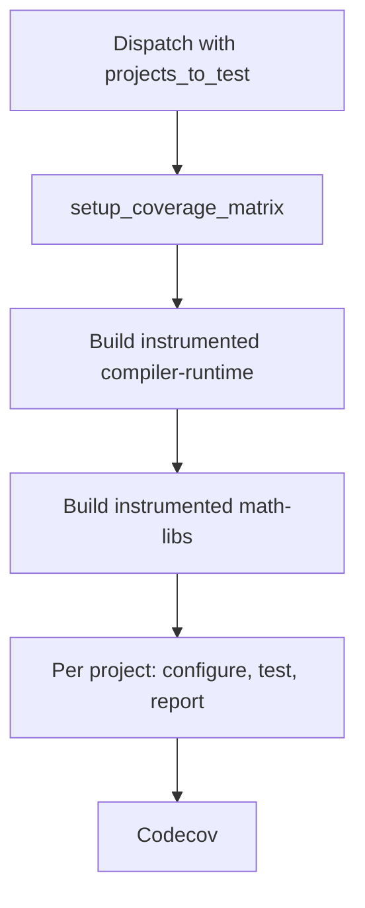

# Code Coverage

TheRock builds ROCm libraries with LLVM source-based coverage and reports to
[Codecov](https://app.codecov.io/gh/ROCm/TheRock). Coverage is opt-in per
project — instrumentation slows a library substantially, and a report is only
worth producing when the test suite gives a meaningful signal.

## How it works

- **Instrumented** — compiled with `-fprofile-instr-generate`; every line bumps
  a counter. Slower and bigger; never shipped.
- **profraw** — the counter file an instrumented process writes on exit.
- **lcov** — the final report: which lines ran and which did not.

Pipeline: build instrumented → run tests → collect profraw → convert to lcov.

A project's tests load its dependencies too. If those were instrumented, their
counters would pollute the report. So exactly one library is instrumented; the
rest come from the regular nightly build (the **baseline**):

|              | Source              | What it provides                   |
| ------------ | ------------------- | ---------------------------------- |
| **Baseline** | Regular nightly run | Whole ROCm stack, non-instrumented |
| **Coverage** | This run            | Only the one instrumented project  |

The test runner installs the baseline, then replaces only the selected
project's libraries with instrumented ones. See [Coverage CI](#coverage-ci).

## Enabling coverage for a local build

```bash
cmake -B build -GNinja . \
  -DTHEROCK_AMDGPU_FAMILIES=gfx94X-dcgpu \
  -DHIPRAND_ENABLE_COVERAGE=ON
```

`<PROJECT>_ENABLE_COVERAGE` is TheRock's own flag; upstream option names are
not standardised (hipRAND: `BUILD_CODE_COVERAGE`, rocRAND: `CODE_COVERAGE`,
RCCL: `ENABLE_CODE_COVERAGE`), so `therock_subproject.cmake` translates it to
whichever name `COVERAGE_PROJECTS` registers for that project. Passing the flag
for an unregistered project is a configure error, not a silent no-op.

### Enabling a whole group

| Option                                | Instruments                                  |
| ------------------------------------- | -------------------------------------------- |
| `THEROCK_COVERAGE_ROCM_LIBRARIES_ALL` | all coverage-enabled rocm-libraries projects |
| `THEROCK_COVERAGE_ROCM_SYSTEMS_ALL`   | all coverage-enabled rocm-systems projects   |
| `THEROCK_COVERAGE_ALL`                | both of the above                            |

Each expands to individual `<PROJECT>_ENABLE_COVERAGE` flags. An explicit
`-D<PROJECT>_ENABLE_COVERAGE=OFF` wins over a group flag. Membership is
generated from `COVERAGE_PROJECTS`; these options default `OFF` and have no
effect on a normal build.

### Host code only

Upstream coverage flags are unqualified and the HIP driver forwards them to
device compilation. Two failures result: the runtime aborts looking up missing
profiling symbols in the device image, and when readback succeeds it writes a
profile named after the device target (colons included, breaking CI artifact
upload). `therock_subproject.cmake` appends the negation scoped to device
compilation:

```
-Xarch_device -fno-profile-instr-generate -Xarch_device -fno-coverage-mapping
```

The later of a `-f`/`-fno-` pair wins; the project's own flags arrive after
`CMAKE_<LANG>_FLAGS`, so the negation is appended to
`CMAKE_<LANG>_COMPILE_OBJECT` via a generated file passed as
`CMAKE_PROJECT_INCLUDE`.

### The profile runtime's link dependencies

`libclang_rt.profile_rocm.a` needs `-ldl` and `-lpthread`, which the driver
does not supply. On the manylinux base these are not in libc, so an instrumented
shared library gets undefined references and any executable linking it fails
`--no-allow-shlib-undefined`. `therock_subproject.cmake` adds both libraries
automatically.

## Producing a report locally

Set `LLVM_PROFILE_FILE` with `%p`/`%m` substitutions to keep per-process files
distinct, run the tests, then call `merge_coverage_report.py`:

```bash
export LLVM_PROFILE_FILE="$PWD/coverage-report/profraw/%p-%m.profraw"
ctest --test-dir build/math-libs/hiprand

python build_tools/github_actions/merge_coverage_report.py \
  --profraw-dir coverage-report/profraw \
  --rocm-dir build/dist/rocm \
  --object-globs "lib/libhiprand.so*" \
  --summary-output coverage-report/coverage_summary.txt \
  --html-output coverage-report/html
```

`llvm-profdata` and `llvm-cov` must match the compiler that built the objects;
the script prefers the copies under `<rocm-dir>/lib/llvm/bin`. Only the HTML
reads source files; lcov and the text table work from coverage mappings alone.
Use `--path-equivalence <from>,<to>` if the source tree has moved since the
build.

## Coverage CI



`multi_arch_ci_coverage_linux.yml` is the entry point: it computes the matrix,
builds the instrumented stack, then fans out to
`multi_arch_ci_coverage_report.yml` per project per GPU family.
`configure_coverage_ci.py` is the registry — CMake target, build stage, test
component, object globs, and Codecov flag for every onboarded project.

### Dispatching a run

Start from the Actions tab or `gh` CLI, or let the rocm-libraries nightly
dispatch it via a GitHub App token. There is no cron trigger.

Pass a recent nightly run id as `baseline_run_id` (keep `baseline_release_type`
at `nightly`) and set `projects_to_test`; other inputs use sensible defaults.
Running coverage separately keeps failures off the nightly's status. Automatic
nightly dispatch is a follow-up; `baseline_run_id` is already the right input.

### The instrumented build

`setup_coverage_matrix` runs `configure_coverage_ci.py`, emitting the matrix,
`coverage_cmake_options`, and `needs_math_libs`. Selections naming a project
whose stage has no build job fail immediately.

`build_instrumented_compiler_runtime` always runs first — every other stage
pulls its inbound artifacts from it. `build_instrumented_math_libs` fans out
over GPU families and is skipped when `needs_math_libs` is false; 17 of the 19
measurable projects live there.

`coverage_cmake_options` is appended to each stage's configure line. A
full-group selection collapses to `-DTHEROCK_COVERAGE_ALL=ON`; a narrow one
names each project. `CMakeLists.txt` expands group options to
`<PROJECT>_ENABLE_COVERAGE` flags; `therock_subproject.cmake` translates each
to the project's upstream name. Everything not selected builds normally.

Build jobs use `multi_arch_build_portable_linux_artifacts.yml` directly;
`extra_cmake_options` is the only build-side hook coverage adds. Artifacts
publish under `release_type: ci`.

### Test execution

Per shard, `test_code_coverage_component.yml` does three things:

1. **Install baseline + swap project.** `install_rocm_code_coverage_build.py`
   installs from `--run-id` (the nightly) and replaces only the
   project-under-test from `--code-coverage-run-id`.
1. **Set `LLVM_PROFILE_FILE`** to a per-shard path (`%p`/`%m`) so concurrent
   processes don't overwrite each other.
1. **Run tests and upload profraw** under `always()` — a failing shard still
   exercised code.

`coverage_enabled` raises the test timeout to a 60-minute floor. Instrumented
libraries are `-O0 -g`; rocRAND tests that finish in milliseconds normally took
25–60 seconds each. A floor rather than a multiplier avoids over-extending
budgets that are already generous (rocBLAS: 288 min).

#### Why there are two run ids

The whole stack is built instrumented once to avoid rebuilding per-project
dependencies. But reporting must be per project: an instrumented rocRAND writes
its own profiles alongside hipRAND's, shifting hipRAND's numbers on unrelated
changes. The baseline-install-then-overlay isolates exactly one project.

The baseline is read from `baseline_release_type` (normally `nightly`), not the
coverage run's `ci` channel — artifacts are bucketed per channel. The overlay
targets `math-libs/hipRAND/stage` rather than the whole `rand` artifact (which
also contains rocRAND). The two runs write to separate S3 paths; no files
collide. An empty overlay fails the job rather than reporting coverage for
uninstrumented binaries.

#### What scopes a report to one project

`object_globs` limits what `llvm-cov` reports on. The overlay limits what is
instrumented: inline and template code is `linkonce_odr` and lands in every
binary that uses it — an instrumented sibling writes counters that
`llvm-profdata` merges in, unreachable by any `-object` filter. This matters
most for header-only projects (rocPRIM, hipCUB, rocThrust, rocWMMA).

### Artifacts

| Artifact     | Where                               | Purpose                       |
| ------------ | ----------------------------------- | ----------------------------- |
| Instrumented | CI bucket, this run                 | Stack under test + LLVM tools |
| Profraw      | GitHub Actions artifacts, per shard | Raw profiles for aggregation  |

Profraw names include the project, GPU family, and shard index.

### Report generation

`aggregate_coverage` runs under `if: !cancelled()` so partial reports survive
shard failures. It downloads profraw artifacts, reinstalls the run's artifacts
(LLVM tools must match the compiler that produced the profiles), then runs
`merge_coverage_report.py`. Two conditions are fatal: no profraw files (tests
didn't run or the wrong library was loaded) and no matching objects (`object_globs`
doesn't match the project's install layout).

The `coverage-report-<project>-<family>` artifact:

| File                   | What it is                 |
| ---------------------- | -------------------------- |
| `coverage.info`        | lcov for Codecov           |
| `coverage_summary.txt` | per-file table with totals |
| `html/index.html`      | browsable annotated report |

Totals are also written to the job summary page. The HTML step runs
`fetch_sources.py` and remaps paths with `--path-equivalence`; it is
`continue-on-error` (losing it costs only the annotated view). Codecov is
skipped, not failed, when `CODECOV_TOKEN` is absent.

## Selecting projects to run

`projects_to_test` takes comma-separated project names or group aliases
(`rocm_libraries_all`, `rocm_systems_all`, `all`). Empty selects every project
with a build job (currently `rocm_libraries_all`).

`rccl` and `rocshmem` live in `comm-libs`, which has no build job; they are
excluded from the default and rejected (not just dropped) when named or reached
via an alias. See [Adding a stage](#adding-a-stage).

`hipblaslt` and `hiptensor` are excluded from the default and aliases because
their instrumented builds fail. Naming one still works and prints the reason —
retesting is how the block gets noticed as fixed. See
[Blocked projects](#blocked-projects).

Aliases resolve to concrete names before the matrix is built; nothing downstream
sees them.

## Adding a project

Add an entry to `COVERAGE_PROJECTS` in `configure_coverage_ci.py`.

`coverage_option` must name the CMake option the project implements, and it must
select LLVM instrumentation (not gcov, which writes `.gcda` files this pipeline
can't read). Names vary: most use `BUILD_CODE_COVERAGE` or `CODE_COVERAGE`;
RCCL uses `ENABLE_CODE_COVERAGE`.

Verify a local instrumented build produces a non-empty report before committing
the entry. Set `source_repo` (`ROCM_LIBRARIES` or `ROCM_SYSTEMS`) to route the
project into the correct group alias; membership lists are generated at configure
time, so no CMake edit is needed. `object_globs` must match what the project
actually installs — a miss fails the report job rather than publishing zero.

## Blocked projects

A `blocked_reason` alongside `coverage_option` means the instrumented build is
broken. The project is dropped from the default and group aliases (including
`--emit-cmake` output) but can still be named explicitly, printing the reason.
A stage is built as a unit, so one blocked project takes the whole stage down.
Drop `blocked_reason` once the upstream fix lands.

`hipblaslt` — its coverage branch links against bare `rocroller` while the rest
of its CMakeLists uses `roc::rocroller`. Under TheRock rocRoller is a separate
subproject; the bare name reaches the linker as `-lrocroller` with no `-L`.

`hiptensor` — upstream applies coverage as a blanket `add_compile_options` on a
composable_kernel-based library. The coverage mapping data exceeds 2GB, failing
the link with out-of-range `R_X86_64_PC32` relocations. A larger code model is
the likely fix.

## Adding a stage

`configure_coverage_ci.py` rejects selections reaching beyond `compiler-runtime`
and `math-libs` (`BUILDABLE_STAGES`). To add a stage: add a build job in
`multi_arch_ci_coverage_linux.yml` and add the stage name to `BUILDABLE_STAGES`.
Order matters — a stage needs its inbound artifacts built first. `comm-libs`
(needed by `rccl`/`rocshmem`) depends on `emulation`; that's two jobs, not one.
Consult `build_topology`; a missing inbound artifact won't surface until deep in
the build.
