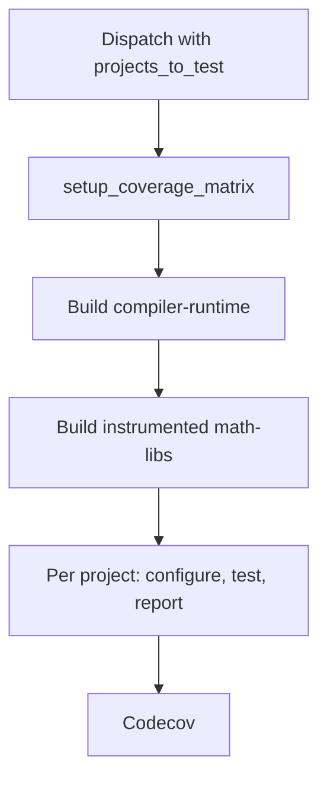

# Code Coverage

TheRock builds ROCm libraries with LLVM source-based coverage and reports to
[Codecov](https://app.codecov.io/gh/ROCm/TheRock). Coverage is opt-in per
project — instrumentation slows a library substantially, and a report is only
worth producing when the test suite gives a meaningful signal.

## How it works

- **Instrumented** — compiled with `-fprofile-instr-generate`; every line bumps
  a counter. Slower and bigger; never shipped.
- **profraw** — the counter file an instrumented process writes on exit.
- **lcov** — the final report: which lines ran and which did not.

Pipeline: build instrumented → run tests → collect profraw → convert to lcov.

A project's tests load its dependencies too. If those were instrumented, their
counters would pollute the report. So exactly one library is instrumented; the
rest come from the regular nightly build (the **baseline**):

|              | Source              | What it provides                   |
| ------------ | ------------------- | ---------------------------------- |
| **Baseline** | Regular nightly run | Whole ROCm stack, non-instrumented |
| **Coverage** | This run            | Only the one instrumented project  |

The test runner installs the baseline, then replaces only the selected
project's libraries with instrumented ones. See [Coverage CI](#coverage-ci).

## Enabling coverage for a local build

```bash
cmake -B build -GNinja . \
  -DTHEROCK_AMDGPU_FAMILIES=gfx94X-dcgpu \
  -DHIPRAND_ENABLE_COVERAGE=ON
```

`<PROJECT>_ENABLE_COVERAGE` is TheRock's own flag; upstream option names are
not standardised (hipRAND: `BUILD_CODE_COVERAGE`, rocRAND: `CODE_COVERAGE`,
RCCL: `ENABLE_CODE_COVERAGE`), so `therock_subproject.cmake` translates it to
whichever name `COVERAGE_PROJECTS` registers for that project. Passing the flag
for an unregistered project is a configure error, not a silent no-op.

### Enabling a whole group

| Option                                | Instruments                                  |
| ------------------------------------- | -------------------------------------------- |
| `THEROCK_COVERAGE_ROCM_LIBRARIES_ALL` | all coverage-enabled rocm-libraries projects |
| `THEROCK_COVERAGE_ROCM_SYSTEMS_ALL`   | all coverage-enabled rocm-systems projects   |
| `THEROCK_COVERAGE_ALL`                | both of the above                            |

Each expands to individual `<PROJECT>_ENABLE_COVERAGE` flags. An explicit
`-D<PROJECT>_ENABLE_COVERAGE=OFF` wins over a group flag. Membership is
generated from `COVERAGE_PROJECTS`; these options default `OFF` and have no
effect on a normal build.

### Host code only

Unless a project opts into [device coverage](#device-coverage), only its host
code is measured. Upstream coverage flags are unqualified and the HIP driver
forwards them to device compilation. Two failures result: the runtime aborts
looking up missing profiling symbols in the device image, and when readback
succeeds it writes a profile named after the device target (colons included,
breaking CI artifact upload). `therock_subproject.cmake` appends the negation
scoped to device compilation:

```
-Xarch_device -fno-profile-instr-generate -Xarch_device -fno-coverage-mapping
```

The later of a `-f`/`-fno-` pair wins; the project's own flags arrive after
`CMAKE_<LANG>_FLAGS`, so the negation is appended to
`CMAKE_<LANG>_COMPILE_OBJECT` via a generated file passed as
`CMAKE_PROJECT_INCLUDE`.

The same file clears `CMAKE_<LANG>_COMPILER_LAUNCHER`, so instrumented
projects never compile through ccache. ccache (4.11 at least) removes every
`-Xarch_<arch> <arg>` pair whose arch did not also arrive as an Apple-style
`-arch`, from both the cache key and the command it runs. That drops the
negation above, so kernels are instrumented after all, and drops the
`-Xarch_host` spelling rocRAND's and hipRAND's own coverage options use, so
those libraries are not instrumented at all. Neither fails the build; both
only show up once the tests run. Projects that are not instrumented keep using
the cache.

### The profile runtime's link dependencies

`libclang_rt.profile_rocm.a` needs `-ldl` and `-lpthread`, which the driver
does not supply. On the manylinux base these are not in libc, so an instrumented
shared library gets undefined references and any executable linking it fails
`--no-allow-shlib-undefined`. `therock_subproject.cmake` adds both libraries
automatically.

## Producing a report locally

Set `LLVM_PROFILE_FILE` with `%p`/`%m` substitutions to keep per-process files
distinct, run the tests, then call `merge_coverage_report.py`:

```bash
export LLVM_PROFILE_FILE="$PWD/coverage-report/profraw/%p-%m.profraw"
ctest --test-dir build/math-libs/hipRAND/build

python build_tools/github_actions/merge_coverage_report.py \
  --profraw-dir coverage-report/profraw \
  --rocm-dir build/dist/rocm \
  --object-globs "lib/libhiprand.so*" \
  --summary-output coverage-report/coverage_summary.txt \
  --html-output coverage-report/html
```

`llvm-profdata` and `llvm-cov` must match the compiler that built the objects;
the script prefers the copies under `<rocm-dir>/lib/llvm/bin`. Only the HTML
reads source files; lcov and the text table work from coverage mappings alone.
Use `--path-equivalence <from>,<to>` if the source tree has moved since the
build.

## Device coverage

A project's GPU kernels can be measured along with its host code. It is opt-in
per project, through `device_coverage=True` in `COVERAGE_PROJECTS`, and only
worth it where the reported objects contain kernels: rocRAND's generators are
all kernels, while hipRAND's and hipDNN's libraries have none. It is enabled
for rocRAND, rocSPARSE and rocSOLVER. rocSOLVER's own coverage option already
instruments its kernels, so for it this only drops the device-side negation;
rocRAND's option is host-only and rocSPARSE's negates device instrumentation
itself, so for those two the device flags are what instrument the kernels.

### Building with device coverage

`CMakeLists.txt` turns `device_coverage` into
`<PROJECT>_ENABLE_DEVICE_COVERAGE=ON` once the project's coverage is on, and
`therock_subproject.cmake` then appends the positive form of the device-scoped
pair in place of the negation:

```
-Xarch_device -fprofile-instr-generate -Xarch_device -fcoverage-mapping
```

Being last on the compile line, it overrides an `-Xarch_host`-only upstream
option such as rocRAND's, or rocSPARSE's own device-side negation, just as the
negation overrides unqualified ones. An
explicit `-D<PROJECT>_ENABLE_DEVICE_COVERAGE` wins in either direction, so a
local build can measure rocRAND's host code alone, or try another project's
kernels:

```bash
cmake -B build -GNinja . \
  -DTHEROCK_AMDGPU_FAMILIES=gfx94X-dcgpu \
  -DROCRAND_ENABLE_COVERAGE=ON
```

The rest comes from the toolchain, with one link-order correction:

| Piece                                          | Supplied by                                                                                       |
| ---------------------------------------------- | ------------------------------------------------------------------------------------------------- |
| Device runtime, amdgcn `libclang_rt.profile.a` | amd-llvm's amdgcn-amd-amdhsa runtimes build; the linker wrapper links it into each device image   |
| Host collector, `libclang_rt.profile_rocm.a`   | the driver on a HIP link; `therock_coverage_device.cmake` where a project names the runtime       |
| Reading device counters back at exit           | `libclang_rt.profile_rocm.a`'s exit handler                                                       |
| Not aborting on an unresolved descriptor       | the HIP runtime, since [ROCm/rocm-systems#10894](https://github.com/ROCm/rocm-systems/pull/10894) |

The include `therock_subproject.cmake` generates for the project runs
`cmake/therock_coverage_device.cmake`, which does two things:

- It fails the configure when the compiler has no amdgcn profile runtime, or no
  `libclang_rt.profile_rocm.a`. The linker wrapper only forwards the profile
  flags to the device link when the first exists, so otherwise the problem
  would surface later, as a device link error or a report without device
  coverage.
- Once the project's targets exist, it inserts `libclang_rt.profile_rocm.a`
  ahead of `libclang_rt.profile.a` in any shared library that names the latter
  itself. Only the former's copy of `InstrProfilingFile.o` reads device
  counters back at exit. The driver orders them correctly on a HIP link with
  `-fprofile-instr-generate`, but rocSPARSE keeps that flag off its link and
  names `clang_rt.profile clang_rt.profile_rocm` itself, in that order, so its
  kernels were counted and never written. Executables are left alone, even
  rocSPARSE's unit tests, which name the same group:
  `libclang_rt.profile_rocm.a` also defines `hipLaunchKernel` and the other
  launch calls as interceptors, and an executable that carries them next to
  those of an instrumented library it loads recurses on its first kernel
  launch.

RCCL needed far more than this
([ROCm/rocm-systems#10650](https://github.com/ROCm/rocm-systems/pull/10650)):
its device linker
bypasses the driver, so it passes the device runtime, a profile section anchor,
a `-u __llvm_profile_hip_collect_device_data` force-link and the host collector
by hand. A library built the standard HIP way gets all of that from the driver.

### Collecting and reporting device coverage

At exit the collector writes one device-side profile per translation unit,
named `<target id>[.<n>].<LLVM_PROFILE_FILE name>`, for example
`gfx942:sramecc+:xnack-.0.rocrand-shard1-1234-5678.profraw`. They merge with
the host profiles as they are.

Kpack-split builds keep device code out of the host libraries, in one archive
per artifact and GPU target (`.kpack/rand_lib_gfx942.kpack` holds rocRAND's
and hipRAND's), keyed `<stage prefix>/<binary>#<n>`. Three consequences:

- The split moves a fat binary's program header table to a trailing `PT_LOAD`
  whose address is not its file offset, and pins the two together again only
  for executables. The profile runtime in an instrumented shared library finds
  its headers at `&__ehdr_start + e_phoff` (`__llvm_write_binary_ids`), so it
  reads the wrong memory when it writes its profile at exit: the test process
  segfaults with an empty profile (librocsparse.so, librocsolver.so), or the
  headers it parses are garbage (librocrand.so). This hits host-only coverage
  just the same. `install_rocm_code_coverage_build.py` therefore pins the
  headers of every instrumented binary it installs, with the same
  normalization rocm_kpack applies to executables
  (`build_tools/_therock_utils/elf_phdr.py`).

- The hybrid install has to swap the project's code objects into the baseline's
  archive, or the instrumented host library runs uninstrumented kernels.
  `install_rocm_code_coverage_build.py --replace-device-code` replaces only the
  entries under the project's folder, so siblings in the same archive keep the
  baseline's kernels.

- `llvm-cov` needs those code objects to map device counters back to source.
  `merge_coverage_report.py --device-code` extracts the ones that carry a
  coverage mapping and adds them as `-object` arguments.

Kernels run noticeably slower once instrumented, which the coverage timeout
multiplier already allows for.

## Coverage CI


```mermaid
graph TD
    dispatch[Dispatch with projects_to_test] --> matrix[setup_coverage_matrix]
    matrix --> compilerRuntime[Build compiler-runtime]
    compilerRuntime --> mathLibs[Build instrumented math-libs]
    mathLibs --> report[Per project: configure, test, report]
    report --> codecov[Codecov]
```

`multi_arch_ci_coverage_linux.yml` is the entry point: it computes the matrix,
builds the instrumented stack, then fans out to
`multi_arch_ci_coverage_report.yml` per project per GPU family.
`configure_coverage_ci.py` is the registry — CMake target, build stage, test
component, object globs, and Codecov flag for every onboarded project.

### Dispatching a run

Start from the Actions tab or `gh` CLI, or let the rocm-libraries nightly
call it via a cross-repo reusable `uses:` workflow call. There is no cron trigger.

Pass a recent nightly run id as `baseline_run_id` (keep `baseline_release_type`
at `nightly`) and set `projects_to_test`; other inputs use sensible defaults.
Running coverage separately keeps failures off the nightly's status. Automatic
nightly dispatch is a follow-up; `baseline_run_id` is already the right input.

### The instrumented build

`setup_coverage_matrix` runs `configure_coverage_ci.py`, emitting the matrix,
`coverage_cmake_options`, and `needs_math_libs`. Selections naming a project
whose stage has no build job fail immediately.

`build_compiler_runtime` always runs first — every other stage pulls its
inbound artifacts from it. It is a regular, non-instrumented build: no
compiler-runtime project has a supported coverage option.
`build_instrumented_math_libs` fans out over GPU families and is skipped when
`needs_math_libs` is false; 17 of the 19 measurable projects live there.

`coverage_cmake_options` is appended to the math-libs configure line only. A
selection covering a whole group collapses to that group's option (the default
selection becomes `-DTHEROCK_COVERAGE_ROCM_LIBRARIES_ALL=ON`); a narrow one
names each project. `CMakeLists.txt` expands group options to
`<PROJECT>_ENABLE_COVERAGE` flags; `therock_subproject.cmake` translates each
to the project's upstream name. Everything not selected builds normally.

Build jobs use `multi_arch_build_portable_linux_artifacts.yml` directly.
Coverage sets three of its inputs:

- `extra_cmake_options` carries `coverage_cmake_options`.
- `artifact_run_id` is `<run_id>-coverage`. Artifacts and logs publish there
  under `release_type: ci`, not under the run id itself. A caller that builds a
  regular stack in the same run (the rocm-libraries nightly does, and uses it
  as the baseline) publishes artifacts with the same names, which a shared
  namespace would overwrite.
- `external_repo_config` is forwarded from the caller, so a rocm-libraries
  nightly measures the commit it is testing. Without it the build uses
  TheRock's pinned submodules.

### Test execution

Per shard, `test_code_coverage_component.yml` does three things:

1. **Install baseline + swap project.** `install_rocm_code_coverage_build.py`
   installs from `--run-id` (the nightly) and replaces only the
   project-under-test from `--code-coverage-run-id` (`<run_id>-coverage`).
   With device coverage it also gets `--replace-device-code`, which swaps the
   project's code objects into the installed kpack archives.
1. **Set `LLVM_PROFILE_FILE`** to a per-shard path (`%p`/`%m`) so concurrent
   processes don't overwrite each other.
1. **Run tests and upload profraw** under `always()` — a failing shard still
   exercised code. Device-side profiles are named after the GPU target, colons
   included, and one of them makes `upload-artifact` reject the whole upload.
   With device coverage their colons become underscores; otherwise they are
   dropped with a warning.

With `BUILD_VARIANT=coverage`, `fetch_test_configurations.py` multiplies each
component's `timeout_minutes` by 4, capped at 180 so the step ends inside the
job's 210-minute limit, and never lowered below the release value.
Instrumented tests run slower, and some upstream coverage options do more than
instrument: hipRAND's `BUILD_CODE_COVERAGE` adds `-O0 -g`, and rocRAND's
`CODE_COVERAGE` compiles in extra CPU-only test suites.

#### Why there are two run ids

The whole stack is built instrumented once to avoid rebuilding per-project
dependencies. But reporting must be per project: an instrumented rocRAND writes
its own profiles alongside hipRAND's, shifting hipRAND's numbers on unrelated
changes. The baseline-install-then-overlay isolates exactly one project.

The baseline is read from `baseline_release_type` (normally `nightly`), not the
coverage run's `ci` channel — artifacts are bucketed per channel. The swap
downloads the project's whole artifact (`rand`, which also contains rocRAND)
but extracts only the paths matching the project's library folder in
`COMPONENT_MAP` (`hipRAND`). The instrumented stack lives under
`<run_id>-coverage`, so even a baseline from the same workflow run is never
overwritten by it.

A missing instrumented artifact fails the install step. A swap that matches no
files does not: the installer logs `Replaced 0` and the tests run against the
baseline's uninstrumented binaries. The failure then surfaces in the report
job, which finds no profraw files.

#### What scopes a report to one project

`object_globs` limits what `llvm-cov` reports on. The overlay limits what is
instrumented: inline and template code is `linkonce_odr` and lands in every
binary that uses it — an instrumented sibling writes counters that
`llvm-profdata` merges in, unreachable by any `-object` filter. This matters
most for header-only projects (rocPRIM, hipCUB, rocThrust, rocWMMA).

### Artifacts

| Artifact     | Where                               | Purpose                       |
| ------------ | ----------------------------------- | ----------------------------- |
| Instrumented | CI bucket, `<run_id>-coverage`      | Stack under test + LLVM tools |
| Profraw      | GitHub Actions artifacts, per shard | Raw profiles for aggregation  |

Profraw names include the project, GPU family, and shard index.

### Report generation

`aggregate_coverage` runs under `if: !cancelled()` so partial reports survive
shard failures. It downloads profraw artifacts, reinstalls the run's artifacts
(LLVM tools must match the compiler that produced the profiles), then runs
`merge_coverage_report.py`. A report that measured nothing fails rather than
publishing 0%:

- No profraw files: the tests didn't run, or the wrong library was loaded.
- No matching objects: `object_globs` doesn't match the project's install
  layout.
- Profiles with no counters: the processes loaded no instrumented code. Either
  the coverage flags never reached the compiler, or every process crashed
  before writing its profile.
- Objects with no coverage mapping (`llvm-cov`: "no coverage data found"): the
  project's coverage option did not take effect.
- No line in the reported objects ran: the tests loaded a different copy of the
  project, or never reached it.

With device coverage the step runs with `--device-code`, which adds two more:

- No code object with a coverage mapping in the kpack archives: the kernels
  were built without device instrumentation.
- No device-side profile: the kernels never ran, the runtime could not read
  their counters back, or the test job dropped the profiles.

The `coverage-report-<project>-<family>` artifact:

| File                   | What it is                 |
| ---------------------- | -------------------------- |
| `coverage.info`        | lcov for Codecov           |
| `coverage_summary.txt` | per-file table with totals |
| `html/index.html`      | browsable annotated report |

Totals are also written to the job summary page. The HTML step runs
`fetch_sources.py` and remaps paths with `--path-equivalence`; it is
`continue-on-error` (losing it costs only the annotated view). Codecov is
skipped, not failed, when `CODECOV_TOKEN` is absent.

## Selecting projects to run

`projects_to_test` takes comma-separated project names or group aliases
(`rocm_libraries_all`, `rocm_systems_all`, `all`). Empty selects every project
with a build job (currently `rocm_libraries_all`).

`rccl` and `rocshmem` live in `comm-libs`, which has no build job; they are
excluded from the default and rejected (not just dropped) when named or reached
via an alias. See [Adding a stage](#adding-a-stage).

`hipblaslt` and `hiptensor` are excluded from the default and aliases because
their instrumented builds fail. Naming one still works and prints the reason —
retesting is how the block gets noticed as fixed. See
[Blocked projects](#blocked-projects).

Aliases resolve to concrete names before the matrix is built; nothing downstream
sees them.

## Adding a project

Add an entry to `COVERAGE_PROJECTS` in `configure_coverage_ci.py`.

`coverage_option` must name the CMake option the project implements, and it must
select LLVM instrumentation (not gcov, which writes `.gcda` files this pipeline
can't read). Names vary: most use `BUILD_CODE_COVERAGE` or `CODE_COVERAGE`;
RCCL uses `ENABLE_CODE_COVERAGE`; rocWMMA and hipTensor prefix the project
(`ROCWMMA_CODE_COVERAGE`). A wrong name still configures and builds cleanly;
it only shows up as a report with no coverage data.

Verify a local instrumented build produces a non-empty report before committing
the entry. Set `source_repo` (`ROCM_LIBRARIES` or `ROCM_SYSTEMS`) to route the
project into the correct group alias; membership lists are generated at configure
time, so no CMake edit is needed. `object_globs` must match what the project
actually installs — a miss fails the report job rather than publishing zero. A
glob prefixed with `!` removes its matches, for test binaries that share an
install directory with a sibling project's (rocPRIM's `bin/test_*` would
otherwise include hipCUB's `bin/test_hipcub_*`).

Set `device_coverage=True` only when the objects in `object_globs` contain
kernels, and check a local build's report shows device functions first. See
[Device coverage](#device-coverage).

## Blocked projects

A `blocked_reason` alongside `coverage_option` means the instrumented build is
broken. The project is dropped from the default and group aliases (including
`--emit-cmake` output) but can still be named explicitly, printing the reason.
A stage is built as a unit, so one blocked project takes the whole stage down.
Drop `blocked_reason` once the upstream fix lands.

`hipblaslt` — its coverage branch links against bare `rocroller` while the rest
of its CMakeLists uses `roc::rocroller`. Under TheRock rocRoller is a separate
subproject; the bare name reaches the linker as `-lrocroller` with no `-L`.

`hiptensor` — upstream applies coverage as a blanket `add_compile_options` on a
composable_kernel-based library. The coverage mapping data exceeds 2GB, failing
the link with out-of-range `R_X86_64_PC32` relocations. A larger code model is
the likely fix.

## Adding a stage

`configure_coverage_ci.py` rejects selections reaching beyond `compiler-runtime`
and `math-libs` (`BUILDABLE_STAGES`). To add a stage: add a build job in
`multi_arch_ci_coverage_linux.yml` and add the stage name to `BUILDABLE_STAGES`.
Order matters — a stage needs its inbound artifacts built first. `comm-libs`
(needed by `rccl`/`rocshmem`) depends on `emulation`; that's two jobs, not one.
Consult `build_topology`; a missing inbound artifact won't surface until deep in
the build.
