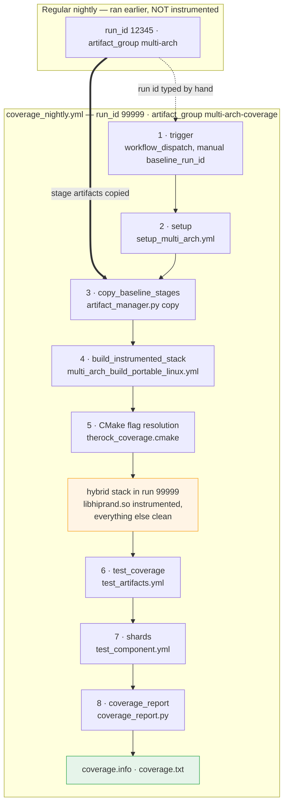
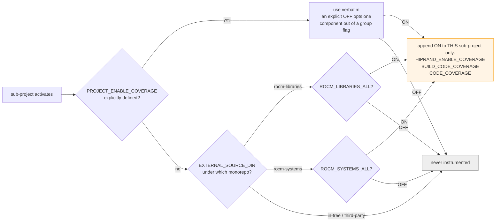

# Nightly Code Coverage: End-to-End Flow

This page traces a nightly coverage run from the dispatch button to the
published lcov report, naming the file responsible at every step. It is a
control-flow reference for people modifying or debugging the pipeline.

For *why* coverage is scoped per project and *how* to request it, see
[Code Coverage](code_coverage.md). For the CI machinery this pipeline reuses,
see [CI Overview](ci_overview.md) and [Artifacts](artifacts.md).

## The one idea to hold on to

A coverage run does not build a full instrumented ROCm stack. It takes an
already-completed regular nightly, copies that nightly's **non-instrumented**
stage artifacts into its own run id, and builds only the stage containing the
projects under test on top of them. The run then owns a complete stack in which
only those projects are instrumented, and every downstream job can fetch it
from a single run id without knowing coverage exists.

Everything below is in service of that assembly.

## Worked example

The walkthrough uses the workflow's defaults, with two invented run ids:

| Thing                | Value                                                |
| -------------------- | ---------------------------------------------------- |
| Baseline nightly     | run id `12345`, artifact group `multi-arch`          |
| Coverage run         | run id `99999`, artifact group `multi-arch-coverage` |
| Family / target      | `gfx94X-dcgpu` / `gfx942`                            |
| Instrumented project | `hipRAND`                                            |
| Stage built          | `math-libs`                                          |
| Stages copied        | all eleven others                                    |

## Overview



## 1. Trigger

**File:** `.github/workflows/coverage_nightly.yml`

`workflow_dispatch` is the only entry point, which is what RFC0014 option B1
asks for: nothing triggers this automatically, so the production nightly is
untouched and a coverage run can fail or be abandoned without consequence.

`baseline_run_id` is `required: true` and has no default. Silently picking the
latest nightly would mix an unknown dependency set into the report, and the
operator supplying a known-good run id by hand is the "manual coordination"
the PoC explicitly accepts.

A `concurrency` group keyed on ref and family prevents two instrumented builds
of the same family competing for nodes for hours to produce the same report.

## 2. Setup: resolving the coverage build variant

| File                                                    | Role                                                       |
| ------------------------------------------------------- | ---------------------------------------------------------- |
| `.github/workflows/setup_multi_arch.yml`                | Called with `build_variant: coverage`                      |
| `build_tools/github_actions/configure_multi_arch_ci.py` | Expands that variant into a build config                   |
| `build_tools/github_actions/amdgpu_family_matrix.py`    | Defines the `coverage` variant and which families offer it |

`amdgpu_family_matrix.py` supplies the three facts that make the variant real:

```python
all_build_variants["linux"]["coverage"] = {
    "build_variant_label": "coverage",
    "build_variant_suffix": "coverage",
    "build_variant_cmake_preset": "linux-release-coverage",
}
```

The suffix is what yields artifact group `multi-arch-coverage`, and that
separate S3 namespace is what makes it impossible for a coverage build to be
consumed as though it were shippable. `coverage` also has to appear in a
family's `build_variants` list to be selectable for that family; it is listed
for `gfx94x` and `gfx950`.

In `configure_multi_arch_ci.py`, `_expand_build_config_for_platform` turns off
Python wheels, PyTorch, JAX, and native Linux packages when the suffix is
`coverage`. All four are consumers of a stack you would ship, which this is not.

The job's `linux_build_config` output carries `baseline_run_id`,
`prebuilt_stages`, `artifact_group`, and the preset name forward. Every later
job reads its inputs out of that JSON rather than from the workflow inputs, so
there is one source of truth.

`stage_reuse_mode` is `dry-run` on purpose. It honors the explicit
`prebuilt_stages` list while only *reporting* what automatic reuse could
additionally do. Applying automatic reuse would be unsafe here: reusing a stage
that holds a project under test would substitute non-instrumented binaries and
produce an empty report rather than an error.

## 3. Copying the baseline stages

**Files:** `.github/workflows/coverage_nightly.yml` (job `copy_baseline_stages`)
→ `build_tools/artifact_manager.py`, plus
`.github/actions/configure_aws_artifacts_credentials`

This job builds nothing. It runs, on a CPU node:

```bash
python build_tools/artifact_manager.py copy \
  --source-run-id=12345 \
  --source-repository=ROCm/TheRock \
  --stage="compiler-runtime,emulation,runtime-tests,..." \
  --amdgpu-families="gfx94X-dcgpu" \
  --expand-family-to-targets
```

The alternative to copying would be to point the test jobs at two run ids, one
for instrumented artifacts and one for dependencies. That would mean teaching
the artifact fetch path about coverage. Copying keeps `setup_test_environment`,
`install_rocm_from_artifacts.py`, and every test job coverage-agnostic, at the
cost of some S3 traffic.

## 4. Building the instrumented stage

| File                                                              | Role                                              |
| ----------------------------------------------------------------- | ------------------------------------------------- |
| `.github/workflows/multi_arch_build_portable_linux.yml`           | One job per stage; forwards `extra_cmake_options` |
| `.github/workflows/multi_arch_build_portable_linux_artifacts.yml` | Runs the configure, build, and artifact upload    |

`prebuilt_stages` causes every stage job except `math-libs` to skip its build,
so only that stage's `multi_arch_build_portable_linux_artifacts.yml` invocation
does real work. It configures with the preset and appends
`extra_cmake_options`, an input added by this PR for build variants that need
per-run settings a preset cannot express:

```bash
cmake ... --preset=linux-release-coverage <stage args> \
  -DTHEROCK_COVERAGE_ROCM_LIBRARIES_ALL=OFF -DTHEROCK_COVERAGE_PROJECTS=hiprand
```

The group flag has to be switched back **off**. The preset instruments all of
rocm-libraries, which is what a full nightly wants, so a run narrowing to one
project must undo it or it will instrument everything and only test hipRAND.
`coverage_nightly.yml` composes that pair of options whenever
`coverage_projects` is non-empty.

Artifacts upload into artifact group `multi-arch-coverage` under run id `99999`,
alongside the copied ones. The hybrid stack now exists.

## 5. How CMake decides what gets instrumented

| File                             | Role                                                                    |
| -------------------------------- | ----------------------------------------------------------------------- |
| `CMakePresets.json`              | `linux-release-coverage`: group flag plus `RelWithDebInfo`              |
| `CMakeLists.txt`                 | `include(therock_coverage)` and the `therock_coverage_init()` call site |
| `cmake/therock_coverage.cmake`   | Normalizes requests; decides per sub-project                            |
| `cmake/therock_subproject.cmake` | Appends the resulting options to one sub-project's configure line       |

`therock_coverage_init()` is called from `CMakeLists.txt` after the monorepo
source directories are known and before any sub-project is declared, because
the group flags are resolved against those directories. It folds
`THEROCK_COVERAGE_PROJECTS` entries to upper case — CI forwards project names
in whatever casing its change detection produced — and sets
`HIPRAND_ENABLE_COVERAGE=ON` in the parent scope.

Then, as each sub-project is activated,
`therock_cmake_subproject_activate()` in `cmake/therock_subproject.cmake` calls
`therock_coverage_get_subproject_args()`:



Monorepo membership comes from the sub-project's `EXTERNAL_SOURCE_DIR` rather
than a declared list, so components moving between monorepos need no
bookkeeping. `amd-llvm` and third-party sources fall through to "never
instrumented": they cost build time and contribute nothing to a component
report.

The two legacy option names are what hipRAND and rocRAND read today. Passing
them is safe **only** because these arguments reach one sub-project's configure
command; a super-build-wide `-DBUILD_CODE_COVERAGE=ON` would be read by every
project that defines it, which is the cross-contamination the design exists to
prevent.

## 6. Selecting what to test

| File                                                      | Role                                             |
| --------------------------------------------------------- | ------------------------------------------------ |
| `.github/workflows/test_artifacts.yml`                    | Threads `coverage_enabled` to the component jobs |
| `build_tools/github_actions/fetch_test_configurations.py` | Resolves `test_labels` into component jobs       |

`coverage_nightly.yml` passes `coverage_enabled: true` and pins
`test_type: full`, since coverage measured against a partial suite understates
a component. With `test_labels: hiprand`, `fetch_test_configurations.py`
resolves to a single component job named `hiprand` with fetch arguments
`--rand --tests`.

The sanity check job also runs but is not given `coverage_enabled`: it only
proves the artifacts are usable, so there is nothing worth reporting.

## 7. Running tests and capturing profraw

**File:** `.github/workflows/test_component.yml` (job `test_component`), via
`.github/actions/setup_test_environment` → `build_tools/install_rocm_from_artifacts.py`

Each shard, on a `gfx942` runner:

1. Fetches artifacts for run `99999` — instrumented hipRAND plus the copied
   clean dependencies, one coherent stack.

1. Sets `LLVM_PROFILE_FILE` **before any test runs**, since that variable is
   the only thing telling the profile runtime where to write:

   ```
   $GITHUB_WORKSPACE/coverage-report/profraw/hiprand-shard1-%p-%m.profraw
   ```

   `%p` (pid) and `%m` (binary signature) are expanded by the profile runtime
   and keep concurrent test processes from overwriting each other. The shard
   index keeps this shard's files distinct once every shard's files are
   downloaded into one directory.

1. Runs the component's test script. Instrumented code writes a `.profraw` per
   process on exit.

1. Uploads the directory **unmerged** as
   `coverage-profraw-hiprand-gfx94X-dcgpu-shard1`, with
   `if-no-files-found: error`.

Merging on the shard would produce a report reflecting only that shard's slice
of the suite: for a five-shard component, roughly 20% no matter how thorough
the tests are. The upload step uses `if: !cancelled()` so counters from a
failing test run are still collected.

## 8. Merging and reporting

**Files:** `.github/workflows/test_component.yml` (job `coverage_report`) →
`build_tools/github_actions/coverage_report.py` →
`build_tools/github_actions/github_actions_api.py`

The job depends on the whole shard matrix, because a component's coverage is
only complete once every shard has reported, and it needs no GPU — it only
reads files. It runs `setup_test_environment` again for two reasons: the
instrumented binaries are the objects the report is generated against, and that
build's `llvm-profdata` / `llvm-cov` are the only tools guaranteed to
understand the profile format those binaries emitted. Both tools arrive with
`amd-llvm_run`, which is in the always-fetched base artifact set in
`install_rocm_from_artifacts.py` and includes `lib/llvm/bin/**`.

Shard artifacts are downloaded with `pattern: ...-shard*` and
`merge-multiple: true`, landing in one directory. Then `coverage_report.py`:

| Step                      | Detail                                                                          |
| ------------------------- | ------------------------------------------------------------------------------- |
| `find_llvm_tool`          | Prefers `build/lib/llvm/bin`, falls back to `PATH` for local runs               |
| `collect_profraw_files`   | Non-empty `*.profraw` recursively; **raises if none found**                     |
| `merge_profraw`           | `llvm-profdata merge -sparse` → `coverage.profdata`                             |
| `discover_objects`        | Prefers `lib/libhiprand.so`; falls back to `bin/hipRAND/test_*` for header-only |
| `run_llvm_cov`            | `export --format=lcov` → `coverage.info`, then `report` → `coverage.txt`        |
| `gha_append_step_summary` | Posts the `TOTAL` line to the job summary                                       |

Two behaviors are deliberate. Missing profraw **fails** the job, because
instrumentation that produced no counters would otherwise be published as 0%
rather than reported as a problem. And `--ignore-filename-regex` drops
`/test/`, `/tests/`, `/googletest/`, `/benchmark/`, and `/_deps/`, so a
component cannot raise its coverage by adding test code.

`COMPONENT_TEST_DIR_OVERRIDES` in the script maps job names to install
directories where they differ, which is why `hiprand` finds its binaries under
`bin/hipRAND`. Only mismatches need an entry.

The result uploads as `coverage-report-hiprand-gfx94X-dcgpu`, holding
`coverage.info` (lcov) and `coverage.txt`, retained 14 days. Forwarding to a
coverage service is out of scope; RFC0014 leaves the choice of service open.

## File index

| File                                                              | Change                                               |
| ----------------------------------------------------------------- | ---------------------------------------------------- |
| `.github/workflows/coverage_nightly.yml`                          | new                                                  |
| `.github/workflows/multi_arch_build_portable_linux.yml`           | `extra_cmake_options` input, forwarded to stage jobs |
| `.github/workflows/multi_arch_build_portable_linux_artifacts.yml` | `extra_cmake_options` appended to configure          |
| `.github/workflows/test_artifacts.yml`                            | `coverage_enabled` input, threaded to components     |
| `.github/workflows/test_component.yml`                            | profraw capture and upload, `coverage_report` job    |
| `CMakeLists.txt`                                                  | include + `therock_coverage_init()` call site        |
| `CMakePresets.json`                                               | `linux-release-coverage` preset                      |
| `cmake/therock_coverage.cmake`                                    | new: request normalization and per-project decision  |
| `cmake/therock_subproject.cmake`                                  | passthrough into the measured sub-project            |
| `build_tools/github_actions/amdgpu_family_matrix.py`              | `coverage` variant, enabled for `gfx94x`             |
| `build_tools/github_actions/configure_multi_arch_ci.py`           | disables packaging for coverage builds               |
| `build_tools/github_actions/coverage_report.py`                   | new: merge and export                                |
| `build_tools/github_actions/tests/coverage_report_test.py`        | new: 14 tests                                        |
| `docs/development/code_coverage.md`                               | new: concepts and usage                              |
| `docs/development/code_coverage_flow.md`                          | new: this page                                       |

## Debugging a failed run

| Symptom                                      | Look at                                                                                                                                           |
| -------------------------------------------- | ------------------------------------------------------------------------------------------------------------------------------------------------- |
| Report is 0% or nearly empty                 | Was the component instrumented? `therock_coverage.cmake` logs `ENABLE CODE COVERAGE: <target>` per instrumented sub-project in the configure log. |
| `No non-empty .profraw files found`          | `LLVM_PROFILE_FILE` versus the upload path in `test_component.yml`, or the binaries were never instrumented                                       |
| `Found neither lib<c>.so nor test binaries`  | `COMPONENT_TEST_DIR_OVERRIDES` in `coverage_report.py`, or the fetch arguments from `fetch_test_configurations.py`                                |
| `Could not find llvm-profdata`               | Whether `amd-llvm_run` was fetched; see `install_rocm_from_artifacts.py`                                                                          |
| Test job cannot find a library at runtime    | A stage missing from both `prebuilt_stages` and the built stage, so it is in neither half of the hybrid stack                                     |
| `llvm-cov` reports a profile format mismatch | Tools and binaries came from different builds; the report job must fetch the same run id the tests did                                            |
| Device code shows no coverage                | Expected. Phase 1 is host-side only; see the scope section in [Code Coverage](code_coverage.md)                                                   |
