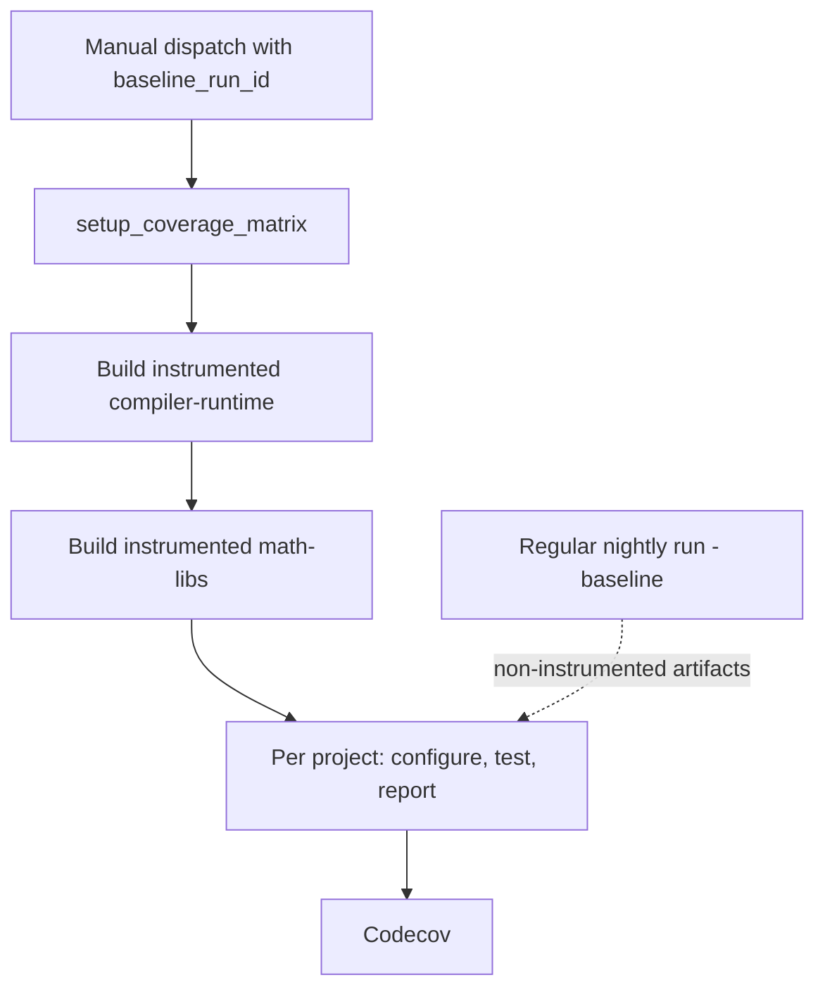

# Nightly Code Coverage Flow

An end-to-end walk through what happens between dispatching a coverage run and
a report landing in Codecov. See [Code Coverage](code_coverage.md) for enabling
coverage on a local build, the CMake options, and how to onboard a project.

The short version: a coverage run instruments the whole stack in one build, then
reconstructs per-project isolation at test time by installing a regular
nightly's non-instrumented artifacts and overlaying only the project under test.

Solid edges are job dependencies inside the coverage run. The dotted edge
crosses a run boundary: the baseline artifacts the test jobs install come from a
different workflow run entirely.

## Trigger point

`multi_arch_ci_coverage_nightly.yml` is started by hand, from the Actions tab or
the `gh` CLI. There is no cron trigger, and the regular nightly does not know
about this workflow.

Two inputs matter for a normal run. `baseline_run_id` is the run id of a recent
regular nightly, which supplies every non-instrumented dependency;
`baseline_release_type` is the channel that run published to, normally
`nightly`. The rest can be left at their defaults: every onboarded project, the
`gfx94X-dcgpu` family, and coverage's own `standard` test type, which is
narrower than the nightly's because instrumented tests already run several times
longer than normal ones.

Leaving `baseline_run_id` empty is supported but means something different: the
run's own instrumented artifacts are tested as built, so a project's
instrumented dependencies are measured alongside it.

Having the regular nightly dispatch this workflow automatically once its build
finishes, passing its own run id as `baseline_run_id`, is a later change. It
only needs to add a dispatching job — everything described below already takes
the baseline as an input.

## The normal build

Nothing about the regular nightly changes. It produces the ordinary
non-instrumented artifacts and publishes them to the nightly channel bucket
under its own run id. Coverage treats that run as a read-only input, and the
nightly has no coverage-specific jobs in it.

## The instrumented build

The dispatch creates a workflow run with its own id, status, and logs, entirely
separate from the baseline nightly's.

`setup_coverage_matrix` runs `configure_coverage_ci.py`, which reads
`PROJECTS_TO_TEST` (empty by default, meaning every onboarded project),
`AMDGPU_FAMILIES`, and `COVERAGE_CONFIG_SOURCE`, and emits the job matrix, the
family list, and `coverage_cmake_options`.

`build_instrumented_compiler_runtime` runs first. Every later stage in the run
fetches its inbound artifacts by run id, so the run needs a compiler-runtime of
its own to link against.

`build_instrumented_math_libs` then builds the whole `math-libs` stage with
`coverage_cmake_options` appended to the configure line. With hipRAND the only
onboarded project, and hipRAND being the whole rocm-libraries group, that
resolves to `-DTHEROCK_COVERAGE_ROCM_LIBRARIES_ALL=ON`; `CMakeLists.txt` expands
the group option into the individual `<PROJECT>_ENABLE_COVERAGE` flags and
`therock_subproject.cmake` forwards them into each subproject.

Both stages call `multi_arch_build_portable_linux_artifacts.yml`, the same
per-stage build workflow regular CI uses, rather than going through the full
`multi_arch_build_portable_linux.yml` pipeline. Naming the two stages coverage
needs keeps the shared pipeline free of coverage-specific stage filtering.

Both also pass `-DTHEROCK_FLAG_KPACK_SPLIT_ARTIFACTS=OFF`: split kernel
packaging would move instrumented device code out of the library `llvm-cov` is
later pointed at.

The instrumented artifacts publish under `release_type: ci`, so they land in the
CI bucket while the baseline sits in the nightly bucket. That is also why the
instrumented and regular copies of an artifact can share a filename without
colliding.

## Run ids

Two runs are involved and each names the other's artifacts differently. The
coverage run refers to its own instrumented artifacts as `github.run_id`
throughout. The baseline is not discoverable, so it is threaded through as an
input:

1. `multi_arch_ci_coverage_nightly.yml` takes `baseline_run_id` and
   `baseline_release_type` as `workflow_dispatch` inputs and forwards them to
   `multi_arch_ci_coverage_linux.yml`.
1. That forwards both again to `test_component.yml` as
   `coverage_baseline_run_id` and `coverage_baseline_release_type`.
1. `test_component.yml` derives `INSTALL_ARTIFACT_RUN_ID` and
   `INSTALL_RELEASE_TYPE` from them, which is what `setup_test_environment`
   installs from.

Because the two runs are connected only by that first input, and nothing in the
coverage run can look the baseline up, the workflow puts it in the `run-name` so
it is visible in the Actions list without opening the logs.

The release channel travels with the run id rather than being assumed, because
artifacts are bucketed per channel: reading the baseline under the coverage
run's own `ci` channel would look in the wrong bucket entirely. Callers that
leave `coverage_baseline_run_id` empty get exactly the previous behaviour.

`quartz_tracking_id` follows the same path. It stays empty on a manual dispatch
and exists so a coverage run can be attached to a release lineage once the
nightly dispatches coverage automatically.

## Test execution

`coverage_report` fans out over the matrix, one call to
`multi_arch_ci_coverage_linux.yml` per project and GPU family.

`configure_test_matrix` runs `fetch_test_configurations.py` — shared with
regular CI — narrowed to the one project this report covers, and outputs the
shard list.

`test_coverage` then runs one `test_component.yml` job per shard with
`coverage_enabled: true`. Four things happen in order:

1. **Install the baseline.** `setup_test_environment` runs against the baseline
   run id and channel, filling the install tree with a complete,
   non-instrumented ROCm.
1. **Overlay one project.** `overlay_coverage_artifacts.py` fetches the
   instrumented artifact from the coverage run and copies only the project's
   own subtree over the baseline copy. Details below.
1. **Point the runtime at a profile directory.** `LLVM_PROFILE_FILE` is set to
   a per-shard path using the `%p` (pid) and `%m` (binary signature)
   substitutions, so a shard that forks or loads several instrumented libraries
   does not overwrite its own profiles.
1. **Run the tests and upload.** The normal test script runs, then the profraw
   files upload as a workflow artifact under `always()` — a failing shard still
   exercised code.

### Why the overlay exists

A test job wants exactly one instrumented project and non-instrumented
everything else. An instrumented dependency would emit its own profiles and move
the coverage denominator around whenever that dependency changed.

Building each project separately would give that for free, but would also mean
rebuilding every dependency once per project. The nightly instead instruments
the whole stack in one build and separates the projects afterwards.

The overlay is per subproject directory rather than per artifact because
TheRock's artifacts are grouped: `rand` carries both rocRAND and hipRAND, so
overlaying a whole artifact would instrument the sibling too. Each project's
files sit under the subproject stage directory they were built in
(`math-libs/hipRAND/stage`), which is what `artifact_relpaths` in the coverage
registry names. Symlinks are preserved so the `libfoo.so -> libfoo.so.1` chain
the loader follows still resolves to the instrumented file.

If none of the relpaths match, the script fails the job. Silently testing the
baseline would report coverage against binaries that were never instrumented.

## Artifacts

Three distinct kinds are in play:

| Artifact     | Where it lives                      | What it is for                                 |
| ------------ | ----------------------------------- | ---------------------------------------------- |
| Baseline     | nightly bucket, baseline run id     | Every non-instrumented dependency              |
| Instrumented | CI bucket, coverage run id          | The project under test, and the LLVM tools     |
| Profraw      | GitHub Actions artifacts, per shard | Raw profiles, collected by the aggregation job |

Profraw artifact names carry the project, GPU family, and shard index, so the
aggregation job can glob back exactly its own shards when several projects are
being measured in one run.

## Report generation

`aggregate_coverage` runs once per project, under `if: !cancelled()` so a
partial report still gets produced when some shards failed.

It downloads every matching profraw artifact, then installs the **instrumented**
artifacts from the coverage run — not the baseline. `llvm-cov` needs the
binaries carrying the coverage mapping sections, and `llvm-profdata` and
`llvm-cov` themselves have to come from the same compiler that produced the
profiles. Both live under `lib/llvm/bin` of the installed distribution; a
version mismatch surfaces as an unhelpfully generic "malformed instrumentation
profile data" error.

`merge_coverage_report.py` then collects the profiles recursively, expands the
project's `object_globs` and deduplicates them by real path (a versioned symlink
family resolves to one file), runs `llvm-profdata merge -sparse` into a single
profdata index, and exports lcov. Finding no profraw files at all is fatal: it
means either the tests never ran, or the instrumented libraries were not the
ones loaded at runtime.

The lcov report uploads as a workflow artifact and goes to Codecov under the
project's flag. The Codecov step is skipped rather than failed when no
`CODECOV_TOKEN` is configured, so forks still get the lcov artifact.
