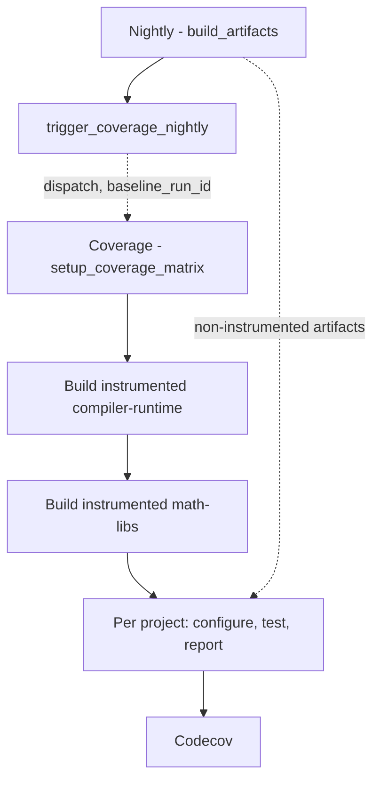

# Nightly Code Coverage Flow

An end-to-end walk through what happens between the regular nightly finishing
its build and a coverage report landing in Codecov. See
[Code Coverage](code_coverage.md) for enabling coverage on a local build, the
CMake options, and how to onboard a project.

The short version: the regular nightly dispatches a separate coverage run and
hands over its own run id. The coverage run instruments the whole stack in one
build, then reconstructs per-project isolation at test time by installing the
regular nightly's non-instrumented artifacts and overlaying only the project
under test.

Solid edges are job dependencies inside one workflow run. Dotted edges cross
run boundaries: the dispatch that starts the coverage run, and the baseline
artifacts its test jobs install.

## Trigger point

`multi_arch_release_linux.yml` (the regular nightly) owns the
`trigger_coverage_nightly` job. It depends on `build_artifacts` alone, not on
the nightly's test jobs: those are dispatched asynchronously and rarely all
pass, so waiting on them would mean coverage rarely runs, while the artifacts
coverage actually needs are ready as soon as the build is.

Four conditions gate the dispatch:

| Condition                                 | Why                                                                  |
| ----------------------------------------- | -------------------------------------------------------------------- |
| `vars.COVERAGE_NIGHTLY_ENABLED == 'true'` | Opt-in per repository while coverage is being rolled out             |
| `release_type` starts with `nightly`      | Dev builds are dispatched ad hoc and are not a useful baseline       |
| `build_variant == 'release'`              | Coverage measures the shipping configuration                         |
| Families include `gfx94X-dcgpu`           | RFC0014 phase 1 collects coverage on the single default architecture |

The job uses `benc-uk/workflow-dispatch` (pinned by SHA, with
`permissions: actions: write`) to start `multi_arch_ci_coverage_nightly.yml`
with four inputs: `baseline_run_id` set to `github.run_id`,
`baseline_release_type` set to the nightly's release channel, `amdgpu_families`
fixed to `gfx94X-dcgpu`, and `quartz_tracking_id`.

`test_type` is deliberately not forwarded. Instrumented tests already run
several times longer than normal ones, so coverage keeps its own narrower
default rather than inheriting the nightly's.

Dispatching `multi_arch_ci_coverage_nightly.yml` by hand and pasting in a
`baseline_run_id` from a recent nightly does exactly the same thing, and is the
supported way to reproduce or re-run a report.

## The normal build

Nothing about the regular nightly's build changes. `build_artifacts` produces
the ordinary non-instrumented artifacts and publishes them to the nightly
channel bucket under its own run id. Coverage treats that run as a read-only
input.

## The instrumented build

The dispatch creates a new workflow run with its own id, status, and logs. A
coverage failure therefore does not colour the nightly's status.

`setup_coverage_matrix` runs `configure_coverage_ci.py`, which reads
`PROJECTS_TO_TEST` (empty from a nightly dispatch, meaning every onboarded
project), `AMDGPU_FAMILIES`, and `COVERAGE_CONFIG_SOURCE`, and emits the job
matrix, the family list, and `coverage_cmake_options`.

`build_instrumented_compiler_runtime` runs first. Every later stage in the run
fetches its inbound artifacts by run id, so the run needs a compiler-runtime of
its own to link against.

`build_instrumented_math_libs` then builds the whole `math-libs` stage with
`coverage_cmake_options` appended to the configure line. With hipRAND the only
onboarded project, and hipRAND being the whole rocm-libraries group, that
resolves to `-DTHEROCK_COVERAGE_ROCM_LIBRARIES_ALL=ON`; `CMakeLists.txt` expands
the group option into the individual `<PROJECT>_ENABLE_COVERAGE` flags and
`therock_subproject.cmake` forwards them into each subproject.

Both stages call `multi_arch_build_portable_linux_artifacts.yml`, the same
per-stage build workflow regular CI uses, rather than going through the full
`multi_arch_build_portable_linux.yml` pipeline. Naming the two stages coverage
needs keeps the shared pipeline free of coverage-specific stage filtering.

Both also pass `-DTHEROCK_FLAG_KPACK_SPLIT_ARTIFACTS=OFF`: split kernel
packaging would move instrumented device code out of the library `llvm-cov` is
later pointed at.

The instrumented artifacts publish under `release_type: ci`, so they land in the
CI bucket while the baseline sits in the nightly bucket. That is also why the
instrumented and regular copies of an artifact can share a filename without
colliding.

## Run ids

Neither run can know the other's id in advance, since GitHub assigns the
coverage run's id only when the dispatch lands. The nightly already knows its
own, so the id travels downward:

1. `trigger_coverage_nightly` sends `baseline_run_id: ${{ github.run_id }}`.
1. `multi_arch_ci_coverage_nightly.yml` receives it as a `workflow_dispatch`
   input and forwards it, with `baseline_release_type`, to
   `multi_arch_ci_coverage_linux.yml`.
1. That forwards both again to `test_component.yml` as
   `coverage_baseline_run_id` and `coverage_baseline_release_type`.
1. `test_component.yml` derives `INSTALL_ARTIFACT_RUN_ID` and
   `INSTALL_RELEASE_TYPE` from them, which is what `setup_test_environment`
   installs from.

The coverage run refers to its own artifacts as `github.run_id` throughout.

The release channel travels with the run id rather than being assumed, because
artifacts are bucketed per channel: reading the baseline under the coverage
run's own `ci` channel would look in the wrong bucket entirely. Callers that
leave `coverage_baseline_run_id` empty get exactly the previous behaviour.

Because the two runs are only connected through this one input, the coverage
workflow puts the baseline in its `run-name`, so it is visible in the Actions
list without opening the logs. `quartz_tracking_id` follows the same path to
keep the coverage run attached to its release lineage.

## Test execution

`coverage_report` fans out over the matrix, one call to
`multi_arch_ci_coverage_linux.yml` per project and GPU family.

`configure_test_matrix` runs `fetch_test_configurations.py` — shared with
regular CI — narrowed to the one project this report covers, and outputs the
shard list.

`test_coverage` then runs one `test_component.yml` job per shard with
`coverage_enabled: true`. Four things happen in order:

1. **Install the baseline.** `setup_test_environment` runs against the baseline
   run id and channel, filling the install tree with a complete,
   non-instrumented ROCm.
1. **Overlay one project.** `overlay_coverage_artifacts.py` fetches the
   instrumented artifact from the coverage run and copies only the project's
   own subtree over the baseline copy. Details below.
1. **Point the runtime at a profile directory.** `LLVM_PROFILE_FILE` is set to
   a per-shard path using the `%p` (pid) and `%m` (binary signature)
   substitutions, so a shard that forks or loads several instrumented libraries
   does not overwrite its own profiles.
1. **Run the tests and upload.** The normal test script runs, then the profraw
   files upload as a workflow artifact under `always()` — a failing shard still
   exercised code.

### Why the overlay exists

A test job wants exactly one instrumented project and non-instrumented
everything else. An instrumented dependency would emit its own profiles and move
the coverage denominator around whenever that dependency changed.

Building each project separately would give that for free, but would also mean
rebuilding every dependency once per project. The nightly instead instruments
the whole stack in one build and separates the projects afterwards.

The overlay is per subproject directory rather than per artifact because
TheRock's artifacts are grouped: `rand` carries both rocRAND and hipRAND, so
overlaying a whole artifact would instrument the sibling too. Each project's
files sit under the subproject stage directory they were built in
(`math-libs/hipRAND/stage`), which is what `artifact_relpaths` in the coverage
registry names. Symlinks are preserved so the `libfoo.so -> libfoo.so.1` chain
the loader follows still resolves to the instrumented file.

If none of the relpaths match, the script fails the job. Silently testing the
baseline would report coverage against binaries that were never instrumented.

## Artifacts

Three distinct kinds are in play:

| Artifact     | Where it lives                      | What it is for                                 |
| ------------ | ----------------------------------- | ---------------------------------------------- |
| Baseline     | nightly bucket, baseline run id     | Every non-instrumented dependency              |
| Instrumented | CI bucket, coverage run id          | The project under test, and the LLVM tools     |
| Profraw      | GitHub Actions artifacts, per shard | Raw profiles, collected by the aggregation job |

Profraw artifact names carry the project, GPU family, and shard index, so the
aggregation job can glob back exactly its own shards when several projects are
being measured in one run.

## Report generation

`aggregate_coverage` runs once per project, under `if: !cancelled()` so a
partial report still gets produced when some shards failed.

It downloads every matching profraw artifact, then installs the **instrumented**
artifacts from the coverage run — not the baseline. `llvm-cov` needs the
binaries carrying the coverage mapping sections, and `llvm-profdata` and
`llvm-cov` themselves have to come from the same compiler that produced the
profiles. Both live under `lib/llvm/bin` of the installed distribution; a
version mismatch surfaces as an unhelpfully generic "malformed instrumentation
profile data" error.

`merge_coverage_report.py` then collects the profiles recursively, expands the
project's `object_globs` and deduplicates them by real path (a versioned symlink
family resolves to one file), runs `llvm-profdata merge -sparse` into a single
profdata index, and exports lcov. Finding no profraw files at all is fatal: it
means either the tests never ran, or the instrumented libraries were not the
ones loaded at runtime.

The lcov report uploads as a workflow artifact and goes to Codecov under the
project's flag. The Codecov step is skipped rather than failed when no
`CODECOV_TOKEN` is configured, so forks still get the lcov artifact.
