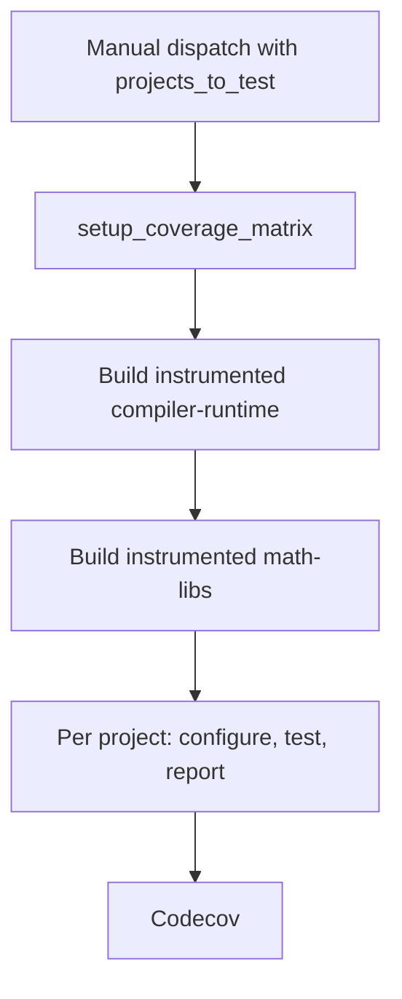

# Nightly Code Coverage Flow

An end-to-end walk through what happens between dispatching a coverage run and
a report landing in Codecov. See [Code Coverage](code_coverage.md) for enabling
coverage on a local build, the CMake options, and how to onboard a project.

The short version: a coverage run builds the stages its selection needs,
instruments only the selected projects, and reports on each of them separately
from that one run.

Every edge is a job dependency inside the one coverage run. Nothing crosses a
run boundary.

## Trigger point

`multi_arch_ci_coverage_nightly.yml` is started by hand, from the Actions tab or
the `gh` CLI. There is no cron trigger, and the regular nightly does not know
about this workflow.

The input that matters is `projects_to_test`: a comma-separated list of project
names, or one of the group aliases. The rest can be left at their defaults — the
`gfx94X-dcgpu` family and coverage's own `standard` test type, which is narrower
than the nightly's because instrumented tests already run several times longer
than normal ones.

Leaving `projects_to_test` empty selects every onboarded project this workflow
can build. That works, but it instruments all of them in one build, which is the
expensive way to run this. Name what you want measured.

`rccl` and `rocshmem` are the exception. They live in `comm-libs`, which has no
build job here, so naming them — or `rocm_systems_all` or `all` — is rejected by
`setup_coverage_matrix` rather than failing hours later with nothing to overlay.
See [Adding a stage](code_coverage.md#adding-a-stage).

## The regular nightly

Unaffected, and not consulted. It has no coverage-specific jobs, and a coverage
run neither reads its artifacts nor depends on it having succeeded.

## The instrumented build

The dispatch creates a workflow run with its own id, status, and logs.

`setup_coverage_matrix` runs `configure_coverage_ci.py`, which reads
`PROJECTS_TO_TEST`, `AMDGPU_FAMILIES` and `COVERAGE_CONFIG_SOURCE` and emits the
per-project job matrix, the family list, `coverage_cmake_options`, and
`needs_math_libs`. It also rejects any selection naming a project whose stage
this workflow has no build job for.

`build_instrumented_compiler_runtime` runs first and unconditionally. Every other
stage takes its inbound artifacts from it — all 19 of `math-libs`' inbound
artifacts are produced there — so no selection can skip it. It also receives the
coverage flags, since several rocm-systems projects (`rocprofiler-sdk`,
`aqlprofile`, `amdsmi`, `rocprofiler-compute`) are built in that stage.

`build_instrumented_math_libs` fans out over the GPU families, and is skipped
when `needs_math_libs` is false. It is the only other stage built: 17 of the 19
measurable projects live there, and the remaining two are blocked upstream, so
phase 1 carries no job for any further stage.

Both stages get `coverage_cmake_options` appended to their configure line.
`configure_coverage_ci.py` collapses a selection covering a whole group into
that group's option, so a full run reads `-DTHEROCK_COVERAGE_ALL=ON` while a
narrow one reads `-DHIPRAND_ENABLE_COVERAGE=ON`. `CMakeLists.txt` expands the
group options into individual `<PROJECT>_ENABLE_COVERAGE` flags. Everything not
selected builds normally.

`<PROJECT>_ENABLE_COVERAGE` is TheRock's own knob and is not what the subproject
sees. Upstream option names are not standardised — hipRAND takes
`BUILD_CODE_COVERAGE`, rocRAND takes `CODE_COVERAGE`, RCCL takes
`ENABLE_CODE_COVERAGE`, hipBLASLt takes `HIPBLASLT_ENABLE_COVERAGE` — so
`therock_subproject.cmake` translates TheRock's flag into the name registered
for that project. Doing it per subproject is what keeps the generic spellings
from instrumenting everything in the build that happens to understand them.

All the build jobs call `multi_arch_build_portable_linux_artifacts.yml`, the
same per-stage build workflow regular CI uses, rather than going through the
full `multi_arch_build_portable_linux.yml` pipeline. Naming the stages coverage
needs keeps the shared pipeline free of coverage-specific stage filtering.

They also pass `-DTHEROCK_FLAG_KPACK_SPLIT_ARTIFACTS=OFF`: split kernel
packaging rearranges the code objects embedded in the library `llvm-cov` is
later pointed at. Coverage is host-only, so this may no longer be load bearing,
but it has not been retested since and the flag is cheap to keep.

The artifacts publish under `release_type: ci`, under this run's id.

## Test execution

`coverage_report` fans out over the matrix, one call to
`multi_arch_ci_coverage_linux.yml` per project and GPU family.

`configure_test_matrix` runs `fetch_test_configurations.py` — shared with
regular CI — narrowed to the one project this report covers, and outputs the
shard list.

`test_coverage` then runs one `test_component.yml` job per shard with
`coverage_enabled: true`. Three things happen in order:

1. **Install the baseline, then overlay.** `setup_test_environment` runs against
   `baseline_run_id` and `baseline_release_type`, installing a fully
   non-instrumented stack. `overlay_coverage_artifacts.py` then fetches this
   run's artifact for the project under test and copies only that project's
   stage directories over it, so exactly one library in the install is
   instrumented.
1. **Point the runtime at a profile directory.** `LLVM_PROFILE_FILE` is set to
   a per-shard path using the `%p` (pid) and `%m` (binary signature)
   substitutions, so a shard that forks or loads several instrumented libraries
   does not overwrite its own profiles.
1. **Run the tests and upload.** The normal test script runs, then the profraw
   files upload as a workflow artifact under `always()` — a failing shard still
   exercised code.

### What scopes a report to one project

Two mechanisms, covering different leaks.

`object_globs` scopes the export. `llvm-cov export` is handed an explicit
`-object` for each of the project's binaries and reports only the functions
found in their coverage mappings, so a sibling's whole functions never appear.

The overlay scopes what is instrumented at all. Globs alone would not be enough,
because inline and template code defined in headers is emitted `linkonce_odr`
into every binary that uses it. If a sibling library were also instrumented, its
copies of those functions would write counters that `llvm-profdata` merges into
this project's, and no `-object` choice could separate them again. Installing a
non-instrumented baseline and overlaying one project keeps that from arising —
which matters most for the header-only projects (rocPRIM, hipCUB, rocThrust,
rocWMMA), where nearly all the measured code lives in headers.

The cost of selecting more projects is build and test time — each instrumented
library is slower to compile and slower to exercise.

## Artifacts

Two kinds are in play:

| Artifact     | Where it lives                      | What it is for                                 |
| ------------ | ----------------------------------- | ---------------------------------------------- |
| Instrumented | CI bucket, this run's id            | The stack under test, and the LLVM tools       |
| Profraw      | GitHub Actions artifacts, per shard | Raw profiles, collected by the aggregation job |

Profraw artifact names carry the project, GPU family, and shard index, so the
aggregation job can glob back exactly its own shards when several projects are
being measured in one run.

## Report generation

`aggregate_coverage` runs once per project, under `if: !cancelled()` so a
partial report still gets produced when some shards failed.

It downloads every matching profraw artifact, then installs the run's artifacts
again. `llvm-cov` needs the binaries carrying the coverage mapping sections, and
`llvm-profdata` and `llvm-cov` themselves have to come from the same compiler
that produced the profiles. Both live under `lib/llvm/bin` of the installed
distribution; a version mismatch surfaces as an unhelpfully generic "malformed
instrumentation profile data" error.

`merge_coverage_report.py` then collects the profiles recursively, expands the
project's `object_globs` and deduplicates them by real path (a versioned symlink
family resolves to one file), runs `llvm-profdata merge -sparse` into a single
profdata index, and exports lcov. Two conditions are fatal rather than reported
as zero coverage: finding no profraw files at all, which means the tests never
ran or the instrumented libraries were not the ones loaded at runtime; and
matching no objects, which means `object_globs` does not describe what the
project actually installs.

The lcov report uploads as a workflow artifact and goes to Codecov under the
project's flag. The Codecov step is skipped rather than failed when no
`CODECOV_TOKEN` is configured, so forks still get the lcov artifact.
