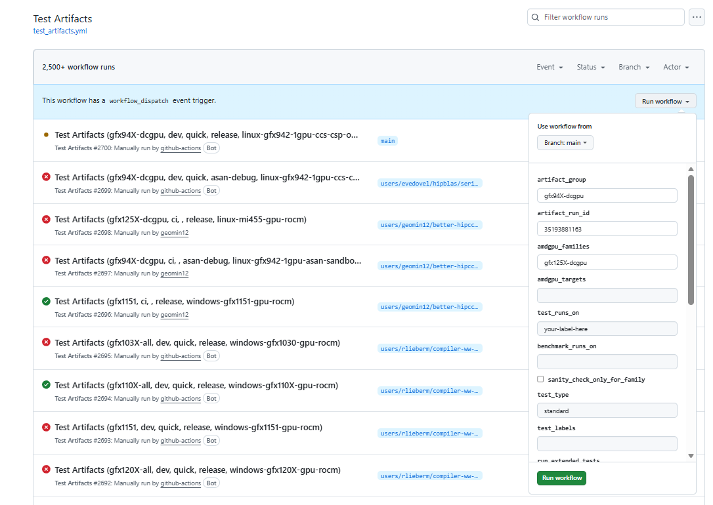

# Machine Bring-Up for GitHub Runners

This guide describes the process for validating a new machine added to the GitHub
runner pool before it enters production use.

## Overview

When a new machine is added to the GitHub Actions runner pool, it must be validated
by running the full test suite to ensure hardware and software compatibility. Use
the `test_artifacts.yml` workflow dispatch to trigger comprehensive testing on the
new runner.

## Prerequisites

- The machine is registered as a GitHub Actions self-hosted runner in the ROCm org
- The runner label is configured (e.g., `linux-gfx942-1gpu-ccs-ossci-rocm`)
- A recent successful build run ID is available to source artifacts from

## Validation Procedure

### Step 1: Find a Recent Successful Build Run ID

In the [ROCm/TheRock](https://github.com/ROCm/TheRock) repository, navigate to
**Actions** > **Multi-Arch CI** and find a recent successful run on `main` branch.

**Important**: The run must have built artifacts for the GPU architecture matching
your new machine. For example:

- RDNA4 machines (gfx1200/gfx1201) require a run that built `gfx120X-all`
- MI300 machines (gfx942) require a run that built `gfx94X-dcgpu`

Click on the successful run and note the run ID from the URL, e.g.,
[https://github.com/ROCm/TheRock/actions/runs/35193881163](https://github.com/ROCm/TheRock/actions/runs/35193881163).

### Step 2: Trigger test_artifacts.yml Workflow

1. Navigate to **Actions** > **Test Artifacts** > **Run workflow**
1. Fill in the workflow parameters:
   - **artifact_run_id**: The run ID from Step 1
   - **artifact_group** and **amdgpu_families**: The GPU family for your machine
     (see
     [therock_amdgpu_targets.cmake](https://github.com/ROCm/TheRock/blob/main/cmake/therock_amdgpu_targets.cmake)
     for available families)
   - **test_runs_on**: The GitHub runner label for the new machine
   - **test_type**: Use `standard` for machine bring-up
1. Click **Run workflow**

### Step 3: Monitor and Retry

Monitor the workflow run in the GitHub Actions UI. Some transient failures are
expected on new hardware - **a few retries are acceptable**. Investigate persistent
failures before declaring the machine production-ready.

### Step 4: Validate All Tests Pass

The machine is ready for production when:

- All sanity check tests pass
- Component tests complete successfully (with reasonable retry allowance)
- No systematic hardware-related failures

## Troubleshooting

### Common Issues

1. **Artifact fetch failures**: Verify `artifact_run_id` points to a successful
   build with the correct `artifact_group`

1. **Runner not picking up jobs**: Check runner registration and labels match
   `test_runs_on`

1. **GPU detection failures**: Verify ROCm driver installation and GPU visibility
   (`rocm-smi`)

1. **Permission errors**: Ensure runner has appropriate permissions for ROCm device
   access

## See Also

- [CI Overview](ci_overview.md) - General CI architecture
- [GitHub Actions Debugging](github_actions_debugging.md) - Debugging workflow
  failures
- [Test Environment Reproduction](test_environment_reproduction.md) - Reproducing
  test failures locally
