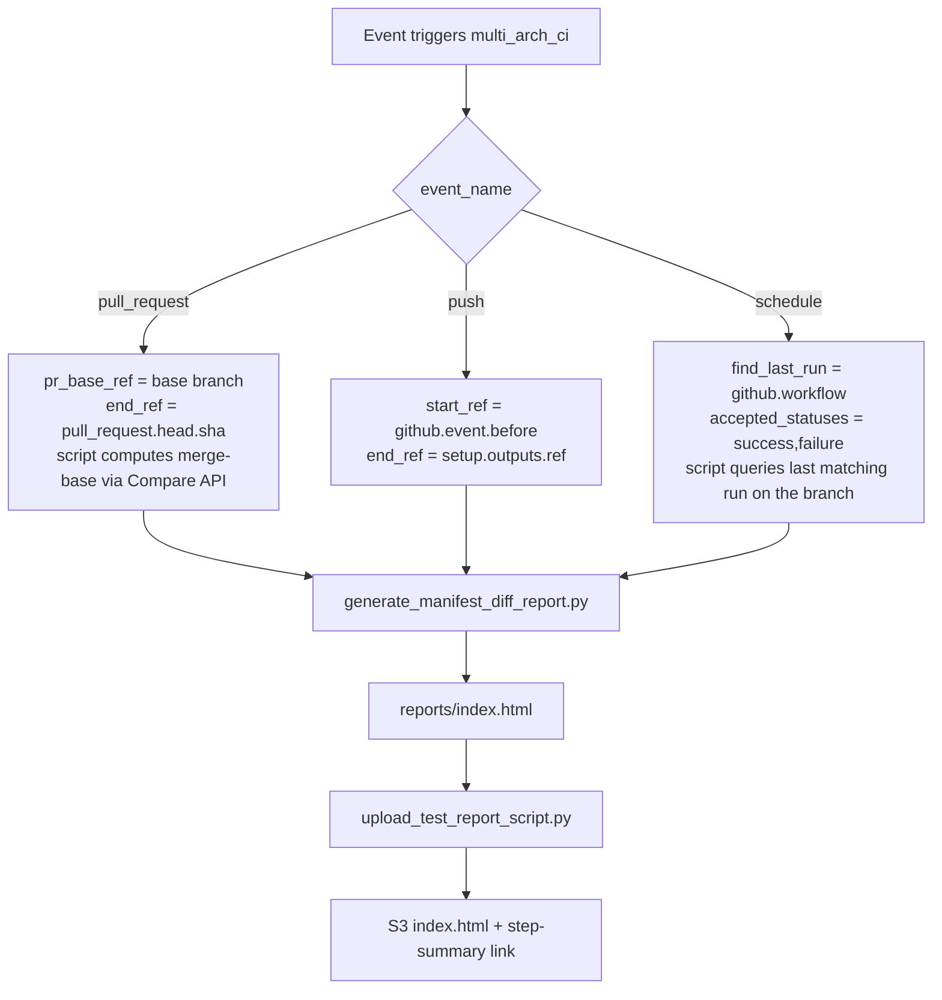

# Manifest Diff Report

This document describes the **manifest diff report** — a CI tool that
summarizes which TheRock submodule SHAs changed between two commits. It runs
automatically on every multi-arch CI run (PR / push / schedule) and can also
be invoked on-demand via `workflow_dispatch` or locally on the command line.

## Summary

TheRock is a CMake super-project pinned to a small set of top-level git
submodules (`.gitmodules`), two of which (`rocm-libraries`, `rocm-systems`)
are themselves superrepos containing further ROCm components under
`projects/` and `shared/`. When a change in TheRock or in any of those
upstream repos lands, it can be non-obvious which pointer(s) actually
moved. The manifest diff report answers that question: for two TheRock
commits (a **start** and an **end**), it walks the manifest produced by
`generate_therock_manifest.py` — top-level submodules plus superrepo
components — and produces an HTML page listing the new commit range on
each one, with links back to the upstream repos.

The report is generated by
[`build_tools/generate_manifest_diff_report.py`](../../build_tools/generate_manifest_diff_report.py)
and uploaded to S3 by the
[`manifest-diff.yml`](../../.github/workflows/manifest-diff.yml) reusable
workflow.

## How it runs in CI

The multi-arch CI top-level workflow
([`setup_multi_arch.yml`](../../.github/workflows/setup_multi_arch.yml))
gates the `manifest_diff` job to `ROCm/TheRock` only and skips it for
external-repo runs. It then calls `manifest-diff.yml` with per-event inputs
that derive the **start** ref differently depending on what triggered the
run:



| Event          | Start ref source                                                                                                                                                                                                    | End ref source                                                                                     |
| -------------- | ------------------------------------------------------------------------------------------------------------------------------------------------------------------------------------------------------------------- | -------------------------------------------------------------------------------------------------- |
| `pull_request` | `pr_base_ref` (the PR's base branch). The script calls the GitHub Compare API to get the merge-base, which is rebase-safe and works on rewritten PRs.                                                               | `pull_request.head.sha` (not `setup.outputs.ref`, which is the synthetic `refs/pull/N/merge` SHA). |
| `push`         | `github.event.before` — the branch tip before the push.                                                                                                                                                             | `setup.outputs.ref` — the commit the build is running against.                                     |
| `schedule`     | `find_last_run` — the script queries the last run of the current workflow whose conclusion is in `accepted_statuses`. Scheduled runs accept `success,failure` so a single broken nightly still produces a baseline. | `setup.outputs.ref`.                                                                               |

The `manifest_diff` job in `setup_multi_arch.yml` is **purely
informational** — it runs in parallel with the build/test jobs, never
gates them, and is marked `continue-on-error: true` inside
`manifest-diff.yml` itself so an API hiccup turns the job card red without
turning the whole CI run red.

### Where the report lives

`manifest-diff.yml`'s upload step calls
[`upload_test_report_script.py`](../../build_tools/github_actions/upload_test_report_script.py),
which pushes `reports/index.html` under the run's S3 prefix using
`manifest-diff` as the "amdgpu family" segment. The same upload script
appends a link to `$GITHUB_STEP_SUMMARY`, so the report shows up in the
**Summary** tab of the workflow run.

S3 path:

```
s3://therock-ci-artifacts/{run_id}-linux/test/manifest-diff/index.html
```

See [`workflow_outputs.md`](workflow_outputs.md) for the full S3 layout.

## Running it manually

### `workflow_dispatch`

Trigger `TheRock Manifest Diff Report` on the
[Actions page](https://github.com/ROCm/TheRock/actions/workflows/manifest-diff.yml).
The dispatch inputs are:

| Input               | Required               | Description                                                                                                                         |
| ------------------- | ---------------------- | ----------------------------------------------------------------------------------------------------------------------------------- |
| `end_ref`           | yes                    | End commit SHA, or a workflow run ID when `workflow_mode=true`.                                                                     |
| `start_ref`         | one of these three     | Start commit SHA (or run ID with `workflow_mode=true`).                                                                             |
| `find_last_run`     | one of these three     | Workflow filename (e.g. `multi_arch_ci.yml`). The script queries the last run on the branch whose status is in `accepted_statuses`. |
| `pr_base_ref`       | one of these three     | PR base branch name. The script resolves the merge-base between `end_ref` and `origin/<pr_base_ref>` via the GitHub Compare API.    |
| `accepted_statuses` | no (default `success`) | Comma-separated workflow run conclusions accepted by `--find-last-run`.                                                             |
| `workflow_mode`     | no (default `false`)   | Treat `start_ref` / `end_ref` as workflow run IDs instead of commit SHAs (resolves each to its `head_sha`).                         |

Exactly one of `start_ref`, `find_last_run`, or `pr_base_ref` is required.

### Local CLI

```bash
python3 build_tools/generate_manifest_diff_report.py \
    --start <sha> \
    --end <sha> \
    --output-dir reports
```

Other supported flags:

| Flag                                  | Purpose                                                                                                            |
| ------------------------------------- | ------------------------------------------------------------------------------------------------------------------ |
| `--start <sha\|run_id>`               | Explicit start ref. With `--workflow-mode`, treated as a workflow run ID.                                          |
| `--end <sha\|run_id>`                 | Explicit end ref. With `--workflow-mode`, treated as a workflow run ID.                                            |
| `--find-last-run <workflow>`          | Resolve `start` as the most recent run of `<workflow>` on `--branch` whose conclusion is in `--accepted-statuses`. |
| `--accepted-statuses success,failure` | Comma-separated set of accepted run conclusions for `--find-last-run`. Default: `success`.                         |
| `--pr-base-ref <branch>`              | Resolve `start` as the merge-base between `end` and `origin/<branch>` via the Compare API.                         |
| `--workflow-mode`                     | Treat `--start` and `--end` as workflow run IDs and resolve each to its `head_sha`.                                |
| `--branch <name>`                     | Branch to scope `--find-last-run` to. Default: `main`.                                                             |
| `--output-dir <path>`                 | Output directory for `index.html`. Default: `reports`.                                                             |

`GITHUB_TOKEN` (or any token with `public_repo` read scope) must be set in
the environment for the GitHub API calls used by `--find-last-run`,
`--pr-base-ref`, and `--workflow-mode`.

### Graceful empty

`--find-last-run` returns `(None, None)` and exits successfully when there
is no prior matching run on the branch (e.g. a first-ever nightly). In that
case the script prints an `[empty]` line and does not write a report; the
downstream upload step gracefully no-ops on the missing directory and the
job card stays green.

Other API failures (e.g. a 404 from the Compare API on a bad
`--pr-base-ref`) propagate as `GitHubAPIError` and are absorbed by the
job-level `continue-on-error: true`, so the job card goes red but the
overall CI run stays green.

## Code map

| File                                                                                                                       | Role                                                                     |
| -------------------------------------------------------------------------------------------------------------------------- | ------------------------------------------------------------------------ |
| [`.github/workflows/manifest-diff.yml`](../../.github/workflows/manifest-diff.yml)                                         | Reusable workflow: checkout, run script, upload to S3.                   |
| [`.github/workflows/setup_multi_arch.yml`](../../.github/workflows/setup_multi_arch.yml)                                   | `manifest_diff` job: per-event input derivation.                         |
| [`build_tools/generate_manifest_diff_report.py`](../../build_tools/generate_manifest_diff_report.py)                       | Resolves start/end SHAs, walks submodules, renders the HTML report.      |
| [`build_tools/github_actions/github_actions_api.py`](../../build_tools/github_actions/github_actions_api.py)               | `gha_query_last_workflow_run()` shared helper used by `--find-last-run`. |
| [`build_tools/github_actions/upload_test_report_script.py`](../../build_tools/github_actions/upload_test_report_script.py) | S3 upload + step-summary link (shared with test reports).                |

## Related

- [`ci_overview.md`](ci_overview.md) — overall multi-arch CI architecture.
- [`workflow_outputs.md`](workflow_outputs.md) — S3 layout used by the upload step.
- [`github_actions_debugging.md`](github_actions_debugging.md) — debugging GitHub Actions runs.
