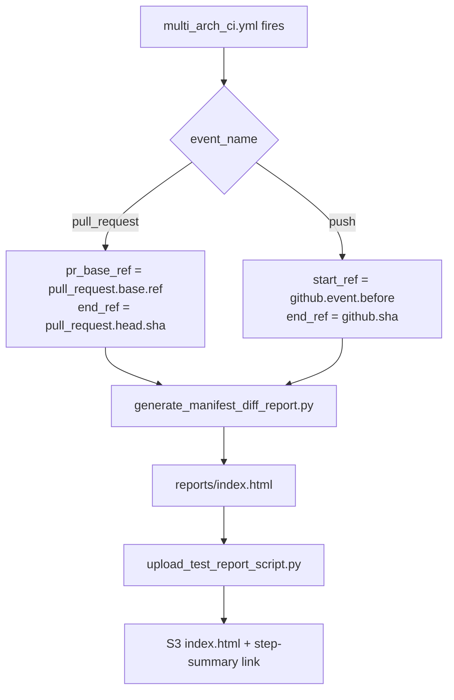

# Manifest Diff Report

This document describes the **manifest diff report** — a CI tool that summarizes which TheRock submodule SHAs changed between two commits. It runs automatically on every multi-arch CI run for `pull_request` and `push` events, and can also be invoked on-demand via direct `workflow_dispatch` of [`manifest-diff.yml`](../../.github/workflows/manifest-diff.yml) or locally on the command line.

## Summary

TheRock is a CMake super-project pinned to a small set of top-level git submodules (`.gitmodules`), two of which (`rocm-libraries`, `rocm-systems`) are themselves superrepos containing further ROCm components under `projects/` and `shared/`. When a change in TheRock or in any of those upstream repos lands, it can be non-obvious which pointer(s) actually moved. The manifest diff report answers that question: for two TheRock commits (a **start** and an **end**), it walks the manifest produced by `generate_therock_manifest.py` — top-level submodules plus superrepo components — and produces an HTML page listing the new commit range on each one, with links back to the upstream repos.

The report is generated by [`build_tools/generate_manifest_diff_report.py`](../../build_tools/generate_manifest_diff_report.py) and uploaded to S3 by the [`manifest-diff.yml`](../../.github/workflows/manifest-diff.yml) reusable workflow.

## How it runs in CI

The multi-arch CI top-level workflow ([`multi_arch_ci.yml`](../../.github/workflows/multi_arch_ci.yml)) hosts the `manifest_diff` job as a top-level sibling. The job has no `needs:`, runs in parallel with `linux_build_and_test` / `windows_build_and_test`, and calls `manifest-diff.yml` with no `with:` block — the reusable workflow derives the **start** and **end** refs from the caller's `github.event` itself, choosing differently depending on what triggered the run.



| Event          | Start ref source                                                                                                                                      | End ref source                                               |
| -------------- | ----------------------------------------------------------------------------------------------------------------------------------------------------- | ------------------------------------------------------------ |
| `pull_request` | `pr_base_ref` (the PR's base branch). The script calls the GitHub Compare API to get the merge-base, which is rebase-safe and works on rewritten PRs. | `pull_request.head.sha` — the tip of the PR's source branch. |
| `push`         | `github.event.before` — the branch tip before the push.                                                                                               | `github.sha` — the new tip the branch was just moved to.     |

To run the report manually with explicit refs, dispatch [`manifest-diff.yml`](../../.github/workflows/manifest-diff.yml) directly — see [Running it manually](#running-it-manually). `multi_arch_ci.yml`'s own `workflow_dispatch` surface intentionally does not expose manifest-diff inputs, so dispatching `multi_arch_ci.yml` is not a supported way to produce a report; the auto-fired `manifest_diff` job will fail (yellow via `continue-on-error`, never red).

The `manifest_diff` job in `multi_arch_ci.yml` is **purely informational** — it runs in parallel with the build/test jobs, never gates them, and is marked `continue-on-error: true` inside `manifest-diff.yml` itself so an API hiccup is reported as a non-blocking warning on the run summary instead of turning the whole CI run red.

### Where the report lives

`manifest-diff.yml`'s upload step calls [`upload_test_report_script.py`](../../build_tools/github_actions/upload_test_report_script.py), which pushes `reports/index.html` under the run's S3 prefix using `manifest-diff` as the "amdgpu family" segment. The same upload script appends a link to `$GITHUB_STEP_SUMMARY`, so the report shows up in the **Summary** tab of the workflow run.

S3 path (base-repo runs):

```
s3://therock-ci-artifacts/{run_id}-linux/logs/manifest-diff/index.html
```

On downstream forks the bucket and prefix shift to `therock-ci-artifacts-external` and `<owner>-<repo>/{run_id}-linux/...` per `WorkflowOutputRoot`. The upload step is non-fatal if the runner has no AWS credentials, so on a fork without the creds mount the report simply isn't uploaded. See [`workflow_outputs.md`](workflow_outputs.md) for the full S3 layout.

## Running it manually

### `workflow_dispatch`

Trigger `TheRock Manifest Diff Report` on the [Actions page](https://github.com/ROCm/TheRock/actions/workflows/manifest-diff.yml). `end_ref` is required; pick exactly one of `pr_base_ref`, `find_last_run`, or `start_ref` to resolve the start (precedence: `pr_base_ref` > `find_last_run` > `start_ref`). See the `description:` fields on the inputs in [`manifest-diff.yml`](../../.github/workflows/manifest-diff.yml) for the authoritative reference.

### Local CLI

See [`generate_manifest_diff_report.py`](../../build_tools/generate_manifest_diff_report.py) and run with `--help` for usage. Set `GITHUB_TOKEN` (any token with `public_repo` read scope) before running to avoid GitHub's 60 req/hr unauthenticated rate limit.

## Out of scope

External orchestrator workflows in `rocm-libraries` / `rocm-systems` that drive TheRock's reusable workflows via `setup_multi_arch.yml`'s `external_repo` input, and the rockrel release-driver flow (via `multi_arch_release.yml`), currently produce no manifest-diff; extending the report to those callers is tracked in #5219.

## Code map

| File                                                                                                                       | Role                                                                     |
| -------------------------------------------------------------------------------------------------------------------------- | ------------------------------------------------------------------------ |
| [`.github/workflows/manifest-diff.yml`](../../.github/workflows/manifest-diff.yml)                                         | Reusable workflow: derives refs from caller event, runs script, uploads. |
| [`.github/workflows/multi_arch_ci.yml`](../../.github/workflows/multi_arch_ci.yml)                                         | Hosts the `manifest_diff` sibling job that calls `manifest-diff.yml`.    |
| [`build_tools/generate_manifest_diff_report.py`](../../build_tools/generate_manifest_diff_report.py)                       | Resolves start/end SHAs, walks submodules, renders the HTML report.      |
| [`build_tools/github_actions/github_actions_api.py`](../../build_tools/github_actions/github_actions_api.py)               | `gha_query_last_workflow_run()` shared helper used by `--find-last-run`. |
| [`build_tools/github_actions/upload_test_report_script.py`](../../build_tools/github_actions/upload_test_report_script.py) | S3 upload + step-summary link (shared with test reports).                |

## Related

- [`ci_overview.md`](ci_overview.md) — overall multi-arch CI architecture.
- [`workflow_outputs.md`](workflow_outputs.md) — S3 layout used by the upload step.
- [`github_actions_debugging.md`](github_actions_debugging.md) — debugging GitHub Actions runs.
