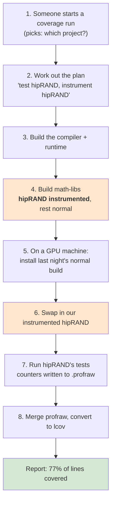

# Code Coverage in TheRock — A Simple Walkthrough

How a coverage report gets produced, start to finish, in plain terms. This is
the narrative introduction; [Code Coverage](code_coverage.md) is the reference,
with the CMake options, the CI walkthrough and how to onboard a project.

______________________________________________________________________

## What is this trying to do?

Answer one question: **when we run hipRAND's tests, how much of hipRAND's code
actually runs?**

The green run answered it — 77% of lines, 82% of functions. Getting to that
number is what everything below is about.

______________________________________________________________________

## First, three words you need

**Instrumented** — a library compiled with extra bookkeeping. Every time a line
runs, it bumps a counter. Instrumented code is slower and bigger, which is why
we don't ship it. You get it by compiling with `-fprofile-instr-generate`.

**profraw** — the counter file an instrumented program dumps when it exits.
Raw, per-process, not human-readable.

**lcov** — the final, readable report: which lines ran and which didn't.

The whole pipeline is just: build instrumented → run tests → collect profraw →
convert to lcov.

______________________________________________________________________

## The one idea that explains the design

You might expect: build everything instrumented, run the tests, done.

The problem is that hipRAND doesn't run alone. Its tests also load rocRAND,
hipBLAS, the HIP runtime and more. If *those* were instrumented too, they'd all
write counters, and hipRAND's report would include code that isn't hipRAND's.
Worse, hipRAND's percentage would move whenever some unrelated library changed.

So we want **exactly one instrumented library, and everything else normal.**

Building "everything else normal" from scratch would take hours. But a normal
build of the whole stack already exists — the **regular nightly** runs every
night. So we reuse it:

> Take last night's normal build, and swap in **just** our instrumented hipRAND.

That is the core trick. It's why two different builds are involved.

______________________________________________________________________

## The two builds

|              | Where it comes from                                             | What we take                  |
| ------------ | --------------------------------------------------------------- | ----------------------------- |
| **Baseline** | Last night's regular nightly (`ROCm/rockrel` run `34068476531`) | The whole ROCm stack, normal  |
| **Coverage** | Our own run, right now                                          | Only the instrumented hipRAND |

______________________________________________________________________

## The flow



The two orange boxes are the parts unique to coverage. Everything else is
TheRock's ordinary build and test machinery.

______________________________________________________________________

## Step by step

### Step 1 — Start the run

Today it starts automatically when a pull request touches a coverage file. That
trigger (`coverage_nightly_pr_check.yml`) is temporary scaffolding for
validation and gets deleted before merge. After that, you start it by hand from
the Actions tab.

You choose one thing that matters: **which projects to measure**, through the
`projects_to_test` input. It takes a comma-separated list of project names, or
one of the group aliases (`rocm_libraries_all`, `rocm_systems_all`, `all`).
Leaving it empty measures every onboarded project the workflow can build. The
walkthrough below follows a single-project run, `hiprand`, because it is the
easiest to read; nothing changes for a larger selection except how many test
and report jobs fan out at the end.

### Step 2 — Work out the plan

`setup_coverage_matrix`*, about 6 seconds*

A script (`configure_coverage_ci.py`) looks up hipRAND in its registry and
figures out everything downstream needs:

- Turn coverage on with `-DHIPRAND_ENABLE_COVERAGE=ON`
- hipRAND lives in the `math-libs` build stage, so build that
- Its files live in `math-libs/hipRAND/stage`
- Report on `lib/libhiprand.so*`
- Run the test suite called `hiprand`

If you asked for something that can't be built, it stops **here** with a clear
message rather than failing two hours later.

### Step 3 — Build the compiler

*about 7 minutes*

Coverage needs the compiler's profiling runtime, so this is built first. Nothing
project-specific happens yet.

### Step 4 — Build the libraries, with hipRAND instrumented

*about 59 minutes — the expensive step*

The whole `math-libs` stage gets built, but only hipRAND is instrumented. The
flag flows through three hands to get there:

```
configure_coverage_ci.py  says  -DHIPRAND_ENABLE_COVERAGE=ON
        ↓
therock_subproject.cmake  translates it to  -DBUILD_CODE_COVERAGE=ON
        ↓
hipRAND's own CMakeLists  adds  -fprofile-instr-generate
```

**Why the translation?** Because projects don't agree on a name. hipRAND calls
its option `BUILD_CODE_COVERAGE`, RCCL calls it `ENABLE_CODE_COVERAGE`, others
use something else. TheRock uses one consistent name and translates per project.
Skipping this step was a real bug — hipRAND built without instrumentation and
quietly reported nothing.

**Why build all of math-libs?** Because a stage, not a project, is the unit CI
knows how to build. The coverage workflow hands the ordinary build workflow
`stage_name: math-libs`, and everything downstream keys off that one input:
`fetch_sources.py --stage`, the configure step's `--stage`, and finally
`cmake --build --target stage-math-libs`. "Build only hipRAND" isn't a smaller
version of that job — it's a job that doesn't exist. There's a floor anyway,
since hipRAND sits on rocRAND, which sits on rocPRIM and the HIP runtime.

This is the design working, not a cost being tolerated. The whole point is to
pay for one instrumented stack per night and test every project against it, so
the build is the same size whether you measure one project or twelve. The
numbers say so: hipRAND alone took 59 minutes, and all twelve took 68.

> Careful with the two verbs: the whole stage is **built**, but only the
> selected projects are **instrumented**. Everything else compiles normally.
> Keeping each project's numbers to itself happens later, in steps 6 and 8 —
> not by restricting what gets built.

### Step 5 — Install last night's normal build

*on a real GPU machine*

The test machine downloads and installs the entire baseline stack — normal,
uninstrumented, nothing special.

At this moment there is **no** instrumented code on the machine at all.

### Step 6 — Swap in the instrumented hipRAND

`overlay_coverage_artifacts.py`

Now copy our instrumented hipRAND files over the baseline's copies:

```
Overlaying .../rand_dev.../math-libs/hipRAND/stage onto .../build
Overlaying .../rand_lib.../math-libs/hipRAND/stage onto .../build
Overlaying .../rand_test.../math-libs/hipRAND/stage onto .../build
Overlaid 3 instrumented subtree(s)
```

Result: a complete, working ROCm install where **exactly one library** counts
what it does.

> Note it copies `math-libs/hipRAND/stage`, not the whole `rand` package. That
> package holds **both** rocRAND and hipRAND, and we want rocRAND left alone.

### Step 7 — Run the tests

hipRAND's normal test suite runs, unchanged. One environment variable tells the
instrumented library where to dump its counters:

```
LLVM_PROFILE_FILE=.../hiprand-shard1-%p-%m.profraw
```

`%p` is the process id and `%m` identifies the binary, so nothing overwrites
anything else. This run produced **8** profraw files.

### Step 8 — Build the report

`merge_coverage_report.py`*, about 30 seconds*

Three things happen:

1. `llvm-profdata` merges the 8 profraw files into one index
1. `llvm-cov` reads that index plus `lib/libhiprand.so*` and writes lcov
1. The lcov file is uploaded (and sent to Codecov if a token is configured)

Pointing `llvm-cov` at only hipRAND's library is the second safeguard: even if
something else were instrumented, it wouldn't reach the report.

______________________________________________________________________

## The result

From run
[34135220913](https://github.com/ROCm/TheRock/actions/runs/34135220913):

```
Merging 8 profraw file(s) into coverage.profdata
Exporting lcov for 1 object(s) to coverage.info
```

|                   |                       |
| ----------------- | --------------------- |
| Lines covered     | 155 / 201 — **77.1%** |
| Functions covered | 28 / 34 — **82.4%**   |
| File measured     | `hiprand.cpp`         |
| Total time        | about 70 minutes      |

______________________________________________________________________

## Which files do what

| File                                 | Its one job                                  |
| ------------------------------------ | -------------------------------------------- |
| `coverage_nightly_pr_check.yml`      | Starts the run (temporary)                   |
| `multi_arch_ci_coverage_nightly.yml` | Runs the builds in order                     |
| `multi_arch_ci_coverage_linux.yml`   | Per project: test, then report               |
| `test_component.yml`                 | Installs, swaps, runs tests                  |
| `configure_coverage_ci.py`           | The registry — knows every project's details |
| `therock_subproject.cmake`           | Translates the coverage flag; fixes linking  |
| `overlay_coverage_artifacts.py`      | Does the swap in step 6                      |
| `merge_coverage_report.py`           | Makes the report in step 8                   |

______________________________________________________________________

## Appendix — every file in the PR

Twenty-one files: eleven new, ten edits to things that already existed. The
table above covers the eight you need for the flow; this is the complete list,
grouped by the part of the pipeline each one belongs to.

| #   | Part                           | What lives here                                     |
| --- | ------------------------------ | --------------------------------------------------- |
| 1   | Entry points and orchestration | Starting a run and sequencing the jobs              |
| 2   | Planning                       | Deciding what to build, instrument, test and report |
| 3   | Build and instrumentation      | Turning the coverage flag into compiler flags       |
| 4   | Artifacts and test execution   | Assembling the install tree and running tests       |
| 5   | Reporting                      | profraw to lcov                                     |
| 6   | Unit tests                     | The fast checks that run on every PR                |
| 7   | Documentation                  | —                                                   |

A useful thing to notice while reading: every one of the ten edits is additive
and defaults to off or empty, so regular CI behaves exactly as before. Coverage
rides on the existing build and test machinery rather than forking it. The one
exception worth knowing about is `CMakeLists.txt`, which runs the registry
script on *every* configure, coverage or not, to learn the project lists — a
few milliseconds, and the reason CMake and CI cannot drift apart.

### 1. Entry points and orchestration

All three are new files.

| File                                                                   | What it does                                                                                                                                                                                                       | Called by                                                                                                                    | Calls                                                                                                                                                           |
| ---------------------------------------------------------------------- | ------------------------------------------------------------------------------------------------------------------------------------------------------------------------------------------------------------------ | ---------------------------------------------------------------------------------------------------------------------------- | --------------------------------------------------------------------------------------------------------------------------------------------------------------- |
| `coverage_nightly_pr_check.yml` **(temporary — deleted before merge)** | Makes the coverage workflow runnable from a branch and visible as a PR check, which `workflow_dispatch` alone cannot do                                                                                            | GitHub, on a `pull_request` touching any of nine coverage paths — deliberately narrow, since every run is a multi-hour build | `multi_arch_ci_coverage_nightly.yml`                                                                                                                            |
| `multi_arch_ci_coverage_nightly.yml`                                   | The real entry point and top-level orchestrator. Five jobs: `setup_coverage_matrix`, `build_instrumented_compiler_runtime`, `build_instrumented_math_libs`, `coverage_report` (project × GPU family), `ci_summary` | A human, from the Actions tab. Today also the PR check above, via a `workflow_call` trigger removed alongside it             | `configure_coverage_ci.py`; `multi_arch_build_portable_linux_artifacts.yml` twice (compiler-runtime, math-libs); `multi_arch_ci_coverage_linux.yml` per project |
| `multi_arch_ci_coverage_linux.yml`                                     | Everything for one project on one GPU family, in three jobs: `configure_test_matrix`, `test_coverage`, `aggregate_coverage`                                                                                        | `multi_arch_ci_coverage_nightly.yml`, once per matrix entry                                                                  | `configure_coverage_ci.py`, `test_component.yml`, `artifact_manager.py`, `merge_coverage_report.py`                                                             |

### 2. Planning

One new file, and the reason the rest of the pipeline stays consistent.

| File                                                  | What it does                                                                                                                                                                                                                                                                                                                                                       | Called by                                                                                                                                                             | Calls                         |
| ----------------------------------------------------- | ------------------------------------------------------------------------------------------------------------------------------------------------------------------------------------------------------------------------------------------------------------------------------------------------------------------------------------------------------------------ | --------------------------------------------------------------------------------------------------------------------------------------------------------------------- | ----------------------------- |
| `build_tools/github_actions/configure_coverage_ci.py` | The registry and single source of truth. Per project it records the build stage, the upstream option name, the artifacts and stage directories to overlay, the object globs to report on, and the test suite to run. Resolves a selection into a job matrix and rejects anything unbuildable up front, so a bad request stops in six seconds rather than two hours | Three places, which is what makes it the source of truth: the nightly's matrix job, the per-project workflow's configure job, and `CMakeLists.txt` via `--emit-cmake` | Nothing — pure data and logic |

### 3. Build and instrumentation

All three already existed. The flags they add are inert unless coverage is on,
with the one caveat from above: `CMakeLists.txt` reads the registry on every
configure regardless.

| File                                            | What it does                                                                                                                                                                                                                                                                                                                                                   | Called by                                           | Calls                                                                                                  |
| ----------------------------------------------- | -------------------------------------------------------------------------------------------------------------------------------------------------------------------------------------------------------------------------------------------------------------------------------------------------------------------------------------------------------------- | --------------------------------------------------- | ------------------------------------------------------------------------------------------------------ |
| `multi_arch_build_portable_linux_artifacts.yml` | Builds one stage in a container and uploads its artifacts. Coverage adds an `extra_cmake_options` input, appended **after** the stage-derived arguments, since the last `-D` wins. This is how the coverage flags reach the build without coverage needing a build workflow of its own                                                                         | Regular multi-arch CI, and now the coverage nightly | The configure step, then `cmake --build --target stage-<name>`                                         |
| `CMakeLists.txt`                                | Declares the three group options (`THEROCK_COVERAGE_ALL`, `..._ROCM_LIBRARIES_ALL`, `..._ROCM_SYSTEMS_ALL`) and expands whichever is set into individual `<PROJECT>_ENABLE_COVERAGE` flags. An explicit `-DFOO_ENABLE_COVERAGE=OFF` still wins                                                                                                                 | Every CMake configure, coverage or not              | `configure_coverage_ci.py --emit-cmake`, then includes the generated `therock_coverage_projects.cmake` |
| `cmake/therock_subproject.cmake`                | Where the generic flag becomes a real one. Translates `<PROJECT>_ENABLE_COVERAGE` into whatever the subproject implements; adds `-ldl` and `-lpthread`, which the profile runtime needs and the driver does not supply; and scopes instrumentation to host code with `-Xarch_device`, injected into the compile rule so it lands after the project's own flags | Every subproject declaration in the build           | Generates a small CMake file handed to the subproject as `CMAKE_PROJECT_INCLUDE`                       |

### 4. Artifacts and test execution

This is the part that assembles a working install in which exactly one library
is instrumented. Only `overlay_coverage_artifacts.py` is new; the other three
already existed and are extended.

| File                                                                 | What it does                                                                                                                                                                                                                                                                                                                                                 | Called by                                                                                                                                                                                                     | Calls                                                                                                                               |
| -------------------------------------------------------------------- | ------------------------------------------------------------------------------------------------------------------------------------------------------------------------------------------------------------------------------------------------------------------------------------------------------------------------------------------------------------ | ------------------------------------------------------------------------------------------------------------------------------------------------------------------------------------------------------------- | ----------------------------------------------------------------------------------------------------------------------------------- |
| `test_component.yml`                                                 | The shared test workflow behind every component test in the repo. Coverage adds seven inputs and four steps: install from the baseline run, overlay the instrumented project, point `LLVM_PROFILE_FILE` at a per-shard path, and upload the profraw files. Also raises the test timeout to a 60-minute floor, since instrumented `-O0` builds run far slower | Every component-test caller in the repo, and now `multi_arch_ci_coverage_linux.yml`                                                                                                                           | `setup_test_environment`, then `overlay_coverage_artifacts.py` (only when a baseline run is set), then the project's own test suite |
| `.github/actions/setup_test_environment/action.yml`                  | Composite action that downloads and installs a ROCm build on the test machine. Coverage adds `RUN_GITHUB_REPO`, because the baseline is published by `ROCm/rockrel` and the bucket lookup fails if it queries the wrong repository                                                                                                                           | `test_component.yml` only                                                                                                                                                                                     | `install_rocm_from_artifacts.py`                                                                                                    |
| `build_tools/github_actions/overlay_coverage_artifacts.py` **(new)** | Step 6, the swap. Copies the instrumented project's stage directories over the baseline install. Most of its care goes into filesystem edge cases: merging into an existing tree, preserving symlinks, and either kind of symlink/regular-file collision                                                                                                     | `test_component.yml`                                                                                                                                                                                          | `artifact_manager.py`, imported as a module rather than shelled out to, fetching with `--artifact-names` and `--stage all`          |
| `build_tools/artifact_manager.py`                                    | Pre-existing artifact transport: pushes a stage's outputs to S3 and fetches them back. Coverage adds `--artifact-names`, an allowlist, because the existing `--exclude-artifacts` denylist is the wrong shape for fetching one project's files                                                                                                               | Six pre-existing callers (`fetch_artifacts.py`, `build_tarballs.py`, `post_stage_upload.py`, `baseline_runs.py`, `stage_reuse_decision.py`, `expand_amdgpu_families.py`) plus `overlay_coverage_artifacts.py` | The S3 artifact backend                                                                                                             |

### 5. Reporting

| File                                                            | What it does                                                                                                                                                                                                                                                                                               | Called by                                                   | Calls                                         |
| --------------------------------------------------------------- | ---------------------------------------------------------------------------------------------------------------------------------------------------------------------------------------------------------------------------------------------------------------------------------------------------------- | ----------------------------------------------------------- | --------------------------------------------- |
| `build_tools/github_actions/merge_coverage_report.py` **(new)** | Step 8. Finds the profraw files, resolves the object globs (collapsing versioned symlinks like `libfoo.so`, `.so.1`, `.so.1.2` into one object), merges and exports lcov. Fails loudly when a glob matches nothing, which is what caught the hipDNN naming bug instead of quietly emitting an empty report | `multi_arch_ci_coverage_linux.yml`, in `aggregate_coverage` | `llvm-profdata merge`, then `llvm-cov export` |

### 6. Unit tests

All four run in the **Unit Tests** workflow, whose "Test build_tools" step runs
`pytest` from `build_tools/` on Ubuntu and Windows, on every pull request. No
GPU, no network, no build — the whole set finishes in about two seconds. That
speed is the point: the alternative way to catch these mistakes is a two-hour
instrumented run on a GPU runner, which is how the hipDNN and hipTensor bugs
were actually found.

| File                                           | Covers             | Notable cases                                                                                                                       |
| ---------------------------------------------- | ------------------ | ----------------------------------------------------------------------------------------------------------------------------------- |
| `configure_coverage_ci_test.py` **(new)**      | The registry       | Alias expansion, blocked projects, and whole-registry invariants: every project declares report inputs and names an upstream option |
| `overlay_coverage_artifacts_test.py` **(new)** | The swap           | Symlink preservation, both file/symlink crossing cases, and failing loudly when nothing was overlaid                                |
| `merge_coverage_report_test.py` **(new)**      | The report         | Tool lookup, versioned-symlink collapsing, and the failure policy for empty profiles and unmatched globs                            |
| `artifact_manager_tool_test.py`                | `--artifact-names` | Two tests beside the existing `--exclude-artifacts` ones, keeping allowlist and denylist symmetric                                  |

Note the last one edits a large pre-existing file rather than adding a new one.

### 7. Documentation

| File                                                            | What it covers                                                                                                                                                                            |
| --------------------------------------------------------------- | ----------------------------------------------------------------------------------------------------------------------------------------------------------------------------------------- |
| `docs/development/code_coverage.md` **(new)**                   | The reference, in one file: the CMake options, the end-to-end CI walkthrough, why instrumentation is host-only, why the test timeout has a floor, and how to onboard a project or a stage |
| `docs/development/nightly_coverage_implementation.md` **(new)** | This document — the narrative introduction to the same pipeline                                                                                                                           |
| `docs/development/ci_overview.md`                               | Places coverage among the CI entry points, noting it is separate because it rebuilds what it measures                                                                                     |
| `docs/development/development_guide.md`                         | Documents `{PROJECT}_ENABLE_COVERAGE` next to the other build flags, including the upper-case rule: `HIPDNN_ENABLE_COVERAGE`, not `hipDNN_ENABLE_COVERAGE`                                |
| `docs/development/README.md`                                    | Index entries for the new documents                                                                                                                                                       |

______________________________________________________________________
