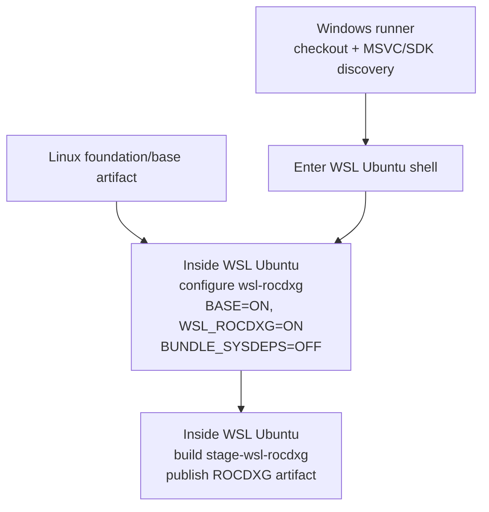

# WSL ROCDXG CI Stage

This document describes the multi-arch CI stage that builds the WSL-only
`rocdxg` bridge library from `rocm-systems`.

> [!NOTE]
> This page is about the WSL ROCDXG CI stage. For native Windows source builds,
> see [Windows Support](windows_support.md).

## Execution Model

The WSL ROCDXG job starts on a Windows runner but runs TheRock's Linux-side
build steps inside a WSL Ubuntu shell:



The Windows host is used for checkout, MSVC setup, and Windows SDK discovery.
The WSL shell handles artifact fetch, CMake configure, build, and artifact
upload. The workflow bridges the Windows SDK shared include path into WSL with
`WSLENV`.

## Build Topology

`wsl-rocdxg` is modeled as its own multi-arch stage and artifact group in
[`BUILD_TOPOLOGY.toml`](../../BUILD_TOPOLOGY.toml). The stage produces a
target-neutral artifact from the `rocm-systems` source set.

The relevant feature controls are:

- `THEROCK_ENABLE_WSL`: enables the WSL feature group.
- `THEROCK_ENABLE_WSL_ROCDXG`: enables the ROCDXG component.

The `wsl-rocdxg` artifact group depends on `base`. This lets the WSL stage
bootstrap from the same inbound base artifact pattern used by other downstream
multi-arch stages.

## Linux Inbound Artifacts

Although the job starts on a Windows runner, CMake runs inside WSL Ubuntu. That
means the configure and build environment is Linux userspace, so the stage
consumes Linux prebuilt artifacts from the Linux `foundation` stage, including
the `base` artifact.

The portable Linux multi-arch workflow gives the WSL job a dependency on
`foundation` so those inbound artifacts exist before the WSL stage fetches
them.

## Configure Behavior

For the WSL stage, [`configure_stage.py`](../../build_tools/configure_stage.py)
is invoked with `--stage=wsl-rocdxg` and `--platform=linux`. The generated
CMake arguments include:

```text
-DTHEROCK_ENABLE_ALL=OFF
-DTHEROCK_ENABLE_BASE=ON
-DTHEROCK_ENABLE_WSL_ROCDXG=ON
```

The workflow also passes:

```text
-DTHEROCK_BUNDLE_SYSDEPS=OFF
```

## Workflow Differences

Compared with the portable Linux artifact workflow, the WSL workflow:

- Runs on the WSL-capable Windows runner.
- Sets up Ubuntu under WSL.
- Configures with `--platform=linux`.
- Builds `stage-${stage_name}` for the WSL stage.

Compared with the native Windows artifact workflow, the WSL workflow:

- Uses host Windows for checkout, MSVC setup, and Windows SDK discovery.
- Uses WSL-local Python and CMake tooling for artifact fetch, configure, build,
  and upload.
- Bridges the Windows SDK shared include path into the WSL shell with `WSLENV`.

## ROCDXG Build

TheRock does not build `rocdxg` directly. The wrapper project invokes the
`libhsakmt` CMake path in `rocm-systems` that produces the WSL `rocdxg`
library, then installs the WSL-built outputs back into the normal TheRock
artifact flow.

## Troubleshooting

- If the job cannot find inbound `base` artifacts, check that the WSL job
  depends on `foundation` and that `wsl-rocdxg` has an artifact group dependency
  on `base`.
- If configure tries to build bundled sysdeps, check that the workflow is still
  passing `-DTHEROCK_BUNDLE_SYSDEPS=OFF`.
- If the WSL build cannot find Windows SDK shared headers, check the Windows SDK
  discovery step and the `WSLENV` bridge into WSL.
- If `rocdxg` outputs are missing, check the `libhsakmt` WSL CMake path in
  `rocm-systems` and the wrapper install step.
