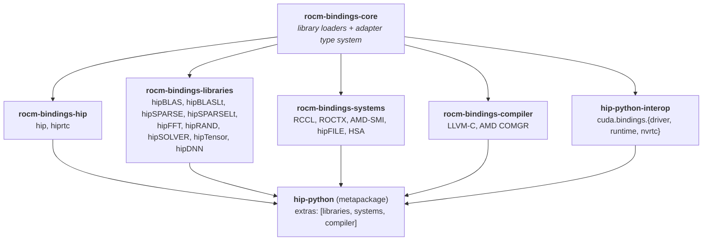

# HIP Python Integration into TheRock

This RFC proposes integrating [HIP Python](https://github.com/ROCm/hip-python) -
the official Pythonic ROCm bindings - into TheRock's super-build and CI/CD
infrastructure, and defines the open decisions (chiefly the code-generation model
in CI) that need to be agreed before the integration starts.

## Overview

HIP Python provides low-level, auto-generated Python bindings for the ROCm C APIs
(HIP runtime, math/communication/systems libraries, and the compiler stack). It
has been published on PyPI since 2023 (ROCm 5.4.3), released for nearly every
patch version since, and is referenced as the official ROCm Python bindings in
the [ROCm programming guide](https://rocm.docs.amd.com/en/latest/how-to/programming_guide.html).
It is already a core dependency of RAPIDS ports (hipDF, hipMM) and Numba HIP, and
is taught in AMD HPC training.

The bindings are produced by a code generator that parses ROCm headers and emits
Cython sources, so the published API always matches a *targeted* ROCm version.
Over the last release the project was restructured into a multi-package monorepo
whose split deliberately mirrors TheRock's component layout. This makes TheRock
the natural home for building and shipping the bindings: ROCm is compiled once in
the super-build, and the wheels are assembled by staging the resulting artifacts
with no second compile.

This RFC describes the architecture, how it maps onto TheRock sources, and the
integration plan, then enumerates the decisions that the TheRock maintainers and
the HIP Python owner need to make together.

> **Current visibility.** The historical bindings are public on PyPI and at
> [ROCm/hip-python](https://github.com/ROCm/hip-python), but the **latest,
> cutting-edge set discussed in this RFC** - the multi-package split, the
> super-build, the loader, and the TheRock-aligned generator work - currently
> lives **privately inside the AMD-AIOSS org** and is shared only via internal
> preview resources. Making it public is part of this integration effort; the
> current recommendation is to **open-source the generator and bundle it with
> `hip-python` (and Numba HIP) into a `rocm-bindings` monorepo** - see the
> [open-sourcing / monorepo decision](#open-questions--decisions-to-make).

### Track record: continuous releases prove the approach is robust

The public release histories are direct evidence that the code-generation
approach reliably produces working bindings across a wide range of ROCm versions.
The package version scheme encodes the targeted ROCm version (e.g.
`5.6.0.228.19`, `7.2.2.562.43`), so each release maps to a specific ROCm release:

- **`hip-python`** - the long-running history on TestPyPI shows **~73 releases**
  spanning **ROCm 5.6.0 (Sep 2023) through 7.2.2 (Apr 2026)**:
  [TestPyPI history](https://test.pypi.org/project/hip-python/#history) ·
  [PyPI history](https://pypi.org/project/hip-python/#history)
- **`hip-python-interop`** (formerly **`hip-python-as-cuda`**) - the CUDA Python
  interop layer, released in lockstep with `hip-python`:
  [PyPI history (`hip-python-interop`)](https://pypi.org/project/hip-python-interop/#history)
  · [TestPyPI history (`hip-python-as-cuda`, ~73 releases, ROCm 5.6.0 -> 7.2.2)](https://test.pypi.org/project/hip-python-as-cuda/#history)
- **`rocm-llvm-python`** (now folded into **`rocm-bindings-compiler`**) - the
  LLVM-C / COMGR bindings, **~40 releases** from **ROCm 6.0.0 (Jan 2024) through
  7.2.2 (Apr 2026)**:
  [TestPyPI history](https://test.pypi.org/project/rocm-llvm-python/#history) ·
  [PyPI history](https://pypi.org/project/rocm-llvm-python/#history)

These cadences - released for nearly every ROCm patch version over more than two
years, with no manual rewrite of the bindings per version - are the core evidence
that the generator-driven pipeline is robust enough to run inside TheRock CI.

## Goals

1. Land HIP Python in TheRock's super-build and CI on a **single branch** that
   carries the generated bindings alongside the hand-written sources.
1. Build the HIP Python wheels by **staging** artifacts from the existing ROCm
   super-build (no second compilation of ROCm itself).
1. Ship the first **preview wheels** from TheRock CI. CI can produce **more than
   one Python version**; 3.12 is only a convenient current default, not a
   requirement, and the target matrix is open for discussion.
1. Agree a **code-generation-in-CI model** (see [Alternatives
   Considered](#alternatives-considered)) and the associated branch strategy and
   ownership.
1. Produce ReadTheDocs-style API docs from the generated type stubs **without**
   requiring a full wheel build.

## Non-Goals

1. Replacing the existing PyPI release process while the preview matures.
1. Re-architecting the code generator itself (it is already in production).
1. Committing to multi-language code generation (Fortran/hipFORT and others) as
   part of *this* integration - it is noted as future direction only.
1. Guaranteeing day-one Windows packaging parity (Windows support is
   experimental).

## Background: Pythonic bindings at every layer

NVIDIA spent the last year making CUDA first-class in Python at every layer:
`cuda.bindings` (1:1 low-level C API), `cuda.core` (Pythonic runtime), and
`cuda.cccl` (CUB/Thrust). As of the May 2026 1.0 milestone, `cuda-python` is a
metapackage of versioned subpackages, and Python gets new hardware features from
day 0. SemiAnalysis flagged this as a strategic gap for AMD, recommending AMD
"invest heavily in Python interfaces at every layer of the ROCm stack, and not
just in ... Kernel Authoring DSLs"
([SemiAnalysis, Apr 2025](https://newsletter.semianalysis.com/i/174558631/summary-of-recommendations-to-amd)).[^semianalysis]

\[^semianalysis\]: A *full* analysis would have turned up that this particular
"strategic gap" was already partly filled: HIP Python has shipped Pythonic
bindings for ROCm continuously since **2023** (see
[Track record](#track-record-continuous-releases-prove-the-approach-is-robust))
\- in particular, it was shipping math-library bindings *before* NVIDIA's
`nvmath-python`, whose first beta (v0.1.0) only appeared in
[June 2024](https://pypi.org/project/nvmath-python/#history).

HIP Python is the ROCm-side answer: standalone, Cython-based Python equivalents
for each layer of the stack. A separate `hip-python-interop` package sits on top
of them and reproduces the `cuda.bindings` API, so existing CUDA Python code can
run unmodified on AMD GPUs ("hipiFLY" for Python).

## Architecture

### Multi-package split (mirrors TheRock)

HIP Python ships under a single `rocm.bindings.*` namespace, split into focused,
independently installable wheels whose boundaries follow TheRock's component
split:

- `rocm-bindings-core` - shared runtime/loader infrastructure
- `rocm-bindings-hip` - `hip`, `hiprtc`
- `rocm-bindings-libraries` - hipBLAS, hipBLASLt, hipSPARSE, hipSPARSELt, hipFFT,
  hipRAND, hipSOLVER, hipTensor, hipDNN
- `rocm-bindings-systems` - RCCL, ROCTX, AMD-SMI, hipFILE, HSA
- `rocm-bindings-compiler` - LLVM-C, AMD COMGR
- `hip-python` - metapackage building on `rocm-bindings-core`; extras pull in the
  library groups (`hip-python[libraries,systems,compiler]`)
- `hip-python-interop` - CUDA Python compatibility layer (formerly
  `hip-python-as-cuda`)

The diagram below shows the current packages and the bindings each one contains;
`rocm-bindings-core` underpins all of them and `hip-python` is the metapackage on
top. **The contents are not fixed** - individual bindings can be extended, trimmed,
or moved between packages easily, since the wheel-assembly layer just re-stages
already-compiled artifacts (see [Two-layer build
system](#two-layer-build-system)).

This replaces the earlier three-package, hand-rolled `setup.py` layout
(`hip-python`, `hip-python-as-cuda`, `rocm-llvm-python`).

> **Packaging is up for negotiation.** The package **names**, **boundaries**, and
> **contents** above are a current proposal, not a fixed contract - they can be
> changed drastically. Because the second layer of the super-build just collects
> already-compiled artifacts (see [Two-layer build
> system](#two-layer-build-system)), packages and their contents can be added,
> removed, split, merged, or remixed freely without recompiling anything. We
> expect to settle the final layout together with the TheRock maintainers.

### Code generation pipeline (the heart of HIP Python)

The generator is what guarantees bindings that match the targeted ROCm version:

- `libclang` parses ROCm headers into an AST; a `pyparsing`-based Doxygen parser
  supplies `@param[in|out]` intent.
- A single control layer maps function arguments - especially pointer arguments -
  to user-friendly Python (IN/OUT/INOUT, scalar vs array), in one central place
  shared across all ROCm libraries and reusable by other language backends.
- It resolves complex nested C structs/unions and hoists anonymous records into
  stable names.
- The generator is ~29k lines (libclang + Doxygen parser + Cython) and emits
  ~920k lines of `.pyx` / `.pyi` / `.pxd` for the current release, plus the
  CMake lists to build them.
- It is hardened by an extensive test **"parkour"** - **~190 tests across 21
  files** - that exercises the generator end to end: AST extraction, the
  Doxygen `@param` intent parser, pointer rank/intent inference, nested
  struct/union hoisting and stable-name synthesis, the hand-coded override
  resolution order, and the emitted `.pxd`/`.pyx`/`.pyi`/CMake outputs. This suite
  is the main reason the pipeline has survived two-plus years of ROCm releases
  (see [Track record](#track-record-continuous-releases-prove-the-approach-is-robust))
  without per-version manual rewrites, and it is what makes running the generator
  inside CI credible.

### Two-layer build system

- ROCm is compiled **once** in a unified super-build; wheels are then assembled by
  **staging** the resulting artifacts - there is no second compile.
- The old per-wheel packaging compiled each wheel one after another; the
  super-build + staging approach is fully parallel (`-j$(nproc)`), reducing a
  representative build from ~30 min to ~4 min on 16 cores.
- A cross-platform CMake build produces all packages in parallel.
- The super-build is **`sccache`-friendly**: the compile layer is cacheable, so
  rebuilds (including across CI runs) reuse cached objects rather than
  recompiling.
- Because the **second layer only collects compiled artifacts**, packages can be
  **added, removed, mixed, and matched freely** - changing the package layout or
  what each package contains does **not** trigger a recompile, only a different
  staging of the same cached artifacts. This makes the packaging
  ([above](#multi-package-split-mirrors-therock)) cheap to renegotiate and iterate
  on.

### Flexible shared-library loader

A runtime loader resolves the backing ROCm shared libraries across deployment
shapes, which is what makes wheel-based TheRock installs viable:

- wheel-based TheRock installs,
- a classic `/opt/rocm` system install, and
- package-bundled libraries.

### Buffer-protocol interoperability (a core ecosystem feature)

A defining feature of the HIP Python ecosystem is that its bindings interoperate
directly with both **host** and **device** buffer protocols, so data moves between
HIP Python and the wider scientific-Python / GPU ecosystem with no manual copies
or pointer juggling:

- **Python (host) buffer protocol** - objects exposing
  [`PEP 3118`](https://peps.python.org/pep-3118/) buffers - `array.array`,
  `bytearray`, `bytes`, `memoryview`, and **NumPy** arrays - can be passed
  straight into runtime calls (e.g. as `hipMemcpy` source/destination) without
  wrapping.
- **Device buffer protocol** - HIP Python device allocations implement the
  **`__cuda_array_interface__`** (CUDA Array Interface), so device buffers are shared zero-copy
  with **CuPy**, **Numba HIP**, PyTorch, and other CAI-aware libraries.

This two-sided interop (host PEP 3118 + device CUDA Array Interface) is what lets
HIP Python act as the binding layer that RAPIDS ports and Numba HIP build on,
rather than an isolated wrapper. Note that we can extend the supported protocols straightforwardly thanks to the HIP Python code generator in the future.

### CUDA Python interop ("hipiFLY")

`hip-python-interop` exposes `cuda.bindings.{driver,runtime,nvrtc}` as aliases of
the corresponding HIP objects, so identical source runs on NVIDIA and AMD GPUs by
swapping the imported package. An "enum constant hallucination" mechanism
synthesizes missing CUDA enum values on the fly. This package is the only part of
HIP Python with a conceptual link to CUDA Python; the `rocm-bindings-*` packages
are standalone.

## Mapping to TheRock sources

TheRock aggregates ROCm as a CMake super-project; HIP Python mirrors that split as
wheels under one namespace:

- `rocm-systems` -> `rocm-bindings-systems`
- `rocm-libraries` -> `rocm-bindings-libraries`
- `llvm-project` -> `rocm-bindings-compiler`
- core + hip underpin everything; `hip-python` is the metapackage on top.

## Work already completed toward integration

This is not a green-field proposal: substantial groundwork has already landed in
the HIP Python codebase specifically to make a TheRock integration possible. The
two most relevant pieces are the shared-library lookup rework and the Windows
support changes.

### Flexible shared-library lookup

Historically the bindings assumed a classic `/opt/rocm` install. To support
wheel-based TheRock distributions, the runtime library resolution was reworked
into a **flexible loader** that locates each backing ROCm shared library across
multiple deployment shapes, in a defined fallback order:

- **TheRock wheel installs** - libraries shipped inside sibling `rocm-*` wheels
  (e.g. resolved relative to the installed package, honoring the TheRock layout).
- **Classic system install** - `/opt/rocm` (and standard loader paths).
- **Package-bundled libraries** - libraries vendored alongside the binding
  package itself.

This is what makes a wheel-based TheRock install work without a system ROCm, and
it is already implemented and shipping in the preview (see [Flexible
shared-library loader](#flexible-shared-library-loader)).

### Windows support

Cross-platform support was added so the same bindings and build can target
Windows in addition to Linux:

- **Cross-platform CMake build** that produces all packages on Windows as well as
  Linux.
- **Platform-aware library loading** - Windows DLL lookup semantics (`.dll`
  naming, search directories / `add_dll_directory`) integrated into the flexible
  loader above.
- Initial **Windows binding builds** validated as an experimental target.

Windows support is still **experimental**, but the platform abstractions needed
for TheRock's cross-platform builds are in place.

## Proposed TheRock integration

### Single-branch generated bindings

Generated bindings live on a **single branch** that fuses the hand-written base
sources with the generated `.pyx`/`.pyi`/`.pxd`. This avoids a separate
"generated" branch and is the precondition for either CI model below.

### Build & packaging in CI

HIP Python is added as a TheRock subproject that stages the already-built ROCm
artifacts into wheels (no recompilation of ROCm). CI can produce wheels for
**multiple Python versions** (3.12 is a current default only) and uploads them as
preview artifacts. Since the wheel-assembly layer only re-stages cached compiled
artifacts, building additional Python versions or changing the package layout is
inexpensive.

### Documentation

Autogenerated `*.pyi` stubs allow building the API documentation **without** a
wheel build, so docs can be produced as a lightweight CI step.

## Open questions / decisions to make

1. **Code-generation model in CI** - automatic per build vs developer-triggered at
   release prep (see [Alternatives Considered](#alternatives-considered)). This is
   the primary decision this RFC seeks to resolve.
1. **API freeze** - if codegen is developer-triggered, from what fixed point are
   ROCm headers considered stable for a given release?
1. **Branch strategy & ownership** - who owns the single integration branch and the
   regeneration step, and how does it relate to TheRock's release cadence?
1. **Python version matrix** and platform coverage (Linux first; Windows is
   experimental). Producing several Python versions is straightforward; the exact
   set is open.
1. **Final package naming and contents** - the layout in this RFC is a starting
   proposal and is expected to be negotiated; the super-build makes re-slicing
   packages cheap (no recompile).
1. **Generator open-sourcing and monorepo bundling** *(updated)* - the interface
   generator ("InterfaceGen", the ~29k-line pipeline and its ~190-test parkour)
   currently lives privately inside the **AMD-AIOSS** org. The earlier position
   (notably from the compiler team) was to keep it closed as AMD IP; that view has
   since changed: with what is now possible via **agentic coding**, the generator
   is **no longer a meaningful moat**, and the current **recommendation is to
   open-source it** so that **external contributors can file PRs directly against
   the code generator**. The proposal is therefore to **bundle InterfaceGen
   together with `hip-python` into a single monorepo** (working name
   **`rocm-bindings`**), and - on the compiler team's recommendation - to **also
   bundle [Numba HIP](https://github.com/ROCm/numba-hip)** into it. Decisions to
   confirm with the maintainers: (a) open-source the generator; (b) the monorepo
   layout and name (`rocm-bindings`); (c) whether Numba HIP joins the same repo.
   Note this **relaxes** the constraint on the code-generation model above:
   open-sourcing keeps the fully-automatic Option A on the table (the generator
   can run in public CI); a closed-source generator would otherwise force the
   developer-triggered Option B.

## Alternatives considered

The central integration decision is *how the automatic code generation is run*.
Because the generated bindings can live on a single branch, two models are
possible:

### Option A - fully automatic (regenerate on every TheRock build)

- Bindings are regenerated on every TheRock build and therefore always track the
  current headers.
- No manual step and no separate API freeze.
- Trade-off: codegen (libclang parse + emit) runs as part of every build, and a
  header change can change the public Python API without an explicit gate.
- **Requires the generator to run in public TheRock CI** - viable under the
  current recommendation to **open-source the generator** (see the open-sourcing /
  monorepo decision in [Open questions](#open-questions--decisions-to-make)).

### Option B - developer-triggered (regenerate at release prep)

- Codegen is run manually while preparing the next release (TheRock's ~6-week
  cadence).
- Requires ensuring header stability - an **API freeze** from a fixed point before
  the release.
- Trade-off: an explicit human/release step, but a controlled and reviewable API
  surface.
- **Compatible with a closed-source generator**: only the (open) generated sources
  are committed. This is the fallback model if the generator is *not* open-sourced;
  with the current recommendation to open-source it (see [Open
  questions](#open-questions--decisions-to-make)), Option B is no longer forced.

### Packaging: per-wheel build vs super-build + staging

The previous per-wheel packaging compiled each wheel sequentially and was
noticeably slower. The proposed super-build + staging model compiles ROCm once and
assembles wheels from the staged artifacts; it is retained as the recommended
approach and the alternative is documented only for context.

## Current status and roadmap

### Current capabilities

- TheRock 7.13.0 preview wheels, sources, and docs exist as internal resources.
- Multi-package split, CMake super-build, and the flexible loader are implemented.
- New library bindings added: hipBLASLt, hipSPARSELt, hipTensor, hipDNN.
- Experimental system bindings: AMD-SMI, hipFILE, HSA.
- Experimental Windows support.
- Approaching full ROCm C API coverage.

### Near-term roadmap

- Land the single-branch integration and the agreed codegen-in-CI model.
- Ship the first preview wheels from TheRock CI.
- RTD docs built from generated stubs.

### Long-term direction

- The generator can target other languages; a draft Fortran recipe already
  regenerates hipFORT-style modules from ROCm headers (~100k generated lines).
- **`rocm-bindings` monorepo** - open-source the InterfaceGen generator and bundle
  it with `hip-python` in one repo, so external contributors can PR against the
  generator and bindings together (see [Open
  questions](#open-questions--decisions-to-make)).
- **Numba HIP integration** - on the compiler team's recommendation, bring
  [Numba HIP](https://github.com/ROCm/numba-hip) (the AMD GPU backend for Numba)
  into the same `rocm-bindings` monorepo and TheRock-aligned packaging/CI story, so
  the JIT/kernel-authoring layer ships and versions alongside the HIP Python
  bindings it already builds on.
- Vision: agent-assisted, automatic multi-language code generation for every
  TheRock release.

## Dependencies

### Build-time dependencies

- The ROCm super-build artifacts (HIP, libraries, systems, compiler) produced by
  TheRock.
- `libclang` (header parsing), `pyparsing` (Doxygen parser), Cython, and a C/C++
  toolchain.
- CMake (cross-platform build of all packages).

### Runtime dependencies

- The targeted ROCm shared libraries, resolved by the flexible loader (TheRock
  wheels, `/opt/rocm`, or package-bundled libs).
- Optional: `numpy` / standard library `array` for host-buffer interop.
- `hip-python-interop` additionally provides the `cuda.bindings.*` compatibility
  surface.

## Documentation & references

> **The publicly available HIP Python docs are outdated.** The public user guide
> and API reference below predate the multi-package split, the super-build, the
> loader, and the new library bindings described in this RFC - they still describe
> the older three-package layout. Up-to-date documentation currently exists only
> as the internal TheRock preview docs (see [Current status and
> roadmap](#current-status-and-roadmap)); refreshing the public docs (built from
> the generated `*.pyi` stubs) is part of this integration effort.

- [HIP Python installation guide (ROCm 6.2.4)](https://rocm.docs.amd.com/projects/hip-python/en/docs-6.2.4/user_guide/0_install.html) -
  the **last RTD build that correctly rendered the Python API indices**, which
  documents the **old, public
  versions of the bindings** (the three-package layout, `MAJOR.MINOR.PATCH.CODEGEN.RELEASE`
  version scheme, TestPyPI distribution). It does **not** describe the current
  multi-package set discussed in this RFC (hence "outdated" above)
- [HIP Python user guide](https://rocm.docs.amd.com/projects/hip-python/en/latest/user_guide/1_usage.html)
  (outdated)
- [ROCm programming guide](https://rocm.docs.amd.com/en/latest/how-to/programming_guide.html)
  (names HIP Python as the official Python bindings)
- [AMD HPC Training Examples](https://github.com/amd/HPCTrainingExamples)

## Related RFCs

- [RFC0003](RFC0003-Build-Tree-Normalization.md): Build Tree Normalization -
  directory structure for ROCm components that the package split follows.
- [RFC0008](RFC0008-Multi-Arch-Packaging.md): Multi-Arch Packaging - relevant to
  wheel packaging and distribution.
- [RFC0009](RFC0009-OS-Packaging-Requirements.md): OS Packaging Requirements.

## Revision history

- 2026-06-03: Initial draft (Dominic Etienne Charrier, Lalith Narasimhan)
- 2026-06-05: Recommend open-sourcing the InterfaceGen generator and bundling it
  with `hip-python` (and Numba HIP) into a `rocm-bindings` monorepo; add Greg
  Rogers, Phani Vaddadi, and Saad Rahim as co-authors
- 2026-06-05: Add footnote on the SemiAnalysis "strategic gap" noting HIP Python
  has shipped ROCm math-library bindings since 2023, predating `nvmath-python`
